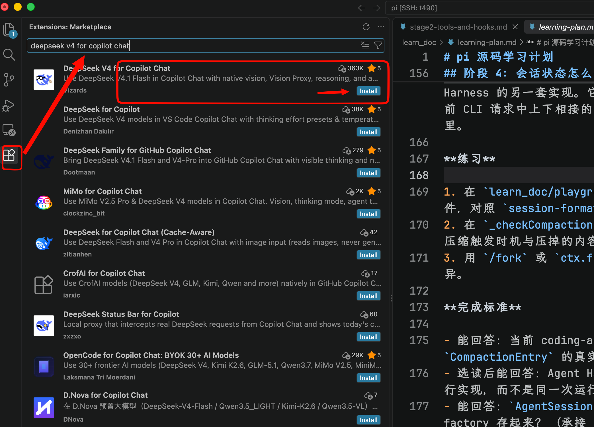

# 二、最重要的是：上课前不要现场装环境

我非常赞同你说的：

> VS Code + WSL / Ubuntu + AI

但我会要求学生在 **开课前一天就全部准备完成**。

Windows 学生统一：

```
Windows 11
    ↓
WSL2
    ↓
Ubuntu
    ↓
g++ / gdb / git
    ↓
VS Code
    ↓
VS Code Remote/WSL
    ↓
AI Agent
```

有 Linux 实机的学生直接 Ubuntu 即可。

我反而**不推荐 Ubuntu 虚拟机作为第一选择**。因为大学生 ACM 编程，本质上只需要 Linux terminal + gcc，WSL2 足够，而且文件、剪贴板、VS Code 集成都方便很多。

统一要求能运行：

```
g++ --version
git --version
gdb --version
```

再让学生提前编译：

```
#include <bits/stdc++.h>
using namespace std;

int main() {
    cout << "ACM Ready!" << endl;
    return 0;
}
```

统一编译命令可以直接教：

```
g++ main.cpp -std=c++20 -O2 -Wall -Wextra -o main
./main
```

甚至第一周都不需要 CMake。

------

# 三、AI 工具我会和你的方案稍微不同

你提到：

> Cherry Studio + VS Code + Cline

我不建议三个东西都作为“必装软件”。

2026 年的 VS Code 自身已经把 Agent 能力做得非常完整，目前官方支持 GitHub Copilot、Anthropic Claude 和 OpenAI Codex 等 agent harness，也可以在编辑器里进行 Plan、Agent、代码编辑、终端执行和测试。VS Code 官方现在已经把这种 agent 工作流当作核心开发方式之一。

所以我会设计成：

| 工具                     | 定位                   | 是否必需       |
| ------------------------ | ---------------------- | -------------- |
| VS Code                  | 编程环境               | **必须**       |
| VS Code AI Agent / Cline | 编程 AI                | **二选一必须** |
| Cherry Studio            | 问概念、总结知识、读题 | 可选           |
| Git                      | 保存代码/比较 AI 修改  | **必须**       |

### 如果让我给学生统一，我现在更倾向于


## 安装 deepseek-v4-for-copilot 插件


这个插件的官方使用文档: https://github.com/Vizards/deepseek-v4-for-copilot/blob/main/README.zh-cn.md


第一步: 安装`deepseek-v4-fro-copilot`插件




第二步: 配置 `API -key`


注册 [deepseek](https://deepseek.com) 首先充值[deepseek](https://platform.deepseek.com/top_up),然后来到[deepseek api key]()页面,创建一个 key

配置 API如下: vscode 快捷键 `ctrl + shift + p` 打开命令面板:


然后粘贴自己key


开始聊天


```markdown
不要重写我的代码。

请根据题目检查我的 main.cpp：
1. 判断算法复杂度
2. 找可能的边界情况
3. 如果存在 bug，只告诉我 bug 的位置和原因
4. 不要直接给完整答案
```


## `AGENTS.md`


```markdown
# ACM Learning Rules

你是一名 ACM 算法助教。

目标不是替学生完成题目，而是帮助学生掌握算法。

当学生询问题目时：

1. 不要直接给出完整代码。
2. 首先询问学生当前的思路。
3. 优先给提示，而不是答案。
4. 提示顺序：
   - 数据范围
   - 时间复杂度
   - 算法方向
   - 关键性质
   - 伪代码
5. 只有学生已经写出代码后，才允许帮助 Debug。
6. Debug 时优先指出问题位置，不直接重写完整程序。
7. AC 后帮助学生分析：
   - 时间复杂度
   - 空间复杂度
   - 边界情况
   - 是否存在更优解法
8. 每道题最后要求学生自己总结算法。
```

## 2. 第一个实验：直接让 AI 看整个工程

比如创建：

```
acm-test/
└── main.cpp
```

`main.cpp`：

```
#include <bits/stdc++.h>
using namespace std;

int main() {
    vector<int> a = {5, 1, 4, 2, 3};

    sort(a.begin(), a.end());

    for (auto x : a)
        cout << x << " ";

    return 0;
}
```

# 8. 对 ACM，我最推荐的是这个 Prompt

例如一道题，学生先自己思考，然后告诉 Agent：

```
你是我的 ACM 助教。

请阅读题目和我当前的 main.cpp。

不要直接给我完整答案，也不要直接重写代码。

请按照下面顺序帮助我：

1. 根据数据范围判断允许的时间复杂度
2. 判断我的算法思路是否正确
3. 如果错误，只给我一个提示
4. 如果代码有 bug，指出大概位置和原因
5. 等我修改后再继续检查
```

这个用法非常好。

再比如 WA：

```
我的程序在 OJ 上 WA。

不要直接修改代码。

请：
1. 阅读 main.cpp
2. 分析可能遗漏的边界情况
3. 给我构造一个能 Hack 掉当前程序的数据
4. 告诉我实际输出和正确输出为什么不同
```

这个比“帮我改代码”有教学价值太多。

# 9. Agent 最厉害的地方：可以把多个动作串起来

以后学生甚至可以说：

```
阅读当前目录里的题目说明和 main.cpp。

先编译程序。

然后自己生成 10 组小规模测试数据。

如果程序崩溃或者出现明显错误，
告诉我失败的测试数据以及原因。

不要修改代码。
```

Agent 可以形成：

```
读取文件
   ↓
理解代码
   ↓
调用 Terminal
   ↓
g++ 编译
   ↓
运行测试
   ↓
分析结果
   ↓
回答学生
```

这才是真正的 **Coding Agent**，也是它和 Cherry Studio 普通聊天最大的区别。
