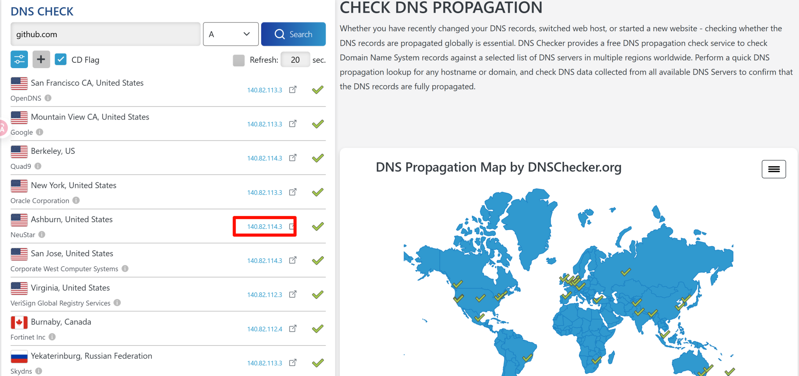

2025-09-09,我发现我的电脑 git 无法推送,

```bash
ssh -vvv -T git@github.com 
```

卡死

神奇的是,并不是因为https无法推送,而是ssh无法推送,这是我第一次遇到这种情况.

```bash
╭─rainboy@y9000x ~
╰─$ nslookup github.com 119.119.119.119
Server:         119.119.119.119
Address:        119.119.119.119#53

Non-authoritative answer:
Name:   github.com
Address: 20.205.243.166
```

```bash
ssh -T git@20.205.243.166
```

卡死

使用在线 dns check : https://dnschecker.org/#A/github.com



得到ip : `140.82.114.3`

```bash
ssh -T git@140.82.114.3


The authenticity of host '140.82.114.3 (140.82.114.3)' can't be established.
ED25519 key fingerprint is SHA256:+DiY3wvvV6TuJJhbpZisF/zLDA0zPMSvHdkr4UvCOqU.
This host key is known by the following other names/addresses:
    ~/.ssh/known_hosts:59: github.com
    ~/.ssh/known_hosts:98: [ssh.github.com]:443
    ~/.ssh/known_hosts:99: 140.82.114.4
Are you sure you want to continue connecting (yes/no/[fingerprint])? yes
Warning: Permanently added '140.82.114.3' (ED25519) to the list of known hosts.
Hi Rainboylvx! You've successfully authenticated, but GitHub does not provide shell access.
```

成功了 !?


```bash
ssh -T -p 443 git@ssh.github.com 
```

也能成功! 真是神奇

不得已,我修改了`~/.ssh/config` 文件

```
Host github.com
  Hostname ssh.github.com
  Port 443
  User git
```

暂时先使用443端口来访问 github