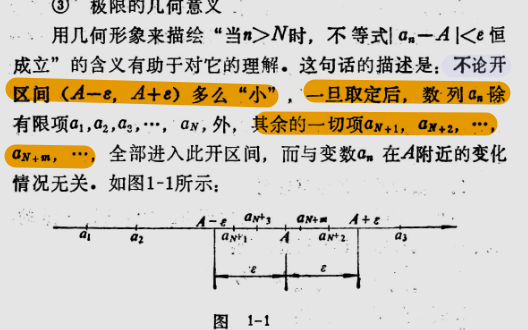

本节对应课本 **§1 映射与函数** + **§2 数列的极限**。

## §1 映射与函数

函数是整个高等数学研究的对象。搞清什么是函数、定义域、反函数、基本初等函数，是后面一切的基础。

### 1.1 映射的概念

> [!IDEA] 映射
> 设 $X, Y$ 是两个非空集合，如果存在一个法则 $f$，使得对 $X$ 中每个元素 $x$，在 $Y$ 中都有**唯一确定**的元素 $y$ 与之对应，则称 $f$ 为从 $X$ 到 $Y$ 的映射，记作
> $$f: X \to Y$$

> [!IMPORTANT] 函数是实数集上的映射
> 函数是一种特殊的映射：定义域 $D \subset \mathbb{R}$，值域 $R_f \subset \mathbb{R}$。
> 函数的两要素：**定义域** + **对应法则**。两个函数相等当且仅当定义域和对应法则都相同。

### 1.2 函数的几种特性

> [!TIP]
> - **有界性**：$|f(x)| \le M$ 对所有 $x \in D$ 成立。
> - **单调性**：$x_1 < x_2 \Rightarrow f(x_1) \le f(x_2)$（增）或 $\ge$（减）。
> - **奇偶性**：$f(-x) = -f(x)$（奇）；$f(-x) = f(x)$（偶）。奇函数关于原点对称，偶函数关于 $y$ 轴对称。
> - **周期性**：存在 $T > 0$ 使 $f(x+T) = f(x)$ 对所有 $x$ 成立。最小的正 $T$ 叫最小正周期。

### 1.3 反函数与复合函数

> [!IDEA] 反函数
> 若函数 $y = f(x)$ 在定义域上是单射（一一对应），则存在反函数 $x = f^{-1}(y)$。
> 习惯上写作 $y = f^{-1}(x)$。$y = f(x)$ 与 $y = f^{-1}(x)$ 的图像关于直线 $y = x$ 对称。

> [!IDEA] 复合函数
> 设 $y = f(u)$ 的定义域为 $D_f$，$u = g(x)$ 的值域为 $R_g$。若 $R_g \cap D_f \neq \varnothing$，则可定义复合函数：
> $$y = f[g(x)], \quad x \in D = \{x \mid g(x) \in D_f\}$$

### 1.4 基本初等函数与初等函数

> [!IMPORTANT] 六类基本初等函数
> 1. **常数函数**：$y = c$
> 2. **幂函数**：$y = x^\mu\ (\mu \in \mathbb{R})$
> 3. **指数函数**：$y = a^x\ (a > 0, a \neq 1)$
> 4. **对数函数**：$y = \log_a x\ (a > 0, a \neq 1)$
> 5. **三角函数**：$\sin x$, $\cos x$, $\tan x$, $\cot x$, $\sec x$, $\csc x$
> 6. **反三角函数**：$\arcsin x$, $\arccos x$, $\arctan x$, $\operatorname{arccot} x$

> [!SUCCESS] 初等函数
> 由基本初等函数经过**有限次**四则运算和复合运算得到的、能用一个式子表示的函数，称为初等函数。
>
> 大多数我们见到的函数都是初等函数。分段函数一般不是初等函数（但绝对值 $|x| = \sqrt{x^2}$ 是）。

## §2 数列的极限

极限是整个微积分的基石。要理解求导、积分，首先得把"无限接近"这个概念说清楚。

### 2.1 数列极限的定义

> [!ABSTRACT] 抽象理解
> 极限 $\iff$ 无限的接近，但"无限的接近"不等于"相等"。

> [!IDEA] 数列极限的 $\varepsilon$-$N$ 定义
> 对于数列 $\{a_n\}$，如果存在常数 $A$，使得：任意给定 $\varepsilon > 0$，总存在正整数 $N$，当 $n > N$ 时，恒有
> $$|a_n - A| < \varepsilon$$
> 则称 $A$ 为数列 $\{a_n\}$ 的极限，记作
> $$\lim_{n\to\infty} a_n = A$$
> 也称数列 $\{a_n\}$ **收敛**于 $A$。如果不存在这样的 $A$，则称数列**发散**。

> [!TIP] 怎样理解 $\varepsilon$-$N$
> - $\varepsilon$ 是任意给定的误差容限，想多小就多小。
> - $N$ 是分界线：$n > N$ 之后的所有项都落在 $(A-\varepsilon, A+\varepsilon)$ 内。
> - 核心逻辑：**$\varepsilon$ 任意小 → 总能找到对应的 $N$。**
>
> 简单记：**任意 $\varepsilon > 0$，存在 $N \in \mathbb{N}^+$，使得 $n > N \Rightarrow |a_n - A| < \varepsilon$。**

### 2.2 几何解释

数列极限的几何意义：$n > N$ 之后的所有 $a_n$ 都落在以 $A$ 为中心、$\varepsilon$ 为半径的开区间 $(A-\varepsilon, A+\varepsilon)$ 内。也就是说，**数列的项最终全部挤在 $A$ 的任意小邻域里**。

### 2.3 常用结论

> [!IMPORTANT] 
> - $\displaystyle\lim_{n\to\infty} \frac{1}{n} = 0$
> - $\displaystyle\lim_{n\to\infty} q^n = 0\ (|q| < 1)$
> - $\displaystyle\lim_{n\to\infty} \frac{1}{n^k} = 0\ (k > 0)$
> - $\displaystyle\lim_{n\to\infty} \sqrt[n]{a} = 1\ (a > 0)$

### 2.4 收敛数列的性质

性质可以用定义严格证明，这里先列结论——唯一性的证明思路见下方折叠。

> [!IMPORTANT] 性质1：极限的唯一性
> 收敛数列的极限是唯一的。如果 $\lim a_n = A$ 且 $\lim a_n = B$，则 $A = B$。

> [!TIP]- 证明思路（反证法）
> 假设 $A \neq B$，取 $\varepsilon = \frac{|A-B|}{2}$，由定义存在 $N_1, N_2$，当 $n > \max(N_1, N_2)$ 时：
> $|a_n-A| < \varepsilon$ 且 $|a_n-B| < \varepsilon$，
> 则 $|A-B| \le |a_n-A| + |a_n-B| < 2\varepsilon = |A-B|$，矛盾。

> [!IMPORTANT] 性质2：收敛数列的有界性
> 收敛数列必有界。存在 $M > 0$ 使得 $|a_n| \le M$ 对所有 $n$ 成立。

> [!IMPORTANT] 性质3：收敛数列的保号性
> 若 $\lim a_n = A > 0$（或 $A < 0$），则当 $n$ 充分大时，$a_n$ 与 $A$ 同号。

> [!IMPORTANT] 性质4：收敛数列与子列
> 数列 $\{a_n\}$ 收敛于 $A$ $\iff$ 它的任意子列都收敛于 $A$。
>
> 推论：如果能找到两个子列收敛于不同极限，原数列一定发散。

> 继续阅读：[§3 函数的极限 + §5~§6 极限运算法则与存在准则](./chapter1-2)
