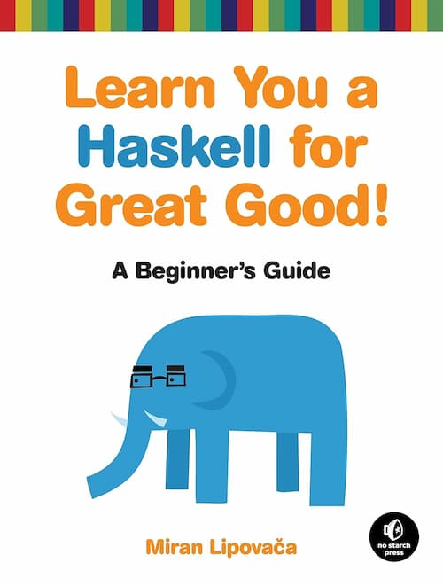

## 资源




- 中文版 https://learnyouahaskell.mno2.org/zh-cn 
- 英文版 https://learnyouahaskell.com/chapters

archlinux [参考 这里](https://wiki.archlinux.org/title/Haskell) 下安装与编译

```bash
sudo pacman -S ghc
cat > 1.hs << EOF
main = putStrLn "Hello, world!"
EOF
ghc -dynamic 1.hs
./1
```

在

最简单的方法可以是用 在线haskell: https://play.haskell.org/

## 资源

- [macM1配置haskell环境](./macM1配置haskell环境.md)
- [鹏翔万里haskell读书笔记](./鹏翔万里haskell读书笔记.md)
- [cis194](https://www.seas.upenn.edu/~cis194/spring13/lectures.html)
- [some codeforces problems that solved by  haskell at Github ](https://github.com/Vicfred/codeforces-haskell)
- [chattille haskell 学习笔记](https://chattille.github.io/haskell-notes)

## 目录

- [Chapter 1: Introduction](./chapter_1)
- [Chapter 2: Starting Out](./chapter_2)
- [Chapter 3: Types and Typeclasses](./chapter_3)
- [Chapter 4: Syntax in Functions](./chapter_4)
- [Chapter 5: Recursion](./chapter_5)
- [Chapter 6: Higher-order Functions](./chapter_6)
- [Chapter 7: Modules](./chapter_7)
- [Chapter 8: Making Our Own Types and Typeclasses](./chapter_8)
- [Chapter 9: Input and Output](./chapter_9)
- [Chapter 10: Functionally Solving Problems](./chapter_10)
- [Chapter 11: Functors, Applicative Functors and Monoids](./chapter_11)
- [Chapter 12: A Fistful of Monads](./chapter_12)
- [Chapter 13: For a Few Monads More](./chapter_13)
- [Chapter 14: Zippers](./chapter_14)

## 其它

- [accumArray](./others/accumArray.md)
- [haskell枚举](./others/枚举.md)

## haskell 在竞赛中的使用

- [haskell io](./hask_io.md)

## 练习

- [Ninety-Nine Haskell Problems](https://ninetynine.haskell.chungyc.org/)
- [Haskell 99 题学习路线](/program_language/haskell-99/)
- https://exercism.org/tracks/haskell/
