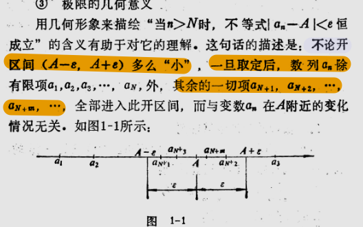

## 1. 数列极限的定义

> [!ABSTRACT] 抽象,形象化的说
> 极限 <=> 无限的接近  

> [!IDEA] 定义
> 定义对于一个无穷数列$\{a_{n}\}$，如果存在一个常数$A$，无论预先指定多么小的正数$\varepsilon$，都能在数列中找到一项$a_{N}$，使得这一项后面所有的项与$A$的差的绝对值都小于$\varepsilon$（即当$n>N$时，$|a_{n}-A|<\varepsilon$恒成立），就把常数$A$叫做数列{$a_{n}$}的极限，记作
> $$\lim_{n\to\infty}a_{n}=A.$$

> [!IDEA]  $\varepsilon-N$ 语言
> 上述定义可以简述为
> 任意给定$\varepsilon>0$，如果总存在自然数$N$，使得当$n>N$时，不等式$|a_{n}-A|<\varepsilon$恒成立，就说数列{$a_{n}$}的极限是$A$。
> 这个定义还可以用记号表示为
> $$
\begin{aligned}
&|a_{n}-A|<\varepsilon  \\
&\nwarrow \qquad \swarrow \\
& \quad n>N
\end{aligned}
$$

## 2. 极限的四则运算

> [!INFO] 信息
> 运用法则时应注意之点，对数列和函数极限是一样的．
以下是数列极限的四则运算法则：
> 如果 $\lim_{n\to\infty}a_n=A$, $\lim_{n\to\infty}b_n=B$, 那么．
> $$
\begin{align}
&\lim\limits_{n\to\infty}(a_n\pm b_n)=A\pm B  \tag 1 \\
&\lim\limits_{n\to\infty}(a_n\cdot b_n)=A\cdot B \tag 2 \\
&\lim\limits_{n\to\infty}\frac{a_n}{b_n}=\frac{A}{B} (b_n\neq 0,\ B\neq 0) \tag 3
\end{align}
$$

在使用它们时，要特别注意各个法则成立的条件．

1. 法则(1) , (2) , (3)可以推广到有限个数列的情形．
2. 法则(1) , (2) , (3)$a_n,b_n$的极限必须存在
3. 在运用法则(3)时，必须注意分母的极限不能为零．

## 3. 无穷等比数列的各项和

无穷等比数列的和

$$
S_n = 
$$

$$
\begin{align}
s_n  = a + aq + aq^2 + \cdots + aq^{n-1}  \tag 1 \\
q\times s_n  = aq + aq^2 + \cdots + aq^{n} \tag 2 \\
\end{align}
$$

$$
\begin{aligned}
(q-1)s_n &= aq^{n} - a \\
s_n &= \frac{a(q^{n} -1)}{q-1} = \frac{a(1 - q^{n} )}{1-q}
\end{aligned}
$$

于是得到

$$
\lim\limits_{n \to \infty} = \frac{a}{1-q} (1-\lim\limits_{n\to \infty} q^n)
$$

如果 $\left| q \right| < 0$

$$
\lim\limits_{n \to \infty} = \frac{a}{1-q} (1-\lim\limits_{n\to \infty} q^n) = \frac{a}{1-q}
$$

## 4. 两个重要极限

$$
\begin{align}
&\lim\limits_{x\to 0}\frac{\sin x}{x} \tag 1 \\
&\lim\limits_{x\to \infty}(1+ \frac{1}{x})^x \tag 2
\end{align}
$$

> 来自: https://www.geogebra.org/m/h6DxENYh

## 5. 函数的连续性

> [!ABSTRACT] 抽象
> 连续 <=> 没有断裂，可以一笔画成

> [!IDEA] 定义
> 设函数 $f(x)$ 在点 $x_0$ 的某个邻域内有定义，如果满足以下条件：
> $$
\lim_{x \to x_0} f(x) = f(x_0)
$$
> 则称函数 $f(x)$ 在点 $x_0$ 处连续。

### 5.1 连续性的三个条件

函数 $f(x)$ 在点 $x_0$ 处连续，必须同时满足以下三个条件：

1. **有定义**：$f(x_0)$ 存在（函数在 $x_0$ 点有定义）
2. **有极限**：$\lim_{x \to x_0} f(x)$ 存在
3. **相等**：$\lim_{x \to x_0} f(x) = f(x_0)$

> [!WARNING] 注意
> 如果上述三个条件中至少有一个不满足，则函数在点 $x_0$ 处不连续，称 $x_0$ 为函数的**间断点**。

### 5.2 增量形式定义

设函数 $f(x)$ 在点 $x_0$ 的某个邻域内有定义，如果当自变量的增量 $\Delta x$ 趋于零时，对应的函数增量 $\Delta y$ 也趋于零，即：

$$
\lim_{\Delta x \to 0} \Delta y = \lim_{\Delta x \to 0} [f(x_0 + \Delta x) - f(x_0)] = 0
$$

则称函数 $f(x)$ 在点 $x_0$ 处连续。

### 5.3 单侧连续性

> [!IDEA] 左连续
> 如果 $\lim_{x \to x_0^-} f(x) = f(x_0)$，则称函数 $f(x)$ 在点 $x_0$ 处**左连续**。

> [!IDEA] 右连续  
> 如果 $\lim_{x \to x_0^+} f(x) = f(x_0)$，则称函数 $f(x)$ 在点 $x_0$ 处**右连续**。

> [!IMPORTANT] 重要结论
> 函数 $f(x)$ 在点 $x_0$ 处连续的充分必要条件是：函数在该点既左连续又右连续。

### 5.4 区间上的连续性

- **开区间 $(a,b)$ 上的连续性**：如果函数 $f(x)$ 在开区间 $(a,b)$ 内每一点都连续，则称 $f(x)$ 在 $(a,b)$ 内连续。

- **闭区间 $[a,b]$ 上的连续性**：如果函数 $f(x)$ 在开区间 $(a,b)$ 内连续，且在左端点 $a$ 处右连续，在右端点 $b$ 处左连续，则称 $f(x)$ 在闭区间 $[a,b]$ 上连续。

### 5.5 连续函数的性质

> [!TIP] 连续函数的性质
> 1. **四则运算性质**：如果函数 $f(x)$ 和 $g(x)$ 在点 $x_0$ 处连续，则它们的和、差、积、商（分母不为零）也在点 $x_0$ 处连续。
> 
> 2. **复合函数性质**：如果函数 $u = g(x)$ 在点 $x_0$ 处连续，且函数 $y = f(u)$ 在点 $u_0 = g(x_0)$ 处连续，则复合函数 $y = f[g(x)]$ 在点 $x_0$ 处连续。
> 
> 3. **反函数性质**：如果函数 $y = f(x)$ 在区间 $I$ 上单调且连续，则其反函数 $x = f^{-1}(y)$ 也在对应的区间上单调且连续。

### 5.6 初等函数的连续性

> [!SUCCESS] 重要结论
> 所有基本初等函数（幂函数、指数函数、对数函数、三角函数、反三角函数等）在其定义域内都是连续的。
> 
> 由基本初等函数经过有限次四则运算和复合运算得到的初等函数，在其定义区间内都是连续的。

### 5.7 间断点的分类

> [!IDEA] 第一类间断点（可去间断点）
> 如果 $\lim_{x \to x_0} f(x)$ 存在，但不等于 $f(x_0)$ 或者 $f(x_0)$ 无定义，则称 $x_0$ 为**可去间断点**。

> [!IDEA] 第二类间断点
> 如果 $\lim_{x \to x_0} f(x)$ 不存在，则称 $x_0$ 为**第二类间断点**。

### 5.8 例题分析

> [!EXAMPLE] 例题1
> 讨论函数 $f(x) = \begin{cases} x^2, & x \leq 1 \\ x+1, & x > 1 \end{cases}$ 在点 $x = 1$ 处的连续性。
> 
> **解**：
> 1. 计算函数值：$f(1) = 1^2 = 1$
> 2. 计算左极限：$\lim_{x \to 1^-} f(x) = \lim_{x \to 1^-} x^2 = 1$
> 3. 计算右极限：$\lim_{x \to 1^+} f(x) = \lim_{x \to 1^+} (x+1) = 2$
> 4. 因为左极限 $\neq$ 右极限，所以极限不存在。
> 
> **结论**：函数在 $x = 1$ 处不连续，这是一个**跳跃间断点**（属于第一类间断点）。

> [!EXAMPLE] 例题2
> 讨论函数 $f(x) = \frac{\sin x}{x}$ 在点 $x = 0$ 处的连续性。
> 
> **解**：
> 1. 函数在 $x = 0$ 处无定义
> 2. 计算极限：$\lim_{x \to 0} \frac{\sin x}{x} = 1$（重要极限）
> 3. 极限存在但函数无定义
> 
> **结论**：$x = 0$ 是一个**可去间断点**。如果补充定义 $f(0) = 1$，则函数在 $x = 0$ 处连续。函数 fx 在点 x0处，连续