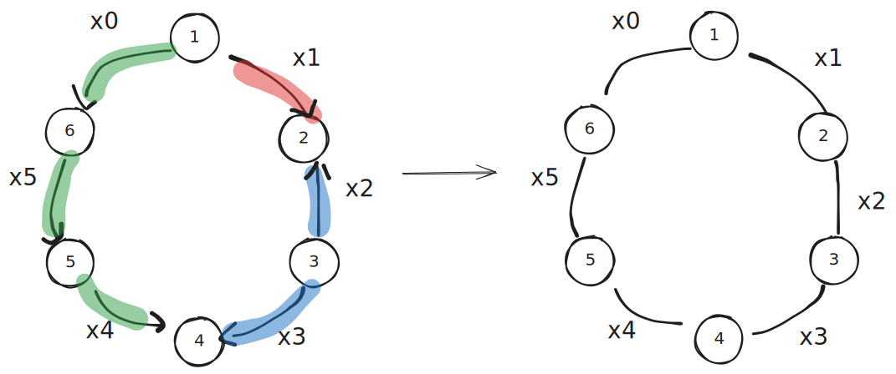
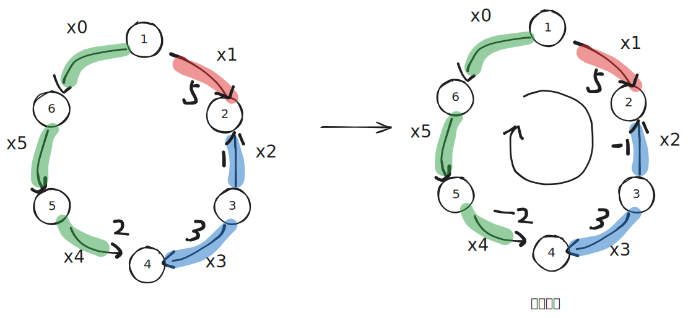
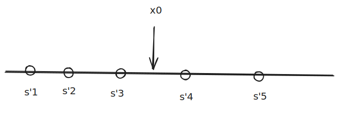
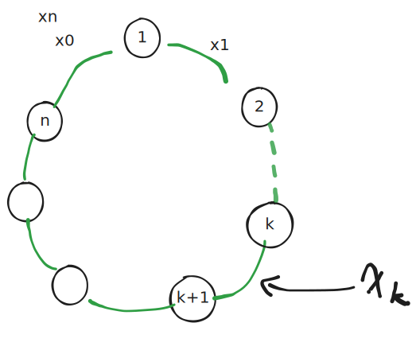

## 证明1 可链化 

> P: 必然存在某个最优解: 这个最优解中存在相邻的元素没有发生交换

这个命题的否命题:$\neg p$: 存在某个数据,这个数据的所有最优解($\forall$);任意两个相邻的元素都会发生交换,

我把这种任意两个相邻元素都发生交换的情况:我称之为:**封闭**

显然，我们要证明的就是$\neg p$是不正确的,比较直觉的想法,就是使用反正法.

使用反证法，我们需要知道反法和前提条件有一定的冲突. 那这里呢我们需要更深入的理解前提条件.

如上图所示,我们给每一条边进行编号. 我们规定,如果相邻的两个元素之间发生的交换为顺时针方向:则数值为正,反之为负.

显然很容易想到，我们所求的最小交换牌数就是

$$
sum = \sum \left| x_i  \right| \tag 1
$$

长链: 我们尽可能的把相邻的同方向的边串在一起组成的链.

设 $p_i$ 表示每一个点的净流出值,显然，我们可以得到下面公式:

$$
p_i = a_i - avg \tag 2
$$

$$
\sum_1^n p_i = 0 \tag 3
$$

当$p_i > 0$表示需要流出(给别人牌), $p_i<0$ 反之

推论一: 长链的起点和终点必然发生交换

### 参考方向

根据公式三,加上平衡理论,理论上，我们应该也可以利用$x_i$计算出$p_i$:

如上图`figure_2`左所示:  $p_2 = 5 + 1,p_3 = -1 + (-3)$,这种计算方法需要我们知道每一条边的方向以及数值. 但是:当我们每条边的变量为$x_i$,我们想要采用变量法来研究问题,写这个时候，我们也不知道每条边的具体方向,我们应该如何列出公式 $p_i$ 呢？

> 其实这个问题的核心在于: 一条边对于相邻的点具有不同的方含义,比如$x_2$对于点3就是流入,对于点3就是流出,我们需要解决这个问题.

根据电路的相关知识灵感,我们取顺时针为**参考方向**,所有与参考方向相同的边为正值,方向相反的边负值，发现：**每一个点的流入等于前一条边的数值减去后一条边的数值**,则每一个点的流入应该计算为:$x_{i-1} - x_{i \mod n}$,此流入值显然应该等于$-p_i$

$$
x_{i-1} - x_{i \mod n} + p_i = 0 \\ 
$$

变形得: 平衡公式二
$$
x_{i \mod n} = p_i + x_{i-1} \tag 4
$$

### 一元一次方程

显然想到:若知道$x_0$的值是多少,则其他所有边的值都知道,则我们可以通过 $x_0$ 的值计算出其他所有 $x_i$ 的值

> 这里其实是线性代数的内容,涉及到一个概念叫独立方程

$$
\begin{aligned}
x_0 &= x_0 \\
x_1 &= p_1 + x_0 \\
x_2 &= p_2 + x_1 &=& p_2+p_1+x_0 \\
x_3 &= p_3 + x_2 &=& p_3+p_2+p_1+x_0 \\
\cdots \\
x_{n-1} &= p_{n-1}+x_{n-2}  &=& p_{n-1} + \cdots + p_1 + x_0
\end{aligned}
$$

设 $s_i = \sum_1^i p_i$,且$\sum_1^n p_i = 0 \Rightarrow s_n = 0$, 若存在$x_n$ 则 $x_n = x_0$

$$
x_i = s_i + x_0
$$

$x_n = s_n+x_0 = x_0$

于是我们可以得到一个重要的函数:当第 n 个人与第一个人之间的交换排数为 $x_0$ 时,最小交换牌数为$F(x_0)$

$$
F(x_0) = \sum_1^n \left| {s_i + x_0} \right| \tag a
$$

### $F(x_0)$性质探究

此时，我们认为命题$\neg p$是成立的,则  $\forall i ( s_i + x_0 \neq 0)$,用集合的方法来表示就是 $x_0 \notin \{-s_1,-s_2,\cdots, -s_n\}$,对$-s_i$进行从大到小排序，得到一个新的序列$s'_i$

这就说明 x0定义域,是在数轴上去除了$s'_i$.

假设$ s'_j < x_0 < s'_{j+1}$

- 对于 $i \leqslant j$，由于 $x_0 > s'_{j} \geqslant s'_{i}$，所以 $|x_0 - s'_{i}| = x_0 - s'_{i}$
- 对于 $i > j$，由于 $x_0 < s'_{j+1} ≤ s'_{i}$，所以 $|x_0 - s'_{i}| = s'_{i} - x_0$

带入$F(x_0)$得到:

$$
\begin{aligned}
F(x_0) &= \sum_1^j(k-s'_i) + \sum_{j+1}^n(s'_i - k) \\
&= j\times k -\sum_1^j{s'_i} + ((n-j) \times -k) + \sum_{j+1} ^k s'_i \\
&= (2j-n)k -\sum_1^j{s'_i} + \sum_{j+1} ^k s'_i  \\
&= (2j-n)k + Constant
\end{aligned}
$$

其中,$Constant$表示和 $x_0$ 无关的一个定值,$F(x_0)$是一个一元一次线性方程,下面分情况讨论

- **如果 $2j - n > 0$**，$F(x_0)$ 在这个区间内是单调递增的。这意味着如果我们稍微减小 $x_0$，$F(x_0)$ 的值就会变小。我们可以一直减小 $x_0$ 直到 $x_0$ 到达区间的左端点 $s'_j$，此时成本 $F(s'_j)$ 会比区间内任何一点的成本都低。
- **如果 $2j - n < 0$**，$F(x_0)$ 在这个区间内是单调递减的。同理，我们可以一直增大 $x_0$ 直到 $x_0$ 到达区间的右端点 $s1_{j+1}$，此时成本 $F(s1_{j+1})$ 会更低。
- **如果 $2j - n = 0$**，$F(x_0)$ 在这个区间内是常数。这意味着区间内所有点的成本都一样，包括端点 $s'_j$ 和 $s'_{j+1}$

在所有情况下，如果我们有一个最优解 $x_0$ 位于开区间 $(s'_j, s'_{j+1})$ 内，我们总能找到一个新的最优解 $x_0$'（它等于 $s'_j$ 或 $s'_{j+1}$），使得 $F(x_0') \leqslant F(x_0)$

这个新的最优解 $x_0$' 属于关键点集合 $S'$。
但如果 $x_0$' 属于 $S'$，那么 $x_0' = -s_i$ 对于某个 $i$ 成立。
这意味着 $x_i = x_0' + s_i = (-s_i) + s_i = 0$
这就找到了一个最优解，其中存在一对相邻元素没有交换！

这与我们最初的假设——“任何最优解中所有相邻元素都发生交换”——产生了直接的矛盾。

### 重要规律

接下来我们发现一个非常重要的规律: 当某一条边$x_i$的数值改变时,比如说减一,那么其他所有的边都要改变(加一或减一):以达到重新的平衡.

## 证明2 求出拆分位置

通过枚举某个$x_i = 0$,来求解

根据可链化证明

假如,我们认为$x_0 = 0$,于是按照顺时针的方向，我们就依次可以算出$x_1,x_2,\cdots,x_{n-1}$,根据公式四:

$$
\begin{array}{c|c}
\hline
x_i & \text{数值} \\
\hline 
x_1 = p_1 - 0 & s_1 \\
x_2 = p_2 + p1 & s_2 \\
x_3 = p_3 +p_2 + p1 & s_3 \\
\cdots & \cdots \\
x_{n-1} & s_i \\
x_n = x_n  = 0 & s_n =0 \\
\end{array}
$$

现在我们从 $x_k$ 开始断开,那我们就是从$x_{k+1}$开始数.

$$
\begin{array}{c|c}
\hline
x_i & \text{数值} \\
\hline 
x_{k+1} = p_{k+1} - 0 & s_{k+1} - s_{k} \\
x_{k+2} = p_{k+2} + p_{k+1} & s_{k+2} - s_{k} \\
x_{k+3} = p_{k+3} p_{k+2} + p_{k+1} & s_{k+3} - s_{k} \\
\cdots & \cdots \\
x_n = p_n +\cdots + p_{k+1}  & s_{n} - s_{k} \\
x_1 = p_1 + x_n & s_1 +s_n-s_k \\
x_2 = p_2 + x_1 & s_2 +s_n-s_k \\
x_3 = p_3 + x_2 & s_3 +s_n-s_k \\
\cdots & \cdots 
\end{array}
$$

我们又知道$s_n = \sum p_i = 0$

$$
\begin{array}{c|c}
\hline
x_i & \text{数值} \\
\hline 
x_{k+1} = p_{k+1} - 0 & s_{k+1} - s_{k} \\
x_{k+2} = p_{k+2} + p_{k+1} & s_{k+2} - s_{k} \\
x_{k+3} = p_{k+3} p_{k+2} + p_{k+1} & s_{k+3} - s_{k} \\
\cdots & \cdots \\
x_n = p_n +\cdots + p_{k+1}  & s_{n} - s_{k} \\
x_1 = p_1 + x_n & s_1 -s_k \\
x_2 = p_2 + x_1 & s_2 -s_k \\
x_3 = p_3 + x_2 & s_3 -s_k \\
\cdots & \cdots 
\end{array}
$$

所以我们得到,从$x_k$处断开得到的函数$F(k)$

$$
F(k) = \sum \left| s_i-s_k \right| \tag b
$$

如果从$x_0$,也就是$x_n$处断开 $F(n) = \sum \left| s_i - s_n \right| = \sum \left| s_i \right|$,符合题目.

且公式 b,显然就是: 一堆数中,选哪个数$x$,求其它数到$x$的距离和最小? 中位数:

1. 如果数字的数量是奇数,则选择排序后中间的那个数字
2. 如果数字的数量是偶数,则选择排序后中间的那个两个之一都可以