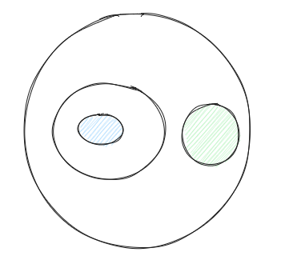
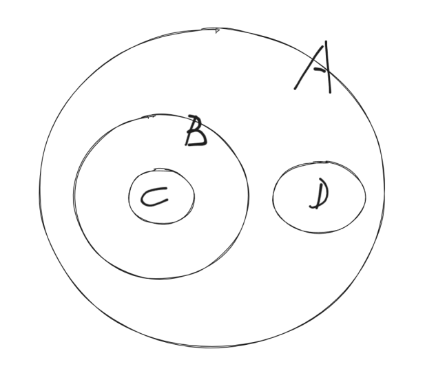
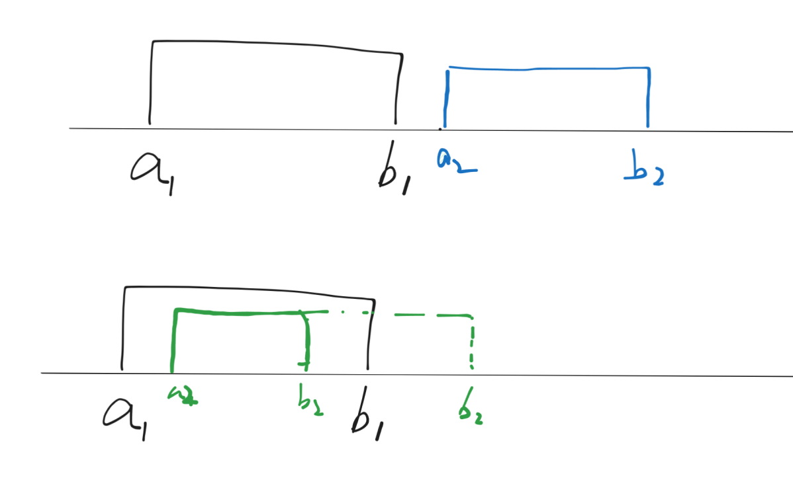

## 二. 区间选点

题目： Radar INstallation AcWing112

对于这个问题的抽象:

1. 多个区间，添加最少点，使得每个区间都含有点。
2. 最少点使得多个区间含有点
3. **区间选点**问题

‍

### 基本思路$O(n^2)$​

区间a,b有两种关系， 1. 分离 2. 含有公共部分（ 包含，相交）

‍

每个区间都可以看成一个集合，这个问题就变成了使用最少的元素，使得每个集合都至少含有一个元素，（决策集合）

对于任意的关系的集合 $A_1,A_2,\cdots,A_n$,来说

1. 情况$1$: 如果有 n 个集合,写这 n 个几何的交集不空,那么答案集合就是这 n 个集合的交集
2. 情况$2$: n个集合的交集是空集,如下图所示,答案集合是两个集合, 

    1. 
3. **结论**： 当你做出一个答案集合$X$之后，如果能更小（发现和另一个答案集合$Y$有交集，那么答案就是$X \cap Y$），那就更小。

对于某个集合$A_1$来说,如何找到它所对应的答案集合呢？根据上面的结论:

1. 使用集合 $A_1$,和其他集合:$A_2,A_3,\cdots,A_n$尝试进行交集运算,得到的最小非空集合就是答案集合
2. $A_1 \cap A_i \cap A_j \cap \cdots  \neq \varnothing$ ,$X = \{A_i | A_1 \cap \bigcap A_i \neq \varnothing \}$ 那么 x 集合里面的元素就是我们所要找的和 A1集合交起来非空的那些集合
3. 这样的话，我们把 x 集合里的元素全部打上标记，从原集合里面去除,在剩余的集合里面再去按照这个方法去寻找
4. 总体时间复杂度为$n^2$

‍

### 优化$O(n)$​

上面的时间范围度为 $n^2$,那么，还有更快的方法吗？

‍

​

如果我们可以对所求的集合进行排序,使得属于同一个 x 集合(集 x 集合内部的所有的集合相交不为空) ,例如` A B C D` , `C B A D`​

那么我们就可以从头到尾进行遍历,因为集合的交集运算是一种迭代运算,当我们算到某一步，发现交集为空时,我们就得到了一个答案,

那么这个排序后的序列，后面的问题就可以作为一个整体问题,这显然是一种 dp 或者是分解子问题的思想.

‍

‍

回到这一个区间选点问题,如果我们对区间进行排序(先按照区间的起始位置,然后再按照区间的结束位置),我们能够能够交在一起的区间保证都在一起吗？

​

对于排序后的第一个区间$[a_1,b_1]$来说,它和第2个区间有两种关系

1. 情况一:两个区间没有公共部分,则第一个区间和后边的所有的区间都不会有公共部分,此时去除第一个区间之后，问题变成一个新的子问题
2. 情况二:第一个区间和第2个区间有交集(存在公共部分),

    1. 根据上面的推导: 则这个答案区间一定是这两个区间的交集$B$.
    2. 此时此刻第1个区间和第2个区间可以从数轴上删除,添加一个新的区间,也就是他们俩的交集 B,显然并不会影响最终答案
    3. 重复的执行操作2,直到变成情况一,这种情况,此时就会得到第一个答案区间,也就是区间$[a_1,b_1]$所对应的答案区间
3. 显然，上面这种操作是递归,根据所学知识，所有的递归都是可以使用数学归纳法来证明,(上面的整个过程显然是正确的)

‍

**由此，我们证明完毕，我们的贪心过程 🎉🎊**

还有一个重要的结论， 会枚举每一个区间，所以不会漏
