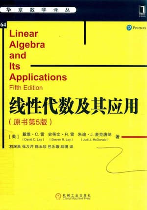

## 第一章 线性方程组

- [1.1 线性方程组](./1.1.md)
- [1.2 行化简与阶梯型矩阵](./1.2.md)
- [1.3 向量方程](./1.3.md)
- [1.4 矩阵方程 Ax=b](./1.4.md)
- [1.5 解集的结构](./1.5.md)
- [1.6 线性方程组的应用](./1.6.md)
- [1.7 线性无关](./1.7.md)
- [1.8 线性变换](./1.8.md)
- [1.9 线性变换的矩阵](./1.9.md)
- [1.10 线性模型](./1.10.md)