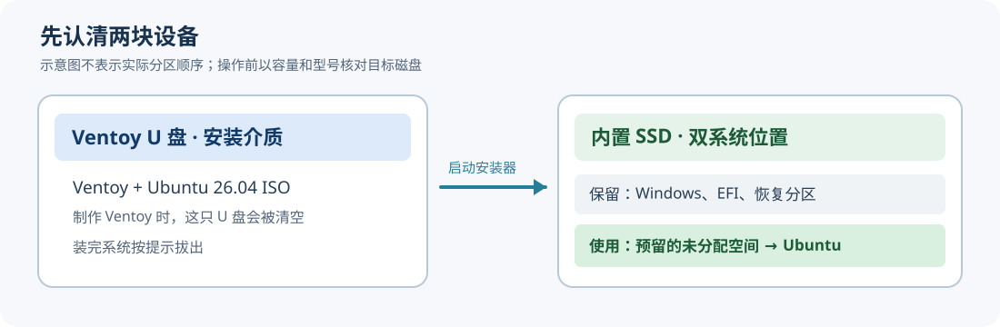

这个 ESP32 系列从 Ubuntu 开发环境开始，但安装 ESP-IDF 之前，电脑得先能启动 Ubuntu。本文记录 **Windows 11 已安装、用 Ventoy U 盘安装 Ubuntu 26.04 Desktop** 的流程。先在 Windows 里备份并腾出空间，再用 U 盘启动 Ubuntu 安装器，最后分别验证两个系统都能进入。[下一篇](./01-ubuntu-26-esp-idf-eim-vscode.md)才安装 EIM、ESP-IDF 和 VS Code。

> [!INFO] 适用范围与验证状态
> 本文以 **x86-64 电脑、UEFI 启动、GPT 内置磁盘**为主线，重点讲 Windows 与 Ubuntu 共用一块内置盘的情况；两块盘的差异单列说明。Ubuntu 26.04 的安装界面、磁盘编号和固件启动键会随电脑变化。本文依据截至 2026-09-24 的 Ubuntu、Ventoy、微软官方资料和所给参考文章整理，尚未拿到目标电脑的磁盘布局、BitLocker 状态及实机安装截图，因此每个磁盘操作都以**本机界面核对结果**为准。



*图：Ventoy 在 U 盘上，Windows 和 Ubuntu 在内置盘上。方框是角色示意，**不是**实际分区顺序。*

## 0. 开始前核对四件事

1. **备份**：把 Windows 里的重要文件另存到外接盘或云端；确认能打开备份文件。安装 Ventoy 会清空所选 U 盘，备份 U 盘里的文件。
2. **恢复密钥**：在 Windows 搜索“管理 BitLocker”，也检查“设置 → 隐私和安全性 → 设备加密”。如果任一磁盘启用了加密，先按[微软说明](https://support.microsoft.com/en-us/windows/finding-your-bitlocker-recovery-key-in-windows-6b71ad27-0b89-ea08-f143-056f5ab347d6)确认 48 位恢复密钥**能从这台电脑以外的地方取得**，不要把密钥保存在待重分区的同一块盘上。固件或启动设置变化可能触发恢复密钥提示。
3. **启动方式**：在 Windows 按 `Win + R`，输入 `msinfo32`，确认“BIOS 模式”为 **UEFI**。在“磁盘管理”中记下 Windows 所在物理磁盘的容量、分区与 GPT 样式。若机器显示 Legacy/MBR，本文的 UEFI/GPT 分区步骤不适用，应先确认机器的现有启动方式。
4. **空间与电源**：Ubuntu 官方最低要求至少 25 GB 空间；为了后续 ESP-IDF 工具链、源码和构建目录，本文建议**按个人磁盘余量预留 80–120 GB**。这是学习用途的建议值，不是 Ubuntu 的最低要求。笔记本接电源，准备一只 **至少 16 GB** 的 U 盘（Ubuntu 官方要求至少 8 GB；这里给 6 GB 左右的桌面 ISO 和 Ventoy 留余量）。[Ubuntu 安装教程](https://ubuntu.com/desktop/docs/en/26.04/tutorial/install-ubuntu-desktop/)给出了最低空间、U 盘和备份要求。

> [!WARNING] 停在这里核对
> 如果备份不可用、BitLocker 恢复密钥找不到、分不清内置盘与 U 盘，先不要进入分区或 Ventoy 的“安装”按钮。下面不会给出可照抄的 `/dev/sda`、`/dev/nvme0n1` 分区号，因为它们不是跨机器固定的。

## 1. 下载并校验 Ubuntu 26.04 Desktop ISO

在 [Ubuntu 26.04 官方发布目录](https://releases.ubuntu.com/26.04/)下载 **Desktop AMD64** 镜像。截至本文日期，目录中已有 `ubuntu-26.04.1-desktop-amd64.iso`；不要误选 Server、WSL 或 ARM 镜像。如果官网以后推出更新的点版本，以同一页面列出的当前 Desktop AMD64 文件名为准。

同时下载同目录的 `SHA256SUMS`。在 Windows PowerShell 中计算镜像哈希；把命令里的文件名换成实际下载的 ISO：

```powershell
Get-FileHash "$env:USERPROFILE\Downloads\ubuntu-26.04.1-desktop-amd64.iso" -Algorithm SHA256
```

把输出的 `Hash` 与 `SHA256SUMS` 中**同名 ISO 那一行**逐字符比较。两者不一致就重新下载，不要继续制作 U 盘。[微软 `Get-FileHash` 文档](https://learn.microsoft.com/en-us/powershell/module/microsoft.powershell.utility/get-filehash)说明了此命令。校验哈希能发现下载损坏；要进一步验证发布者身份，可按 Ubuntu 的镜像校验文档检查 `SHA256SUMS.gpg` 签名。

## 2. 用 Ventoy 制作启动 U 盘

从 [Ventoy 官方下载页](https://www.ventoy.net/en/download.html)进入其提供的下载位置，取得 Windows 版压缩包并解压。Ubuntu 的[启动 U 盘文档](https://ubuntu.com/desktop/docs/en/26.04/how-to/create-a-bootable-usb-stick/)指出 **Ventoy 1.1.11 有安装问题**，不要使用该版本；使用已修复的较新版本，并先核对 Ventoy 官网列出的 SHA-256 与下载文件。

1. 插入要清空的 U 盘，打开 `Ventoy2Disk.exe`。核对设备**容量、型号与盘符**，确保选中 U 盘而不是内置 SSD；不要为了“找不到 U 盘”就打开 `Show all devices` 后盲选。
2. 此文面向 UEFI/GPT 机器，在 Ventoy 的 `Option → Partition Style` 选 **GPT**。这是 **U 盘**的分区样式设置，不会把 Windows 内置盘转换成 GPT。
3. 若电脑启用了 Secure Boot，可在 Ventoy 的 `Option → Secure Boot Support` 查看对应支持选项，并阅读[Ventoy 首次启动的密钥登记说明](https://www.ventoy.net/en/doc_secure.html)。Ventoy 的这一实现有自己的信任策略；如果电脑或单位策略不允许登记 Ventoy 密钥，就改用 Ubuntu 官方文档中的其他 U 盘写入工具。**不应为制作 U 盘而默认关闭 Secure Boot。**
4. 点击 `Install`，读清两次清空 U 盘提示后确认。完成后，**把 ISO 文件原样复制**到 Ventoy 的大数据分区；不要解压 ISO，也不要再用 Rufus 覆写这个 U 盘。弹出 U 盘后重新插入，确认 ISO 文件能看到。

[Ventoy 官方入门文档](https://www.ventoy.net/en/doc_start.html)说明：首次安装 Ventoy 会格式化目标 U 盘；此后只需复制 ISO 文件，启动时在 Ventoy 菜单选择镜像。与参考文章使用 Rufus 的做法相比，这一步是本篇最明显的变化。

## 3. 在 Windows 中给 Ubuntu 留未分配空间

按 `Win + X → 磁盘管理`，或 `Win + R` 输入 `diskmgmt.msc`。先找到**装有 Windows 的内置物理磁盘**，核对总容量、C 盘和已有的 EFI、恢复分区。右键空间充足的 Windows 数据卷，选择“**压缩卷**”，按计划输入压缩量；例如预留约 100 GiB 时，输入 `102400` MB。压缩完成后，应看到一块黑色标识的“**未分配**”空间。[微软磁盘管理说明](https://support.microsoft.com/en-us/windows/experience/storage-filemanagement/disk-management-in-windows)给出了压缩卷入口。

**到此为止，不要在 Windows 里把这块未分配空间新建成 E 盘、格式化成 NTFS 或分配盘符。**Ubuntu 安装器将使用它。也不要删除现有的 EFI 系统分区、Windows 恢复分区或 C 盘。

### BitLocker 开着怎么办

参考文章写“必须关闭 BitLocker”，这对 Ubuntu 26.04 过于绝对。[Ubuntu 26.04 发布说明](https://documentation.ubuntu.com/release-notes/26.04/summary-for-lts-users/#dual-boot-enhancements)写明：有足够未分配空间时，可以在已有 BitLocker 分区旁安装 Ubuntu。**这不表示安装器可以随意改动加密的 Windows 分区。**本篇先由 Windows 自己压缩卷，给 Ubuntu 留出明确的未分配空间；进安装器后只接受能清楚显示 Windows 保留、Ubuntu 使用目标空闲空间的方案。

如果安装器仍提示 BitLocker 阻碍安装，**停止，不要选“擦除磁盘”绕过**。回到 Windows，按 [Ubuntu 的 BitLocker 说明](https://ubuntu.com/desktop/docs/en/26.04/tutorial/install-ubuntu-desktop/#alert-windows-bitlocker-is-enabled)判断是否需要关闭加密并等待解密完成；操作前再次确认备份和恢复密钥。微软的“设备加密”和手动开启的 BitLocker 都应纳入检查。

## 4. 从 Ventoy 以 UEFI 模式启动 Ubuntu

让 U 盘保持插入，从 Windows 选择“重启”，在开机菜单里选 **UEFI: U 盘名称**。启动菜单键因机器而异，常见 `F12`、`Esc`、`F2`；也可从 Windows“高级启动”进入 UEFI 固件设置。Ventoy 菜单出现后选择刚复制的 Ubuntu Desktop ISO。若看到 Ventoy 首次 Secure Boot 密钥登记界面，按其[官方说明](https://www.ventoy.net/en/doc_secure.html)判断是否接受；不要看到陌生密钥登记画面就连续确认。

先选 **Try Ubuntu（试用）**，检查键盘、触控板、网络、显示和安装器能否看到目标内置盘。试用模式不会安装系统。若安装器报告 **Intel RST** 或看不到内置盘，先停下并阅读 [Ubuntu 的 RST 说明](https://ubuntu.com/desktop/docs/en/26.04/tutorial/install-ubuntu-desktop/)；直接在固件里从 RST 切到 AHCI 可能使原有 Windows 无法启动。

参考文章还建议先关 Windows Fast Startup 和固件 Secure Boot。这里不把二者设成通用前提：Windows 的“重启”会走完整启动过程；Ventoy 有 Secure Boot 支持。若日后要从 Ubuntu **写入** Windows NTFS 分区，应先处理 Windows 快速启动/休眠状态，避免在 Windows 未完全关闭时写入共享分区。启动设置任何改动之前，都应确保 BitLocker 恢复密钥已备份。[微软对 Fast Startup 的说明](https://learn.microsoft.com/en-us/troubleshoot/windows-client/setup-upgrade-and-drivers/fast-startup-causes-system-hibernation-shutdown-fail)。

## 5. 安装 Ubuntu，与 Windows 共存

在试用桌面启动安装器，按实际界面选语言、键盘和网络。到了**磁盘设置**页面再放慢速度：

1. 如果出现“**安装 Ubuntu，与 Windows 共存**”或相同意思的选项，确认它识别到了正确的 Windows 安装与目标内置盘。继续到最终确认页，检查摘要只把**计划预留的空间**用于 Ubuntu，没有删除或格式化 Windows、EFI、恢复分区。
2. 如果共存选项不存在，而“手动分区”清晰显示了目标未分配空间，可以在**未分配空间**里建 Ubuntu 的 ext4 根分区 `/`。已有的 EFI 系统分区用于 UEFI 启动，若安装器要求指定挂载点，可按界面把现有 EFI 分区挂载到 `/boot/efi`，**不要格式化它**。安装器界面或磁盘布局与你看到的不同，就退回检查，不要猜磁盘编号。
3. 如果只看到“**擦除磁盘并安装 Ubuntu**”，或者摘要要删除 Windows 分区，**不要继续**。先检查 UEFI 启动方式、BitLocker 提示、RST 提示与目标盘选择。`/dev/nvme0n1` 是整块盘，`/dev/nvme0n1p1` 才是该盘上的某个分区；不能把参考文章的设备名当作自己机器的 EFI 分区号。

本篇不规定“必须建一个等于内存大小的 swap 分区”或“必须单独建 `/home`”。对首次安装，先让安装器在目标空间完成默认布局更清楚；休眠和自定义分区留到理解实际需求后再做。安装摘要确认无误后才点击真正写盘的按钮。[Ubuntu 26.04 官方安装教程](https://ubuntu.com/desktop/docs/en/26.04/tutorial/install-ubuntu-desktop/)也把手动分区定位为进阶方式。

### 如果 Windows 与 Ubuntu 装在两块盘

在磁盘设置页按**容量、型号和现有分区**区分两块内置盘。Ubuntu 安装器允许选择另一块盘，但“擦除磁盘”只在你明确同意**清空选中的目标盘**时才能使用；安装摘要仍要核对 Windows 所在盘没有改动。两块盘也不意味着可以跳过备份或恢复密钥。本文的“压缩 C 盘”步骤只适用于需要从 Windows 所在盘腾空间的情况。

## 6. 重启并验证两个系统

安装器提示完成后重启，按提示拔掉 Ventoy U 盘。启动菜单可能显示 Ubuntu 与 Windows Boot Manager，也可能因固件启动顺序直接进入其中一个系统；**是否显示 GRUB 菜单不是唯一验收标准**。分别进入 Ubuntu 和 Windows，检查：

- Ubuntu 登录正常；打开终端运行 `cat /etc/os-release`，能看到 `VERSION_ID="26.04"`，并确认网络、存储和输入设备工作。
- Windows 11 仍能登录，原 C 盘文件与应用可访问；如要求输入 BitLocker 恢复密钥，使用事先备份的对应密钥。
- 在 Ubuntu 的“磁盘”工具或 Windows 磁盘管理里，确认 Ubuntu 使用的是预留空间，Windows、EFI 与恢复分区仍在。

如果重启后直接进 Windows，先用固件的一次性启动菜单找 **Ubuntu** 启动项，再检查启动顺序。不要立即按参考文章的做法添加第三方 Boot-Repair PPA 并自动修复；那会改动引导配置，而问题也可能只是启动顺序。

完成这三项，才算双系统安装结束。下一步进入[第 1 篇：在 Ubuntu 26.04 安装 ESP-IDF、EIM 和 VS Code](./01-ubuntu-26-esp-idf-eim-vscode.md)。

## 参考资料

- [Ubuntu 26.04 Desktop 安装教程](https://ubuntu.com/desktop/docs/en/26.04/tutorial/install-ubuntu-desktop/)、[发布镜像与 SHA256SUMS](https://releases.ubuntu.com/26.04/)、[双系统改进说明](https://documentation.ubuntu.com/release-notes/26.04/summary-for-lts-users/#dual-boot-enhancements)
- [Ubuntu 创建启动 U 盘指南：Ventoy 已知版本问题](https://ubuntu.com/desktop/docs/en/26.04/how-to/create-a-bootable-usb-stick/)
- [Ventoy 下载](https://www.ventoy.net/en/download.html)、[安装与复制 ISO](https://www.ventoy.net/en/doc_start.html)、[Secure Boot 说明](https://www.ventoy.net/en/doc_secure.html)
- [微软：磁盘管理](https://support.microsoft.com/en-us/windows/experience/storage-filemanagement/disk-management-in-windows)、[查找 BitLocker 恢复密钥](https://support.microsoft.com/en-us/windows/finding-your-bitlocker-recovery-key-in-windows-6b71ad27-0b89-ea08-f143-056f5ab347d6)
- [用户提供的 Windows + Ubuntu 参考文章](https://zhuanlan.zhihu.com/p/1986476457430643786)（本文按 Ubuntu 26.04 与 Ventoy 重写）
