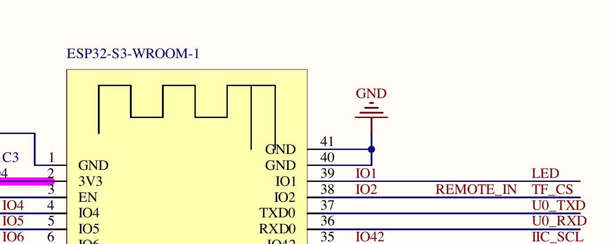
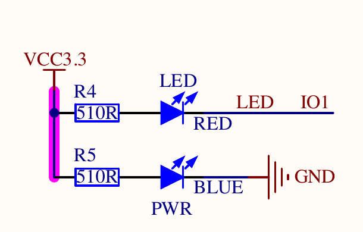

[上一篇](./01-ubuntu-26-esp-idf-eim-vscode.md)介绍了 ESP-IDF、EIM 与 VS Code 的安装，以及用 `hello_world` 验证编译的方法。这一篇跟着《DNESP32S3 使用指南（IDF 版）》第 10 章，控制**正点原子 DNESP32S3 的红色用户 LED**。我们会做两遍同一件事：

- **2.1 单文件点灯**：除 ESP-IDF 必需的构建文件外，应用逻辑全写在 `main/main.c`，先弄明白 GPIO 怎样让灯亮灭。
- **2.2 BSP 分层点灯**：保持引脚、时序和实验现象不变，把板级细节从 `main.c` 移到 `components/BSP/LED/`，再比较这样做的收益与成本。

两节各有一个[可独立构建的示例工程](https://github.com/Rainboylvx/esp32-learning-code/tree/main/examples)；建议先完成 2.1，再读 2.2。

> [!INFO] 验证范围
> [2.1 单文件工程](https://github.com/Rainboylvx/esp32-learning-code/tree/main/examples/02-01-main-led/)和[2.2 BSP 工程](https://github.com/Rainboylvx/esp32-learning-code/tree/main/examples/02-02-bsp-led/)都已在 macOS 的 ESP-IDF v5.5.5 下执行 `idf.py set-target esp32s3`、`idf.py build`，编译成功。Ubuntu 26.04 实机及开发板当前未接入；串口号、烧录和实际闪灯仍须在目标机器上验证。

## 先读原理图：GPIO1 控制哪盏灯

下面两幅是 `ATK_DNESP32S3_V1.2.pdf` 的局部图（图源：正点原子课程资料）。第一幅找芯片引脚，第二幅顺着同名网络找到 LED 电路。



*图 1：模组的物理 39 脚标为 IO1，网络名为 `LED`。程序里用的是 GPIO1，不是 GPIO39。*



*图 2：`VCC3.3 → R4（510 Ω）→ 红色 LED → LED/IO1`。下方蓝色 `PWR` 灯接电源与 GND，是电源指示灯，不由 GPIO1 控制。*

因此，GPIO1 输出**低电平**时，电流经 R4 和红色 LED 流向 GPIO1，红灯点亮；输出**高电平**时红灯熄灭。教材第 10 章和官方 `01_led` 工程也使用 GPIO1。

| 要核对的量 | 本篇取值 |
| --- | --- |
| 目标芯片 | ESP32-S3：`esp32s3` |
| 红色用户 LED | GPIO1（模组物理 39 脚） |
| 有效电平 | 低电平亮，高电平灭 |
| 预期现象 | 亮 500 毫秒、灭 500 毫秒，循环 |

## 2.1 一个 `main.c` 完成点灯

### 用 `idf.py` 创建空工程

先激活 ESP-IDF；**每开一个新终端都要重新激活**。下方的 v5.5.5 是本机 macOS 上已验证的 EIM 安装版本。Ubuntu 用户先按[上一篇的激活步骤](./01-ubuntu-26-esp-idf-eim-vscode.md)找到本机脚本，替换这一行的版本号。项目路径不要包含空格。

```bash
source "$HOME/.espressif/tools/activate_idf_v5.5.5.sh"
idf.py --version
mkdir -p "$HOME/esp"
cd "$HOME/esp"
idf.py create-project 02-01-main-led
cd 02-01-main-led
mv main/02-01-main-led.c main/main.c
```

`create-project` 生成根目录和 `main/` 的 CMake 文件，以及一个空的 `app_main()`。它没有自动选择 ESP32-S3。根目录 `CMakeLists.txt` 保持生成的 `project(02-01-main-led)`；我们只需要把 `main/CMakeLists.txt` 改成：

```cmake
idf_component_register(SRCS "main.c"
                    INCLUDE_DIRS "."
                    PRIV_REQUIRES esp_driver_gpio)
```

这里显式写出 `main` 的 GPIO 驱动依赖；`driver/gpio.h` 只在 `main.c` 中使用，所以采用 `PRIV_REQUIRES`。再在根目录新建 `sdkconfig.defaults`，记录目标芯片和这块板的 16 MB Flash：

```text
CONFIG_IDF_TARGET="esp32s3"
CONFIG_ESPTOOLPY_FLASHSIZE_16MB=y
```

此时还没有 BSP。`main.c` 是**唯一承载应用逻辑的 C 文件**；CMake 和 `sdkconfig.defaults` 是构建配置，不是另一套点灯代码。

### 在 `main.c` 直接控制 GPIO

把 `main/main.c` 完整替换为下面的代码：

```c
#include <stdbool.h>
#include "driver/gpio.h"
#include "esp_check.h"
#include "esp_log.h"
#include "freertos/FreeRTOS.h"
#include "freertos/task.h"

#define LED_GPIO GPIO_NUM_1

static const char *TAG = "led_demo";

static esp_err_t led_set(bool on)
{
    return gpio_set_level(LED_GPIO, on ? 0 : 1);
}

static esp_err_t led_init(void)
{
    const gpio_config_t config = {
        .pin_bit_mask = 1ULL << LED_GPIO,
        .mode = GPIO_MODE_OUTPUT,
        .pull_up_en = GPIO_PULLUP_DISABLE,
        .pull_down_en = GPIO_PULLDOWN_DISABLE,
        .intr_type = GPIO_INTR_DISABLE,
    };

    esp_err_t err = gpio_config(&config);
    if (err != ESP_OK) {
        return err;
    }
    return led_set(false);
}

void app_main(void)
{
    ESP_ERROR_CHECK(led_init());

    while (1) {
        ESP_ERROR_CHECK(led_set(true));
        ESP_LOGI(TAG, "LED on");
        vTaskDelay(pdMS_TO_TICKS(500));

        ESP_ERROR_CHECK(led_set(false));
        ESP_LOGI(TAG, "LED off");
        vTaskDelay(pdMS_TO_TICKS(500));
    }
}
```

看这段程序时抓住三件事：`gpio_config()` 将 GPIO1 配成输出；`led_set(true)` 输出 **0** 才是点亮红灯；`pdMS_TO_TICKS(500)` 把 500 毫秒换成 FreeRTOS tick 数。`ESP_ERROR_CHECK` 会在 GPIO 调用失败时报告错误，日志则帮助我们把程序状态和肉眼看到的灯对起来。

### 编译与实板验收

在 `02-01-main-led` 根目录运行。`set-target` 只需在新工程首次选择芯片时执行：

```bash
idf.py set-target esp32s3
idf.py build
grep -E 'CONFIG_IDF_TARGET=|CONFIG_ESPTOOLPY_FLASHSIZE=' sdkconfig
```

配置应显示 `esp32s3`、`16MB`。`Project build complete` 且命令以 0 退出，表示固件编译成功；它还不能证明 LED 闪烁。以后只改普通 C 代码，直接重新 `idf.py build` 即可。

用支持数据传输的 USB 线连接开发板，插拔前后分别列出设备，找出**新出现的串口**。Ubuntu 常见 `/dev/ttyUSB*` 或 `/dev/ttyACM*`；macOS 用 `/dev/cu.*`。以下两条按操作系统选一条运行：

```bash
# Ubuntu
find /dev -maxdepth 1 \( -name 'ttyUSB*' -o -name 'ttyACM*' \) -print | sort

# macOS
find /dev -maxdepth 1 -name 'cu.*' -print | sort
```

确认端口属于开发板后，将下面**引号内的示例路径**换成刚找到的实际路径：

```bash
idf.py -p '/dev/cu.替换为开发板端口' flash monitor
```

Ubuntu 用户把整段路径换成自己的 `/dev/ttyUSB*` 或 `/dev/ttyACM*` 端口。`flash monitor` 会先编译，再烧录并打开串口监视器，无需先单独运行 `build`。本机目前看到的 `/dev/cu.usbmodem301NTBKCY8612` 是 Steam 控制器，**不是**这块开发板的端口。

验收要同时满足两项：Monitor 交替打印 `LED on`、`LED off`；板上的**红色用户 LED**亮约 0.5 秒、灭约 0.5 秒并循环。蓝色 `PWR` 灯持续亮属于正常供电现象。Monitor 用 `Ctrl+]` 退出；若 Linux 报串口权限不足，按[上一篇的串口权限步骤]()处理。

## 2.2 把同一程序整理成 BSP

### BSP 到底是什么

**BSP（Board Support Package，板级支持包）**是把“这块板子怎么接线、怎么初始化和控制外设”的代码集中起来的一种组织方式。这里 `components/BSP` 是我们给 ESP-IDF **组件**取的名字；ESP-IDF 负责按组件的 CMake 声明编译和链接，`BSP` 这个目录名并不会自动赋予特殊功能。

在 2.1，`main.c` 同时知道“每 500 毫秒亮灭一次”和“LED 接 GPIO1、低电平亮”。现在保留前者，把后者移到 BSP。为便于重做和对照，[2.2 工程](https://github.com/Rainboylvx/esp32-learning-code/tree/main/examples/02-02-bsp-led/)是独立快照；两个工程运行后的灯和日志应该完全一样。

### 从 2.1 工程开始重构

在 `~/esp` 创建第二个空工程，复制 2.1 的主程序和配置，再新建 BSP 目录：

```bash
cd "$HOME/esp"
idf.py create-project 02-02-bsp-led
cd 02-02-bsp-led
mv main/02-02-bsp-led.c main/main.c
cp ../02-01-main-led/main/main.c main/main.c
cp ../02-01-main-led/sdkconfig.defaults sdkconfig.defaults
mkdir -p components/BSP/LED
```

在 `components/BSP/LED/led.h` 声明 BSP 对应用层提供的两个动作：

```c
#pragma once

#include <stdbool.h>
#include "esp_err.h"

esp_err_t led_init(void);
esp_err_t led_set(bool on);
```

在 `components/BSP/LED/led.c` 放入原来 `main.c` 里的 GPIO 细节。GPIO1 和低电平有效只在这里出现：

```c
#include "led.h"
#include "driver/gpio.h"

#define LED_GPIO GPIO_NUM_1

esp_err_t led_init(void)
{
    const gpio_config_t config = {
        .pin_bit_mask = 1ULL << LED_GPIO,
        .mode = GPIO_MODE_OUTPUT,
        .pull_up_en = GPIO_PULLUP_DISABLE,
        .pull_down_en = GPIO_PULLDOWN_DISABLE,
        .intr_type = GPIO_INTR_DISABLE,
    };

    esp_err_t err = gpio_config(&config);
    if (err != ESP_OK) {
        return err;
    }
    return led_set(false);
}

esp_err_t led_set(bool on)
{
    return gpio_set_level(LED_GPIO, on ? 0 : 1);
}
```

在 `components/BSP/CMakeLists.txt` 注册 BSP 组件：

```cmake
idf_component_register(SRCS "LED/led.c"
                    INCLUDE_DIRS "LED"
                    PRIV_REQUIRES esp_driver_gpio)
```

`main/CMakeLists.txt` 不再直接依赖 GPIO 驱动，改为依赖 BSP：

```cmake
idf_component_register(SRCS "main.c"
                    INCLUDE_DIRS "."
                    PRIV_REQUIRES BSP)
```

最后，把 `main/main.c` 中的 `led_init()`、`led_set()` 实现移走，留下调用：

```c
#include "esp_check.h"
#include "esp_log.h"
#include "freertos/FreeRTOS.h"
#include "freertos/task.h"
#include "led.h"

static const char *TAG = "led_demo";

void app_main(void)
{
    ESP_ERROR_CHECK(led_init());

    while (1) {
        ESP_ERROR_CHECK(led_set(true));
        ESP_LOGI(TAG, "LED on");
        vTaskDelay(pdMS_TO_TICKS(500));

        ESP_ERROR_CHECK(led_set(false));
        ESP_LOGI(TAG, "LED off");
        vTaskDelay(pdMS_TO_TICKS(500));
    }
}
```

根目录 `CMakeLists.txt` 仍由 `create-project` 生成，项目名应为 `project(02-02-bsp-led)`。此时目录结构是：

```text
02-02-bsp-led/
├── CMakeLists.txt
├── sdkconfig.defaults
├── main/
│   ├── CMakeLists.txt
│   └── main.c
└── components/
    └── BSP/
        ├── CMakeLists.txt
        └── LED/
            ├── led.h
            └── led.c
```

在 `02-02-bsp-led` 根目录重新选择目标并编译：

```bash
idf.py set-target esp32s3
idf.py build
```

接板后按 2.1 的方法确认串口，再运行 `idf.py -p '实际串口路径' flash monitor`。验收标准与 2.1 完全相同。还可以在两个工程里分别搜索 `GPIO_NUM_1`：2.1 只应在 `main/main.c` 找到，2.2 只应在 `components/BSP/LED/led.c` 找到。这是板级细节从应用层移出的直接证据。

### 这次分层到底得到了什么

| 比较 | 2.1 单文件 | 2.2 BSP |
| --- | --- | --- |
| `main.c` 管什么 | 闪烁时序、GPIO1、有效电平 | 闪烁时序与日志 |
| GPIO1 和低电平有效在哪 | `main/main.c` | `components/BSP/LED/led.c` |
| 依赖关系 | `main → esp_driver_gpio` | `main → BSP → esp_driver_gpio` |
| 改板卡接线时 | 修改应用文件 | 集中修改 BSP 实现 |
| 额外成本 | 文件少 | 多了头文件、实现文件和组件 CMake |

**BSP 的收益是隔离板级细节，不是让这一盏 LED 闪得更好。**如果程序只有一个灯，2.1 更直接；当按键、蜂鸣器等外设陆续加入时，统一的板级接口能防止应用流程里到处散落引脚和有效电平。`led_set(bool)` 也没有让程序自动兼容其他板子：换板仍要核对原理图并修改或替换 BSP 实现。这里两节都固定使用 GPIO1；引脚做成 `Kconfig.projbuild` 可配置项留待后续多板实践。

## 和教材官方工程对答案

教材第 10 章的官方 `01_led` 工程同样是 GPIO1 低电平点亮。本篇两种实现有意采用同一控制逻辑，方便只观察文件组织的变化；它们与官方实现的差异是：

| 项目 | 官方 `01_led` | 本篇两个工程 | 原因 |
| --- | --- | --- | --- |
| 引脚模式 | `GPIO_MODE_INPUT_OUTPUT`，使能上拉 | `GPIO_MODE_OUTPUT`，不使能内部上下拉 | 本篇不通过 `gpio_get_level()` 读回状态 |
| 切换方式 | `LED_TOGGLE()` 读回电平后翻转 | `led_set(true/false)` 显式设置 | 代码里直接看出亮灭顺序 |
| 延时 | `vTaskDelay(500)` | `vTaskDelay(pdMS_TO_TICKS(500))` | 明确表达 500 毫秒 |
| 错误处理 | GPIO 返回值未检查 | `ESP_ERROR_CHECK` 检查 | 调用失败时报告位置 |

官方工程的 `CONFIG_FREERTOS_HZ=1000`，因此它的 500 tick 在该工程里等于 500 毫秒；本篇工程默认 tick 配置可能不同，不能直接照抄数值。单纯 GPIO 点灯不需要 NVS 初始化，所以本篇没有加入教材其他片段里的 NVS 代码。

## 参考资料

- 《DNESP32S3 使用指南（IDF 版）》第 10 章、`ATK_DNESP32S3_V1.2.pdf` 原理图与官方 `01_led` 工程（本地课程资料）
- [乐鑫：ESP-IDF v5.5 的 `idf.py` 命令](https://docs.espressif.com/projects/esp-idf/en/v5.5/esp32s3/api-guides/tools/idf-py.html)
- [乐鑫：ESP-IDF 组件构建规则](https://docs.espressif.com/projects/esp-idf/en/v5.5/esp32s3/api-guides/build-system.html)
