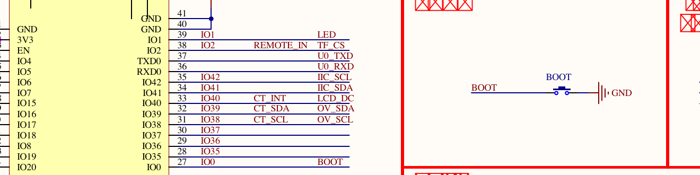
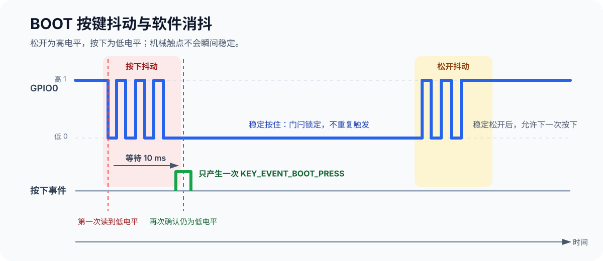

[上一篇](./02-dnesp32s3-idf-create-project-led.md)已经把 GPIO1、低电平点亮和 BSP 分层讲清楚。这一篇继续跟学《DNESP32S3 使用指南（IDF 版）》第 11 章：把 **BOOT 按键作为 GPIO 输入**，每完成一次有效按下，就翻转一次红色用户 LED。

我们不会把“读到低电平”直接当成一次按键动作，而是依次解决三个问题：

1. BOOT 按下和松开时，GPIO0 分别是什么电平？
2. 机械按键为什么会抖动，怎样确认一次真正的按下？
3. 怎样让长按只产生一个事件，并由 `main.c` 用这个事件控制 LED？

配套工程位于 [`examples/03-boot-key-control-led/`](https://github.com/Rainboylvx/esp32-learning-code/tree/main/examples/03-boot-key-control-led/)。仓库只保留最终工程，正文通过小片段展示从原始电平到按键事件的过程。

> [!INFO] 验证范围
> 配套工程已在 macOS、ESP-IDF v5.5.5 下完成 `idf.py set-target esp32s3`、`idf.py build`，并通过 `/dev/cu.usbmodem31101` 成功烧录到 ESP32-S3。Monitor 已看到应用启动和 `Ready: press BOOT to toggle LED`；按键事件与红色 LED 翻转仍待人工按键确认。

## 1. 先读原理图：BOOT 为什么按下为 0

下面是 `ATK_DNESP32S3_V1.2.pdf` 的局部图。左侧可以看到模组的 IO0 连接 `BOOT` 网络，右侧可以看到 BOOT 按键按下后会把这条网络接到 GND。



*图 1：BOOT 按键连接 GPIO0，按下时接地。图源：正点原子 DNESP32S3 V1.2 原理图。*

原理图中没有给 BOOT 画外部上拉电阻。如果把 GPIO0 只配置成普通输入，按键松开后引脚可能处于悬空状态，读数不稳定。因此程序还要开启 ESP32-S3 的**内部上拉电阻**：

```c
const gpio_config_t config = {
    .pin_bit_mask = 1ULL << GPIO_NUM_0,
    .mode = GPIO_MODE_INPUT,
    .pull_up_en = GPIO_PULLUP_ENABLE,
    .pull_down_en = GPIO_PULLDOWN_DISABLE,
    .intr_type = GPIO_INTR_DISABLE,
};
```

有了内部上拉，GPIO0 的电平关系才是确定的：

| BOOT 状态 | 电路状态 | GPIO0 电平 | 程序含义 |
| --- | --- | --- | --- |
| 松开 | 内部上拉把 GPIO0 拉向 3.3 V | 1 | 没有按下 |
| 按下 | 按键把 GPIO0 接到 GND | 0 | 按键按下 |

因此 BOOT 是**低电平有效**的输入。这里的“上拉”只负责让松开状态稳定，它不会把按下后的低电平变成高电平。

> [!WARNING] BOOT 还是启动配置按键
> GPIO0 不只是一根普通输入引脚。ESP32-S3 会在启动阶段采样它；如果上电或复位时一直按住 BOOT，芯片可能进入下载模式。程序正常运行后再按 BOOT，才能把它当作本实验的用户按键。

## 2. 读到电平，不等于得到一次按键事件

### 2.1 先观察原始电平

配置完 GPIO0 后，可以暂时用下面的循环观察它。松开时日志应打印 1，按下时应打印 0：

```c
while (1) {
    // 这里只观察原始电平，还没有消抖，也没有“只触发一次”的逻辑。
    ESP_LOGI("key_raw", "BOOT level = %d", gpio_get_level(GPIO_NUM_0));
    vTaskDelay(pdMS_TO_TICKS(100));
}
```

这段代码只能回答“此刻是高电平还是低电平”。如果直接写成下面这样，按住按键时循环会不断执行，LED 可能连续翻转：

```c
// 错误示意：低电平会在按住期间持续存在，不代表每次循环都是新按了一次。
if (gpio_get_level(GPIO_NUM_0) == 0) {
    led_on = !led_on;
    led_set(led_on);
}
```

我们真正需要的不是“当前为低电平”，而是“一次新的按下动作已经发生”。这就是从**电平**到**事件**的转换。

### 2.2 机械触点为什么需要消抖

按键内部是机械触点。按下或松开的一瞬间，触点可能在几毫秒内反复接通、断开，使 GPIO0 在 0 和 1 之间快速跳变。如果每次跳变都算一次按下，一个动作就可能触发多次。



*图 2：第一次读到低电平后等待 10 ms，再次读取仍为低电平，才确认一次按下。*

本篇采用最容易理解的延时消抖：

1. 第一次读到低电平。
2. 让当前任务阻塞约 10 ms，跳过主要抖动阶段。
3. 再读一次；仍为低电平才产生按下事件。
4. 事件产生后锁住，持续按住不再返回事件。
5. 松开后也等待 10 ms 再确认，确认稳定为高电平后解除锁定。

`vTaskDelay(pdMS_TO_TICKS(10))` 中的 `pdMS_TO_TICKS()` 会按工程的 FreeRTOS tick 频率把 10 ms 换算成 tick。这样比直接写 `vTaskDelay(10)` 更明确，也不会把“10 tick”误认为在任何配置下都是 10 ms。

> [!NOTE] 本篇只讲轮询
> GPIO 中断还会引入 ISR 限制、队列和中断消抖。这里先用轮询建立输入、电平、消抖和事件的完整认识；中断方式留到后续 EXIT 实验。

## 3. 从上一篇 BSP 工程继续扩展

### 3.1 创建第三个工程

如果已经完成上一篇的 `02-02-bsp-led`，可以创建一个新工程骨架，再复制 LED BSP：

```bash
# 每个新终端先激活 ESP-IDF。
source "$HOME/.espressif/tools/activate_idf_v5.5.5.sh"

cd "$HOME/esp"

# 创建独立工程，不直接修改上一篇的示例。
idf.py create-project 03-boot-key-control-led
cd 03-boot-key-control-led
mv main/03-boot-key-control-led.c main/main.c

# 新建 BSP 目录，并复用上一篇已经验证过的 LED 模块。
mkdir -p components/BSP/LED components/BSP/KEY
cp ../02-02-bsp-led/components/BSP/LED/led.c components/BSP/LED/
cp ../02-02-bsp-led/components/BSP/LED/led.h components/BSP/LED/
cp ../02-02-bsp-led/sdkconfig.defaults .
```

最终目录结构如下：

```text
03-boot-key-control-led/
├── CMakeLists.txt
├── sdkconfig.defaults
├── main/
│   ├── CMakeLists.txt
│   └── main.c                 # 应用层：按键事件驱动 LED 状态
└── components/
    └── BSP/
        ├── CMakeLists.txt
        ├── LED/               # GPIO1、低电平点亮
        │   ├── led.c
        │   └── led.h
        └── KEY/               # GPIO0、内部上拉、消抖和事件
            ├── key.c
            └── key.h
```

### 3.2 KEY 对应用层提供什么

在 `components/BSP/KEY/key.h` 定义事件和接口：

```c
#pragma once

#include "esp_err.h"

/**
 * @brief 按键扫描产生的事件。
 */
typedef enum {
    KEY_EVENT_NONE = 0,       // 当前没有新的按下事件。
    KEY_EVENT_BOOT_PRESS,     // BOOT 完成了一次有效按下。
} key_event_t;

/**
 * @brief 初始化 BOOT 按键对应的 GPIO0 输入和内部上拉。
 */
esp_err_t key_init(void);

/**
 * @brief 轮询 BOOT 按键，并对按下和松开过程进行软件消抖。
 *
 * 一次按住只产生一个 KEY_EVENT_BOOT_PRESS；松开并再次按下后，
 * 才会产生下一个事件。
 */
key_event_t key_scan(void);
```

接口没有把 GPIO0、低电平有效和 10 ms 消抖暴露给 `main.c`。应用层只需要区分“没有新事件”和“BOOT 完成了一次有效按下”。

这里也没有照抄官方 `key_scan(mode)` 的连续触发模式。本实验只需要一次按住返回一次事件，删除暂时用不到的模式参数，可以减少调用者必须理解的状态。

### 3.3 在 KEY BSP 中完成输入与消抖

在 `components/BSP/KEY/key.c` 写入：

```c
#include <stdbool.h>
#include "key.h"
#include "driver/gpio.h"
#include "freertos/FreeRTOS.h"
#include "freertos/task.h"

// DNESP32S3 V1.2 的 BOOT 按键连接 GPIO0，按下时接地。
#define BOOT_KEY_GPIO GPIO_NUM_0
#define BOOT_KEY_ACTIVE_LEVEL 0
#define BOOT_KEY_RELEASED_LEVEL 1
#define KEY_DEBOUNCE_MS 10

// true 表示已经确认按键处于松开状态，可以接收下一次按下。
static bool s_key_ready = true;

esp_err_t key_init(void)
{
    const gpio_config_t config = {
        .pin_bit_mask = 1ULL << BOOT_KEY_GPIO,
        .mode = GPIO_MODE_INPUT,
        // 原理图未画外部上拉；内部上拉让松开时的 GPIO0 稳定为高电平。
        .pull_up_en = GPIO_PULLUP_ENABLE,
        .pull_down_en = GPIO_PULLDOWN_DISABLE,
        // 本篇使用轮询，中断留到后续 EXIT 实验。
        .intr_type = GPIO_INTR_DISABLE,
    };

    s_key_ready = true;
    return gpio_config(&config);
}

key_event_t key_scan(void)
{
    const int level = gpio_get_level(BOOT_KEY_GPIO);

    if (s_key_ready && level == BOOT_KEY_ACTIVE_LEVEL) {
        // 第一次读到低电平后等待触点稳定，再进行第二次确认。
        vTaskDelay(pdMS_TO_TICKS(KEY_DEBOUNCE_MS));

        if (gpio_get_level(BOOT_KEY_GPIO) == BOOT_KEY_ACTIVE_LEVEL) {
            // 锁住本次按下；持续按住时不再重复产生事件。
            s_key_ready = false;
            return KEY_EVENT_BOOT_PRESS;
        }
    } else if (!s_key_ready && level == BOOT_KEY_RELEASED_LEVEL) {
        // 松开同样可能抖动，稳定后再允许下一次按下。
        vTaskDelay(pdMS_TO_TICKS(KEY_DEBOUNCE_MS));

        if (gpio_get_level(BOOT_KEY_GPIO) == BOOT_KEY_RELEASED_LEVEL) {
            s_key_ready = true;
        }
    }

    return KEY_EVENT_NONE;
}
```

`s_key_ready` 是一个门闩：

- 初始为 `true`，允许接收一次新的按下。
- 确认按下后改成 `false`，长按期间不再产生事件。
- 确认松开后恢复 `true`，下一次按下才能再次触发。

按下和松开都做二次采样，是为了避免释放抖动刚出现一个高电平，就过早解除门闩。

### 3.4 注册 KEY 与 LED

`components/BSP/CMakeLists.txt` 同时注册两个模块：

```cmake
# BSP 同时包含 LED 输出和 KEY 输入两个模块。
# 两个模块都使用 GPIO 驱动，KEY 的消抖还会调用 FreeRTOS 延时。
idf_component_register(SRCS "LED/led.c" "KEY/key.c"
                    INCLUDE_DIRS "LED" "KEY"
                    PRIV_REQUIRES esp_driver_gpio freertos)
```

`INCLUDE_DIRS "LED" "KEY"` 把两个目录作为 BSP 的公开头文件搜索目录，所以依赖 BSP 的 `main` 可以直接包含 `led.h` 和 `key.h`。

`main/CMakeLists.txt` 仍然只依赖 BSP：

```cmake
# main 只负责组合 KEY 和 LED 两个 BSP 接口。
idf_component_register(SRCS "main.c"
                    INCLUDE_DIRS "."
                    PRIV_REQUIRES BSP)
```

## 4. 用按下事件翻转 LED

把 `main/main.c` 替换为：

```c
#include <stdbool.h>
#include "esp_check.h"
#include "esp_log.h"
#include "freertos/FreeRTOS.h"
#include "freertos/task.h"
#include "key.h"
#include "led.h"

static const char *TAG = "key_demo";

void app_main(void)
{
    // LED 初始化后默认熄灭；应用层保存的是“亮/灭”这个逻辑状态。
    bool led_on = false;

    ESP_ERROR_CHECK(led_init());
    ESP_ERROR_CHECK(key_init());
    ESP_LOGI(TAG, "Ready: press BOOT to toggle LED");

    while (1) {
        // 只有一次经过消抖确认的新按下动作发生时，才会进入 if。
        if (key_scan() == KEY_EVENT_BOOT_PRESS) {
            led_on = !led_on;
            ESP_ERROR_CHECK(led_set(led_on));
            ESP_LOGI(TAG, "BOOT pressed, LED %s", led_on ? "on" : "off");
        }

        // 限制轮询频率，让其他 FreeRTOS 任务有机会运行。
        vTaskDelay(pdMS_TO_TICKS(10));
    }
}
```

这一层的职责现在很清楚：

| 层次 | 知道什么 |
| --- | --- |
| `main.c` | BOOT 按下后翻转 LED 状态 |
| `BSP/KEY` | GPIO0、输入上拉、低电平有效、消抖、按下事件 |
| `BSP/LED` | GPIO1、输出模式、低电平点亮 |

LED 当前状态由 `main.c` 保存，因为“按键控制 LED”属于本实验的应用规则。KEY BSP 不直接调用 LED BSP，两个硬件模块因此可以独立复用。

## 5. 编译、烧录与验收

在工程根目录执行：

```bash
# 每个新终端都要先激活对应版本的 ESP-IDF。
source "$HOME/.espressif/tools/activate_idf_v5.5.5.sh"

# 新工程首次明确选择 ESP32-S3，然后编译。
idf.py set-target esp32s3
idf.py build
```

macOS 可以插拔开发板并比较设备列表。本机识别到的 ESP32-S3 端口是 `/dev/cu.usbmodem31101`：

```bash
# 列出 macOS 串口；其他机器应使用自己实际出现的端口。
find /dev -maxdepth 1 -name 'cu.*' -print | sort

# flash 会自动检查构建，monitor 会在烧录后显示串口日志。
idf.py -p /dev/cu.usbmodem31101 flash monitor
```

按 `Ctrl+]` 退出 Monitor。验收时逐条检查：

1. 启动后红色用户 LED 熄灭，日志打印 `Ready: press BOOT to toggle LED`。
2. 短按并松开一次 BOOT，只打印一条 `BOOT pressed`，LED 只翻转一次。
3. 一直按住 BOOT，LED 不会连续翻转，日志不会连续出现。
4. 松开后再次按下，才能产生下一条日志和下一次翻转。
5. 蓝色 `PWR` 灯始终亮属于正常供电，与 GPIO1 控制的红色用户 LED 无关。

> [!INFO] 本次实机进度
> 固件写入、Flash 哈希校验、复位启动和应用就绪日志已经通过。尚未在 Monitor 期间完成实体 BOOT 按键操作，因此本文没有把“按键只触发一次”和“红色 LED 翻转”标成已验证。

> [!WARNING] 如果按住 BOOT 后再按 RESET
> 芯片可能进入下载模式，应用程序不会正常启动。先松开 BOOT，再按 RESET，即可重新运行已经烧录的程序。

## 6. 和教材官方工程对答案

教材第 11 章和官方 `02_key` 工程同样使用 BOOT/GPIO0、输入上拉、低电平有效和轮询消抖。本篇有意保留实验现象，同时调整接口与错误处理：

| 项目 | 官方 `02_key` | 本篇工程 | 原因 |
| --- | --- | --- | --- |
| 扫描接口 | `key_scan(mode)` 返回整数键值 | `key_scan()` 返回 `key_event_t` | 当前实验只需要一次按下触发一次 |
| 连续触发 | `mode=1` 支持长按连续返回 | 不支持 | 避免一个长按多次翻转 LED |
| 消抖延时 | `vTaskDelay(10)` | `vTaskDelay(pdMS_TO_TICKS(10))` | 明确表达 10 ms，不依赖 tick 频率恰好为 1000 Hz |
| 松开过程 | 读到高电平立即解除门闩 | 延时后再次确认高电平 | 避免释放抖动过早解锁 |
| LED 翻转 | BSP 宏读回 GPIO 后翻转 | `main.c` 保存逻辑状态并调用 `led_set()` | 应用规则留在应用层 |
| 初始化错误 | GPIO 返回值未传给调用者 | 返回 `esp_err_t` 并检查 | 初始化失败时给出明确错误 |

教材下载验证写的是“烧录后 LED 初始亮”，但官方 `led_init()` 实际将低电平有效的 GPIO1 设为高电平，按原理图应当初始熄灭。本篇以原理图和代码为依据，将初始状态设为熄灭，并把实板观察结果作为最终判断。

## 7. 小结

这一篇新增的核心不是 `gpio_get_level()`，而是把不稳定、持续存在的物理电平整理成应用层可以安全使用的**一次按下事件**：

```text
GPIO0 原始电平
    ↓ 内部上拉与低电平判断
按下、松开二次采样
    ↓ 消抖与门闩
KEY_EVENT_BOOT_PRESS
    ↓ main.c 的应用规则
翻转 LED 逻辑状态
```

有了这个边界，后续把 BOOT 换成其他按键，或者把 LED 换成蜂鸣器时，应用层都不需要重新理解底层电平细节。

## 参考资料

- 《DNESP32S3 使用指南（IDF 版）》第 11 章 KEY 实验
- 正点原子 `ATK_DNESP32S3_V1.2.pdf` 原理图与官方 `02_key` 工程（本地课程资料）
- [乐鑫：ESP-IDF GPIO API](https://docs.espressif.com/projects/esp-idf/en/v5.5/esp32s3/api-reference/peripherals/gpio.html)
- [FreeRTOS：任务延时与时间换算](https://docs.espressif.com/projects/esp-idf/en/v5.5/esp32s3/api-reference/system/freertos_idf.html)
