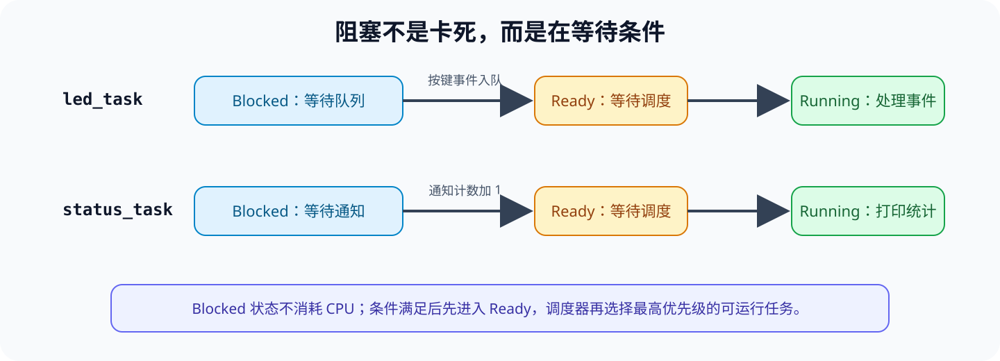
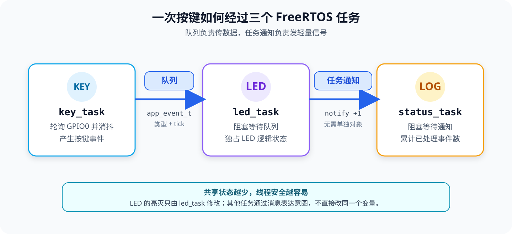

[第 03 课](./03-dnesp32s3-boot-key-control-led.md)用一个循环完成了“扫描 BOOT 按键 → 翻转 LED”。代码很直观，但随着串口、传感器和网络功能加入，一个循环会同时承担越来越多的职责。

这一课暂时不增加新硬件，仍使用 DNESP32S3 的 **BOOT/GPIO0** 和红色用户 **LED/GPIO1**，把原来的循环拆成三个长期运行的任务：

1. `key_task` 扫描按键，产生带数据的事件；
2. `led_task` 从队列接收事件，只由它修改 LED 状态；
3. `status_task` 接收轻量任务通知，统计已经处理的事件数。

配套工程位于 [`examples/05-freertos-task-queue-notify/`](https://github.com/Rainboylvx/esp32-learning-code/tree/main/examples/05-freertos-task-queue-notify/)。本课是后续 GPIO 中断、定时器和多外设协作的基础补充。

> [!INFO] 验证范围
> 配套工程已在 macOS、ESP-IDF v5.5.5 下完成编译，并通过 `/dev/cu.usbmodem31101` 烧录到 DNESP32S3。串口已确认工程名、ESP-IDF 版本、三个任务创建完成和 `app_main()` 正常返回；物理按键、LED 翻转与通知计数仍待人工按键验收。

## 1. `app_main` 本来就在 FreeRTOS 里

ESP-IDF 启动应用时，FreeRTOS 调度器已经运行，`app_main()` 本身就在一个任务里执行。因此不需要也不应该在应用中再次调用 `vTaskStartScheduler()`。

任务不是“只运行一次的函数”。典型任务函数包含一个无限循环，并在没有工作时主动进入阻塞状态：

```c
static void worker_task(void *arg)
{
    while (1) {
        // 等待工作并处理。
    }
}
```

FreeRTOS 任务常见的四种状态是：

| 状态 | 含义 |
| --- | --- |
| Running | 此刻正在某个 CPU 核心上执行 |
| Ready | 已具备运行条件，等待调度器选择 |
| Blocked | 正在等待时间、队列、通知等条件 |
| Suspended | 被显式挂起，恢复前不参与调度 |

调度器从 Ready 任务中选择可以运行的最高优先级任务。优先级高不代表它应该一直占用 CPU；任务没有工作时应使用 `vTaskDelay()`、`xQueueReceive()` 或 `ulTaskNotifyTake()` 等阻塞 API。



*图 1：等待队列或通知时，任务处于 Blocked 状态，不会用循环持续占用 CPU。*

> [!NOTE] ESP32-S3 是双核芯片
> ESP-IDF v5.5.5 使用支持双核 SMP 的 FreeRTOS。普通 `xTaskCreate()` 创建的任务不绑定核心，调度器可以安排它运行在任一核心。本课不依靠“任务碰巧在哪个核心”，通信都通过 FreeRTOS 提供的同步机制完成。

## 2. 为什么不能只共享一个全局变量

最容易想到的写法是让按键任务修改一个全局标志，让 LED 任务反复读取：

```c
// 错误示意：volatile 不能把共享变量变成可靠的任务通信。
static volatile bool key_pressed;

// key_task
key_pressed = true;

// led_task
if (key_pressed) {
    key_pressed = false;
    // 处理按键……
}
```

它至少有三个问题：

1. LED 任务清零前发生两次按下，两个事件会合并成一个；
2. 两个任务同时读写，操作顺序依赖调度时机；
3. LED 任务必须不断轮询，没事件时仍然消耗 CPU。

`volatile` 只要求编译器每次真正访问内存，不提供互斥、事件计数或跨任务的执行顺序保证。ESP32-S3 还是双核系统，关闭当前核心的中断也不能自动保护另一个核心上的访问。

更清晰的办法是让任务拥有自己的状态，通过消息表达“希望对方做什么”。本课让 `led_task` 独占 `led_on`，其他任务不直接修改它。

## 3. 队列和任务通知分别解决什么



*图 2：队列携带完整事件，任务通知只传递“又完成一次”的计数信号。*

### 3.1 队列：需要保存数据和顺序

本课使用队列传递下面的结构体：

```c
typedef enum {
    APP_EVENT_BOOT_PRESSED = 1,
} app_event_type_t;

typedef struct {
    app_event_type_t type;  // 事件类型。
    TickType_t tick;        // 事件产生时的系统 tick。
} app_event_t;
```

创建队列时必须指定两个参数：

```c
s_event_queue = xQueueCreate(8, sizeof(app_event_t));
```

- `8` 表示最多暂存 8 条尚未处理的消息；
- `sizeof(app_event_t)` 表示每条消息的固定大小。

`xQueueSend()` 会把结构体内容复制进队列，因此生产者可以安全地发送栈上的局部变量。`xQueueReceive()` 再把队首消息复制到接收者提供的变量中。队列由 FreeRTOS 管理并发访问，不需要我们再给队列本身加锁。

队列适合这些情况：

- 需要传递事件类型、时间、测量值等数据；
- 同一时间可能积累多条消息；
- 接收者必须按先后顺序处理。

### 3.2 任务通知：明确通知某一个任务

每个任务内部都有通知状态和 32 位通知值。发送者知道目标任务句柄时，可以直接通知它，不需要另外创建队列对象。

本课使用通知的“计数信号”形式：

```c
// led_task：通知值加 1。
xTaskNotifyGive(s_status_task_handle);

// status_task：阻塞等待；pdTRUE 表示返回后把计数清零。
uint32_t received = ulTaskNotifyTake(pdTRUE, portMAX_DELAY);
```

如果状态任务得到调度前连续收到三次通知，`ulTaskNotifyTake()` 可以返回 `3`，因此代码应累计返回值。

任务通知适合这些情况：

- 发送目标只有一个任务；
- 只需要唤醒、计数、位标志或一个 32 位值；
- 不需要建立可以被多个接收者读取的消息容器。

| 选择问题 | 队列 | 任务通知 |
| --- | --- | --- |
| 是否有独立对象 | 有 `QueueHandle_t` | 通知状态属于目标任务 |
| 携带内容 | 固定大小消息的副本 | 32 位值、位或计数 |
| 是否能积累多条不同消息 | 可以 | 不适合保存多条结构化消息 |
| 接收者 | 持有队列句柄的任务 | 指定的一个任务 |
| 本课用途 | BOOT 按下事件和产生时间 | 已处理事件计数 |

## 4. 工程结构与组件依赖

工程继续复用第 03 课的 KEY 和 LED BSP：

```text
05-freertos-task-queue-notify/
├── CMakeLists.txt
├── sdkconfig.defaults
├── main/
│   ├── CMakeLists.txt
│   └── main.c                 # 任务、队列、通知和应用规则
└── components/
    └── BSP/
        ├── CMakeLists.txt
        ├── KEY/
        │   ├── key.c          # GPIO0、内部上拉、轮询消抖
        │   └── key.h
        └── LED/
            ├── led.c          # GPIO1、低电平点亮
            └── led.h
```

本课有意继续使用轮询按键。这样事件来源与第 03 课一致，新增内容只剩任务通信；后续 GPIO 外部中断课会把生产者换成 ISR 与任务协作。

`main/CMakeLists.txt` 同时声明 BSP 和 FreeRTOS 私有依赖：

```cmake
# main 组合 KEY、LED 与 FreeRTOS 通信；GPIO 细节仍封装在 BSP 中。
idf_component_register(SRCS "main.c"
                    INCLUDE_DIRS "."
                    PRIV_REQUIRES BSP freertos)
```

ESP-IDF 会从工程的 `components/BSP/` 找到名为 `BSP` 的组件。FreeRTOS 是 ESP-IDF 自带组件，因此 `PRIV_REQUIRES freertos` 不需要在项目中复制一份源码。

## 5. 编写三个任务

### 5.1 按键任务：事件生产者

```c
static void key_task(void *arg)
{
    (void)arg;

    while (1) {
        if (key_scan() == KEY_EVENT_BOOT_PRESS) {
            const app_event_t event = {
                .type = APP_EVENT_BOOT_PRESSED,
                .tick = xTaskGetTickCount(),
            };

            // 队列满时阻塞等待，不忙等，也不悄悄丢事件。
            xQueueSend(s_event_queue, &event, portMAX_DELAY);
        }

        vTaskDelay(pdMS_TO_TICKS(10));
    }
}
```

`portMAX_DELAY` 表示等待到队列出现空间。等待期间任务进入 Blocked 状态。对于人的按键输入，这种策略简单而可靠；如果以后生产者是高速采样中断，就要明确决定“阻塞、丢弃旧数据、丢弃新数据还是覆盖最新值”。

`vTaskDelay(pdMS_TO_TICKS(10))` 也会阻塞当前任务，但它等待的是时间。两种阻塞都不会把整个芯片停住，其他 Ready 任务仍能运行。

### 5.2 LED 任务：队列消费者

```c
static void led_task(void *arg)
{
    (void)arg;
    bool led_on = false;
    app_event_t event;

    while (1) {
        // 队列为空时阻塞，不循环检查“有没有数据”。
        if (xQueueReceive(s_event_queue, &event, portMAX_DELAY) != pdTRUE) {
            continue;
        }

        if (event.type == APP_EVENT_BOOT_PRESSED) {
            led_on = !led_on;
            ESP_ERROR_CHECK(led_set(led_on));

            ESP_LOGI("freertos_demo",
                     "queue event: tick=%lu, LED %s",
                     (unsigned long)event.tick,
                     led_on ? "on" : "off");

            xTaskNotifyGive(s_status_task_handle);
        }
    }
}
```

`led_on` 是 `led_task` 的局部变量，只有这个任务修改它。按键任务表达“BOOT 被按下”，LED 任务决定如何改变 LED。这样不需要用互斥锁保护 LED 状态。

### 5.3 状态任务：通知接收者

```c
static void status_task(void *arg)
{
    (void)arg;
    uint32_t total_events = 0;

    while (1) {
        // 清零式读取会返回清零前累计的通知次数。
        const uint32_t received = ulTaskNotifyTake(pdTRUE, portMAX_DELAY);
        total_events += received;

        ESP_LOGI("freertos_demo",
                 "notification: received=%lu, total=%lu",
                 (unsigned long)received,
                 (unsigned long)total_events);
    }
}
```

如果只写 `total_events++`，多次累计通知被一次取出时就会少算。使用 API 返回的 `received`，才能保留计数语义。

## 6. 在 `app_main()` 中按依赖顺序创建资源

```c
void app_main(void)
{
    ESP_ERROR_CHECK(led_init());
    ESP_ERROR_CHECK(key_init());

    // 先创建通信对象。
    s_event_queue = xQueueCreate(8, sizeof(app_event_t));
    ESP_ERROR_CHECK(s_event_queue != NULL ? ESP_OK : ESP_ERR_NO_MEM);

    // 先取得 status_task 的句柄，led_task 才有明确的通知目标。
    ESP_ERROR_CHECK(
        xTaskCreate(status_task, "status_task", 3072, NULL, 5,
                    &s_status_task_handle) == pdPASS
            ? ESP_OK
            : ESP_ERR_NO_MEM);

    ESP_ERROR_CHECK(
        xTaskCreate(led_task, "led_task", 3072, NULL, 5, NULL) == pdPASS
            ? ESP_OK
            : ESP_ERR_NO_MEM);

    ESP_ERROR_CHECK(
        xTaskCreate(key_task, "key_task", 3072, NULL, 5, NULL) == pdPASS
            ? ESP_OK
            : ESP_ERR_NO_MEM);

    ESP_LOGI("freertos_demo", "Ready: press BOOT to send an event");
}
```

创建顺序体现了依赖关系：

1. 初始化硬件；
2. 创建队列；
3. 创建状态任务并取得句柄；
4. 创建可能使用这些资源的任务。

`xTaskCreate()` 的返回值是 `pdPASS` 或失败值，不是 `esp_err_t`，所以示例先把结果转换成 `ESP_OK` 或 `ESP_ERR_NO_MEM` 再交给 `ESP_ERROR_CHECK()`。

这里三个任务使用相同优先级 `5`。初学阶段没有必要用优先级“强行安排执行顺序”；数据依赖由队列和通知表达。调度器只在 Ready 任务中选择，两个消费者大部分时间都在阻塞。

> [!IMPORTANT] ESP-IDF 的任务栈单位是字节
> 在原版 FreeRTOS 中，`xTaskCreate()` 的栈深度通常以 `StackType_t` 的字为单位；ESP-IDF FreeRTOS 把这个参数改为**字节数**。本课的 `3072` 表示 3072 字节。后续可以用 `uxTaskGetStackHighWaterMark()` 观察余量，再决定是否调整。

`app_main()` 返回并不代表应用结束。ESP-IDF 会删除执行完的 `app_main` 任务，刚才创建的三个任务继续运行。

## 7. 编译、烧录与验收

在工程根目录执行：

```bash
# 每个新终端都先激活本课使用的 ESP-IDF。
source "$HOME/.espressif/tools/activate_idf_v5.5.5.sh"

# 新工程首次选择 ESP32-S3，然后编译。
idf.py set-target esp32s3
idf.py build

# 插拔开发板前后比较端口，再替换成实际端口。
find /dev -maxdepth 1 -name 'cu.*' -print | sort
idf.py -p /dev/cu.usbmodem31101 flash monitor
```

按 `Ctrl+]` 退出 Monitor。每按一次 BOOT，预期看到两类日志：

```text
I (...) freertos_demo: queue event: tick=12345, LED on
I (...) freertos_demo: notification: received=1, total=1
```

再次按下时 LED 熄灭，`total` 增加：

```text
I (...) freertos_demo: queue event: tick=13579, LED off
I (...) freertos_demo: notification: received=1, total=2
```

逐条验收：

1. 启动后出现 `Ready: press BOOT to send an event`，红色 LED 初始熄灭；
2. 短按 BOOT 一次，只出现一条 `queue event`，LED 翻转一次；
3. 随后出现 `notification`，`total` 每次恰好增加 1；
4. 一直按住 BOOT 不会连续产生事件；松开后再次按下才能产生下一条；
5. 空闲时没有高速重复日志，说明等待任务没有用忙循环占用 CPU。

> [!INFO] 实机进度
> `idf.py build` 已通过，固件大小为 `0x302c0` 字节，应用分区剩余 81%；烧录、Flash 哈希校验和复位启动均成功。Monitor 已看到项目 `05-freertos-task-queue-notify`、ESP-IDF v5.5.5、`Ready: press BOOT to send an event` 以及 `main_task: Returned from app_main()`。尚未人工按下 BOOT，因此第 2～4 项仍待实板验收；目录中的课程状态继续保留为“进行中”。

## 8. 这段程序为什么是线程安全的

线程安全并不等于“到处加锁”。先减少共享状态，通常更容易得到正确设计：

| 数据或资源 | 所有者 | 其他任务如何访问 |
| --- | --- | --- |
| BOOT 扫描状态 | `key_task` 内部的 KEY BSP | 通过队列发布事件 |
| `led_on` | `led_task` | 其他任务不直接访问 |
| 事件消息 | FreeRTOS 队列 | `xQueueSend()` / `xQueueReceive()` 复制 |
| 通知计数 | `status_task` 的任务通知值 | `led_task` 只执行 Give |
| 总事件数 | `status_task` 的局部变量 | 其他任务不访问 |

如果多个任务以后必须共同修改一份配置，就需要互斥锁等同步机制；如果只是把工作交给另一个任务，优先考虑队列或任务通知。

## 9. 小结

本课把一个顺序循环改成了三个可以独立等待和运行的任务：

```text
BOOT 物理动作
    ↓ key_task
app_event_t 队列消息
    ↓ led_task
LED 状态翻转
    ↓ 任务通知计数
status_task 输出统计
```

需要记住的不是 API 名单，而是三条规则：

1. 没有工作就阻塞等待，不要忙循环；
2. 带数据、要排队的事件使用队列；
3. 明确唤醒一个任务的轻量信号可以使用任务通知。

下一步把 `key_task` 的轮询替换为 GPIO 外部中断时，LED 和状态任务不需要重新设计：只要新的生产者仍然产生同一种应用事件即可。

## 参考资料

- [ESP-IDF v5.5.5：FreeRTOS（IDF）](https://docs.espressif.com/projects/esp-idf/en/v5.5.5/esp32s3/api-reference/system/freertos_idf.html)
- [FreeRTOS：`xQueueCreate()`](https://www.freertos.org/Documentation/02-Kernel/04-API-references/06-Queues/01-xQueueCreate)
- [FreeRTOS：`xTaskNotify()` 与任务通知](https://www.freertos.org/Documentation/02-Kernel/04-API-references/05-Direct-to-task-notifications/04-xTaskNotify)
- [FreeRTOS：`ulTaskNotifyTake()`](https://www.freertos.org/Documentation/02-Kernel/04-API-references/05-Direct-to-task-notifications/03-ulTaskNotifyTake)
