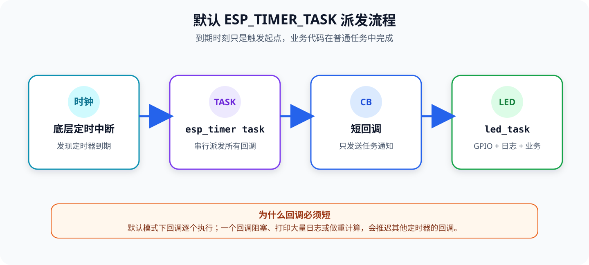

[第 05 课](./05-freertos-task-queue-notify.md)已经让普通任务通过通知协作。这一课跟学《DNESP32S3 使用指南（IDF 版）》第 14 章，使用 `esp_timer` 每隔 1 秒调度一次 LED 翻转。

教材和官方 `05_esptim` 工程直接在回调中执行 `LED_TOGGLE()`。这个实验可以运行，但它没有体现默认 ESP Timer 回调共享同一个高优先级任务的约束。本课保留同样的闪灯结果，同时把职责拆开：

1. `esp_timer` 负责产生稳定的周期事件；
2. 回调只调用 `xTaskNotifyGive()`，不阻塞、不打印日志；
3. `led_task` 被通知唤醒后，再操作 GPIO、保存 LED 状态并打印实际间隔。

配套工程位于 [`examples/06-esp-timer-periodic-led/`](https://github.com/Rainboylvx/esp32-learning-code/tree/main/examples/06-esp-timer-periodic-led/)。

> [!INFO] 验证范围
> 工程已在 macOS、ESP-IDF v5.5.5 下编译，并通过 `/dev/cu.usbmodem31101` 烧录到 DNESP32S3。Monitor 连续记录 9 次周期事件，第一次间隔为 `1000090 us`，之后为 `999984～1000000 us`，没有出现累计通知。日志确认 GPIO1 的逻辑状态每秒翻转，红色 LED 的物理明灭也已人工确认正常。

## 1. 硬件目标：仍然控制 GPIO1 红色 LED

ESP Timer 是 ESP32-S3 的片上资源，不需要外接信号线。本实验唯一使用的板外可见资源仍是 GPIO1 红色用户 LED。


*图 1：红色用户 LED 连接 GPIO1，并且低电平点亮。图源：正点原子 DNESP32S3 V1.2 原理图。*

程序启动时 LED 熄灭，此后每隔 1 秒翻转一次：

| 时间 | GPIO1 逻辑状态 | LED |
| --- | --- | --- |
| 启动 | 高电平 | 熄灭 |
| 约 1 秒 | 低电平 | 点亮 |
| 约 2 秒 | 高电平 | 熄灭 |
| 约 3 秒 | 低电平 | 点亮 |

这里的“周期为 1 秒”指**每隔 1 秒改变一次状态**。一个完整的亮灭循环需要约 2 秒。

## 2. `vTaskDelay()` 和 `esp_timer` 有什么区别

第 02、03、05 课已经多次使用：

```c
vTaskDelay(pdMS_TO_TICKS(1000));
```

它表达的是“让当前任务至少阻塞约 1000 ms”。任务恢复执行后还要完成自己的工作，再次调用延时，因此循环周期会包含代码执行和调度等待时间。

`esp_timer_start_periodic()` 则创建一条独立的周期时间线。周期参数使用微秒：

```c
esp_timer_start_periodic(timer, 1000000ULL);  // 1 秒
```


*图 2：时间单位只是选择依据之一，还要考虑回调延迟和业务需求。*

| 工具 | 时间基础 | 适合做什么 |
| --- | --- | --- |
| `vTaskDelay()` | FreeRTOS tick | 让当前任务延时、降低轮询频率 |
| `xTaskDelayUntil()` | FreeRTOS tick | tick 粒度的固定周期任务 |
| `esp_timer` | 微秒，分辨率 1 μs | 单次延时、周期采样、软件超时 |
| GPTimer / RMT / LEDC | 专用硬件外设 | 更严格的时序、捕获、波形与 PWM |

> [!IMPORTANT] 分辨率不等于回调延迟
> ESP Timer 的时间分辨率是 1 μs，API 也使用微秒，但默认回调仍要等 `esp_timer` 任务得到调度。系统负载、其他定时器回调和 Flash 操作都可能让实际派发稍晚。需要产生严格硬件波形时，应选择 GPTimer、RMT 或 LEDC 等专用外设。

## 3. 默认回调不是“定时器中断函数”

`esp_timer_create_args_t.dispatch_method` 决定回调从哪里执行：

| 派发方式 | 回调上下文 | 特点 |
| --- | --- | --- |
| `ESP_TIMER_TASK` | 高优先级 `esp_timer` 任务 | 默认方式，所有回调串行执行 |
| `ESP_TIMER_ISR` | 中断上下文 | 延迟更低，限制更多，需要配置支持 |

本课明确写出：

```c
.dispatch_method = ESP_TIMER_TASK,
```

因此 `periodic_timer_callback()` 是**任务上下文回调**，不是 ISR。它可以使用普通的 `xTaskNotifyGive()`；如果改成 `ESP_TIMER_ISR`，就必须重新检查全部 API，使用相应的 ISR 安全版本，不能只改一个枚举值。



*图 3：底层中断唤醒 ESP Timer 任务，ESP Timer 任务再串行调用各个回调。*

默认派发方式下，某个回调如果执行大量日志、文件操作或长时间计算，会推迟排在后面的其他回调。因此本课把回调限制为一次任务通知。

## 4. 工程结构与组件依赖

本课不再使用按键，只复用 LED BSP：

```text
06-esp-timer-periodic-led/
├── CMakeLists.txt
├── sdkconfig.defaults
├── main/
│   ├── CMakeLists.txt
│   └── main.c                 # 定时器、回调、任务通知和业务逻辑
└── components/
    └── BSP/
        ├── CMakeLists.txt
        └── LED/
            ├── led.c          # GPIO1、低电平点亮
            └── led.h
```

`main/CMakeLists.txt` 声明三个私有依赖：

```cmake
# main 使用 BSP、FreeRTOS 任务通知和 ESP Timer。
idf_component_register(SRCS "main.c"
                    INCLUDE_DIRS "."
                    PRIV_REQUIRES BSP freertos esp_timer)
```

- `BSP` 来自工程的 `components/BSP/`；
- `freertos` 提供任务和任务通知；
- `esp_timer` 提供高分辨率软件定时器。

## 5. 先写一个只发送通知的短回调

```c
static void periodic_timer_callback(void *arg)
{
    const TaskHandle_t led_task_handle = (TaskHandle_t)arg;
    xTaskNotifyGive(led_task_handle);
}
```

创建定时器时，`arg` 保存 LED 任务句柄。每次到期，ESP Timer 会把这个指针原样传给回调。回调因此不需要读取可变的全局任务句柄。

回调没有做这些事：

- 不调用 `vTaskDelay()` 或等待队列；
- 不直接翻转 GPIO；
- 不执行 `ESP_LOGI()`；
- 不进行文件、网络或复杂计算。

任务通知值相当于计数器。即使 LED 任务暂时来不及运行，多次 `xTaskNotifyGive()` 也可以先累计，而不是只保留一个布尔标志。

## 6. LED 任务处理真正的工作

```c
static void led_task(void *arg)
{
    (void)arg;
    bool led_on = false;
    uint32_t total_expirations = 0;
    int64_t previous_time_us = esp_timer_get_time();

    while (1) {
        // 没有定时事件时阻塞，不占用 CPU 忙等。
        const uint32_t expirations =
            ulTaskNotifyTake(pdTRUE, portMAX_DELAY);

        const int64_t now_us = esp_timer_get_time();
        const int64_t elapsed_us = now_us - previous_time_us;
        previous_time_us = now_us;

        // 多次通知可能合并返回，因此按事件次数更新逻辑状态。
        for (uint32_t i = 0; i < expirations; ++i) {
            led_on = !led_on;
        }

        total_expirations += expirations;
        ESP_ERROR_CHECK(led_set(led_on));

        ESP_LOGI("esp_timer_demo",
                 "handled=%" PRIu32 ", total=%" PRIu32
                 ", elapsed=%" PRId64 " us, LED %s",
                 expirations,
                 total_expirations,
                 elapsed_us,
                 led_on ? "on" : "off");
    }
}
```

`esp_timer_get_time()` 返回 ESP Timer 初始化以来经过的微秒数。它不是日期时间，也没有时区概念；这里用相邻两次读取的差值观察实际处理间隔。

正常情况下 `expirations` 为 `1`。如果它大于 `1`，说明 LED 任务开始处理前已经累计了多次到期。循环按次数翻转，能够保留事件数量的奇偶结果；日志也会直接暴露处理落后，而不是悄悄隐藏。

## 7. 创建并启动周期定时器

关键初始化代码如下：

```c
#define TIMER_PERIOD_US 1000000ULL

static esp_timer_handle_t s_periodic_timer;

void app_main(void)
{
    TaskHandle_t led_task_handle = NULL;

    ESP_ERROR_CHECK(led_init());

    // 先创建接收通知的任务，才能把有效句柄交给回调。
    ESP_ERROR_CHECK(
        xTaskCreate(led_task, "led_task", 3072, NULL, 5,
                    &led_task_handle) == pdPASS
            ? ESP_OK
            : ESP_ERR_NO_MEM);

    const esp_timer_create_args_t timer_args = {
        .callback = periodic_timer_callback,
        .arg = led_task_handle,
        .dispatch_method = ESP_TIMER_TASK,
        .name = "periodic_led",
    };

    ESP_ERROR_CHECK(esp_timer_create(&timer_args, &s_periodic_timer));
    ESP_ERROR_CHECK(
        esp_timer_start_periodic(s_periodic_timer, TIMER_PERIOD_US));

    ESP_LOGI("esp_timer_demo",
             "Started periodic timer: period=%" PRIu64 " us",
             TIMER_PERIOD_US);
}
```

顺序不能随意调换：

1. 初始化 LED；
2. 创建 LED 任务并取得句柄；
3. 创建 ESP Timer 实例；
4. 启动周期定时器。

如果先启动定时器，回调可能在任务句柄有效之前发生。先建立消费者，再启动事件源，可以避免这种启动竞争。

### 单次定时器和周期定时器

同一个定时器实例启动时可以选择一种模式：

```c
// 500 ms 后只回调一次，回调结束后停止。
esp_timer_start_once(timer, 500000);

// 每 500 ms 回调一次，直到显式停止。
esp_timer_start_periodic(timer, 500000);
```

已经运行的定时器不能再次调用普通 start API。要改变周期，可以：

```c
ESP_ERROR_CHECK(esp_timer_restart(timer, 250000));
```

不再使用时，按生命周期停止并删除：

```c
ESP_ERROR_CHECK(esp_timer_stop(timer));
ESP_ERROR_CHECK(esp_timer_delete(timer));
```

本实验需要一直闪烁，所以定时器在程序生命周期内保持运行。

## 8. 编译、烧录和观察实际间隔

```bash
# 每个新终端都先激活 ESP-IDF v5.5.5。
source "$HOME/.espressif/tools/activate_idf_v5.5.5.sh"

# 新工程首次设置目标，然后编译。
idf.py set-target esp32s3
idf.py build

# 查找开发板实际串口，再编译、烧录并打开 Monitor。
find /dev -maxdepth 1 -name 'cu.*' -print | sort
idf.py -p /dev/cu.usbmodem31101 flash monitor
```

本次实测启动日志：

```text
I (...) app_init: Project name:     06-esp-timer-periodic-led
I (...) app_init: ESP-IDF:          v5.5.5
I (259) esp_timer_demo: Started periodic timer: period=1000000 us
I (259) main_task: Returned from app_main()
```

随后连续得到：

```text
I (1259) esp_timer_demo: handled=1, total=1, elapsed=1000090 us, LED on
I (2259) esp_timer_demo: handled=1, total=2, elapsed=999984 us, LED off
I (3259) esp_timer_demo: handled=1, total=3, elapsed=1000000 us, LED on
I (4259) esp_timer_demo: handled=1, total=4, elapsed=1000000 us, LED off
I (5259) esp_timer_demo: handled=1, total=5, elapsed=1000000 us, LED on
```

日志说明：

- 周期事件持续发生，`app_main()` 返回没有停止定时器；
- 每次 `handled=1`，LED 任务没有积压多个通知；
- 相邻处理间隔接近 1,000,000 μs；
- LED 逻辑状态按 `on → off → on` 翻转。

实板验收清单：

1. 启动后红色 LED 初始熄灭；
2. 约 1 秒后点亮，再过约 1 秒熄灭；
3. 串口每秒输出一条日志，`total` 连续递增；
4. `handled` 持续为 `1`，没有周期事件积压；
5. `elapsed` 接近 `1000000 us`，并允许存在少量调度误差。

> [!INFO] 本次实机进度
> `idf.py build` 已通过，固件大小为 `0x308a0` 字节，应用分区剩余 81%；烧录和 Flash 哈希校验通过。Monitor 已验证第 3～5 项，并连续观察到 9 次事件；红色 LED 每秒正常翻转也已人工确认。以上 5 项全部通过。

## 9. 和教材官方工程对答案

| 项目 | 官方 `05_esptim` | 本课工程 | 原因 |
| --- | --- | --- | --- |
| 工程名 | `00_basic` | `06-esp-timer-periodic-led` | 日志能直接识别课程 |
| 周期 | 1,000,000 μs | 1,000,000 μs | 保留教材实验现象 |
| 派发方式 | 未写，默认 `ESP_TIMER_TASK` | 显式写 `ESP_TIMER_TASK` | 明确回调上下文 |
| 回调工作 | 直接 `LED_TOGGLE()` | 只发送任务通知 | 避免拖慢共享回调任务 |
| LED 状态 | 读取 GPIO 后取反 | 由 LED 任务保存逻辑状态 | 单一任务拥有状态，更容易推理 |
| 错误处理 | 未检查返回值 | 全部 `ESP_ERROR_CHECK()` | 创建或启动失败立即暴露 |
| 定时器句柄 | 初始化函数的局部变量 | 文件内静态句柄 | 后续可停止、重启或删除 |
| 运行观测 | 无串口周期数据 | 输出通知数和实际间隔 | 可以验证调度是否积压 |

教材把这个默认回调称为“中断回调函数”。按照 ESP-IDF v5.5.5 的实际机制，默认 `ESP_TIMER_TASK` 是底层 ISR 唤醒 ESP Timer 任务，再由该任务执行回调。只有显式使用 `ESP_TIMER_ISR` 时，用户回调才直接运行在中断上下文。

## 10. 常见问题

### LED 每秒改变一次，为什么完整闪烁周期是两秒

因为一次回调只改变一次状态：第 1 秒从灭到亮，第 2 秒从亮到灭。亮和灭构成一个完整周期。

### `elapsed` 为什么不是永远精确等于 1,000,000

到期时刻和 LED 任务真正开始运行之间存在回调派发、任务通知和调度延迟。微秒分辨率允许精细记录时间，不代表软件业务会零延迟执行。

### 为什么不在回调里打印日志

默认 ESP Timer 回调在同一个任务中串行执行。日志输出可能耗时，会推迟其他定时器回调。通知普通任务后再记录日志，可以把共享回调任务尽快释放。

### 为什么回调里用 `xTaskNotifyGive()`，不是 `xTaskNotifyGiveFromISR()`

因为本课明确选择 `ESP_TIMER_TASK`，回调运行在任务上下文。ISR 版本留给真正的中断上下文，不能根据函数名字里有“timer”就误判。

## 11. 小结

本课建立了一个以后可以复用的周期调度结构：

```text
ESP Timer 每 1 秒到期
    ↓ 默认 ESP_TIMER_TASK 回调
短回调发送任务通知
    ↓ FreeRTOS 调度
led_task 翻转 GPIO1 并记录实际间隔
```

核心规则有三条：

1. `esp_timer` 的周期单位是微秒，但软件派发仍可能有延迟；
2. 默认回调运行在共享的 ESP Timer 任务中，应保持短小且不阻塞；
3. GPIO、日志和复杂业务交给普通任务，回调只负责发出事件。

下一课进入 GPTimer，比较专用硬件定时器与 ESP Timer 软件服务在配置方式、事件回调和实时性上的差异。

## 参考资料

- 《DNESP32S3 使用指南（IDF 版）》第 14 章 ESPTIMER 实验
- 正点原子官方 `05_esptim` 工程（本地课程资料）
- [ESP-IDF v5.5.5：ESP Timer 高分辨率定时器](https://docs.espressif.com/projects/esp-idf/en/v5.5.5/esp32s3/api-reference/system/esp_timer.html)
- [ESP-IDF v5.5.5：FreeRTOS（IDF）](https://docs.espressif.com/projects/esp-idf/en/v5.5.5/esp32s3/api-reference/system/freertos_idf.html)
