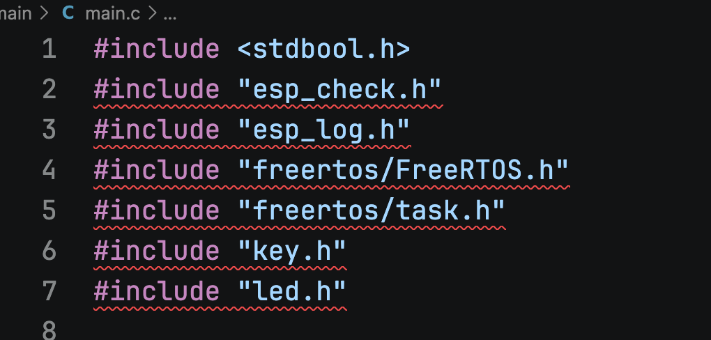
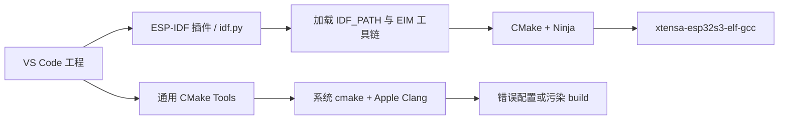

使用 VS Code 打开 ESP-IDF 工程后，可能同时遇到两个很像“工程坏了”的现象：

1. CMake Tools 弹出“配置失败，是否尝试使用 CMake 调试程序进行配置”；
2. `esp_check.h`、`esp_log.h`、FreeRTOS 以及自己的 BSP 头文件全部出现红色波浪线。

这次问题出现在工程：

```text
~/mycode/esp32-blog/examples/03-boot-key-control-led
```

实际排查结果是：**源码和 ESP-IDF 组件依赖没有问题，错误来自 VS Code 中两套工具各自使用了错误的配置。** 通用 CMake Tools 抢先把 ESP-IDF 工程当作普通 CMake 工程处理；Microsoft C/C++ IntelliSense 又没有读取 ESP-IDF 生成的 `compile_commands.json`。

> [!IMPORTANT] 先记住结论
> CMake Tools 配置失败、编辑器头文件飘红、ESP-IDF 真正编译失败，是三个不同层次的信号。不能只看红色波浪线就判断代码不能编译，也不能用普通 CMake Tools 的“生成”按钮代替 `idf.py build` 或 ESP-IDF 插件的 Build。

## 1. 看到的两个错误

### 1.1 CMake Tools 配置失败

VS Code 右下角出现下面的通知：


*图 1：通知来源明确写着 `CMake Tools`，并不是 Espressif 的 ESP-IDF 插件。*

这个弹窗里的“调试”是调试 **CMake 配置过程**，不是调试 ESP32 程序。当前问题不需要点它，直接取消即可。

### 1.2 ESP-IDF 头文件和 BSP 头文件全部飘红

`main.c` 中除了标准库头文件，其他 `#include` 几乎全部无法识别：



*图 2：`esp_check.h`、`esp_log.h`、FreeRTOS、`key.h` 和 `led.h` 同时报错。这样成片出现时，应先检查语言服务器配置，而不是逐个手写头文件路径。*

VS Code 的 Problems 面板给出的典型诊断是：

```text
无法打开源文件 "esp_check.h"
无法打开源文件 "esp_log.h"
无法打开源文件 "freertos/FreeRTOS.h"
无法打开源文件 "freertos/task.h"
无法打开源文件 "esp_err.h" (dependency of "key.h")
```

## 2. 为什么一个工程会被两套 CMake 处理

ESP-IDF 的确使用 CMake，但它不是直接执行一条普通的 `cmake -S . -B build` 就能完成配置。`idf.py` 会先准备 `IDF_PATH`、Python 环境、交叉编译器、Ninja 和目标芯片等参数，再调用 ESP-IDF 的 CMake 构建系统。



这次 CMake Tools 实际执行的是：

```text
/opt/homebrew/bin/cmake
  -DCMAKE_C_COMPILER=/usr/bin/clang
  -DCMAKE_CXX_COMPILER=/usr/bin/clang++
  -S .../03-boot-key-control-led
  -B .../03-boot-key-control-led/build
  -G "Unix Makefiles"
```

但它的进程中没有 `IDF_PATH`。因此顶层 `CMakeLists.txt` 中的：

```cmake
include($ENV{IDF_PATH}/tools/cmake/project.cmake)
```

会被展开成错误路径：

```text
/tools/cmake/project.cmake
```

于是 CMake 报错：

```text
include could not find requested file:
  /tools/cmake/project.cmake
```

更麻烦的是，CMake Tools 在失败前已经操作了工程的 `build/`，并写入 `Unix Makefiles` 生成器信息。随后再运行 ESP-IDF 默认的 Ninja 构建，会出现：

```text
generator : Ninja
Does not match the generator used previously: Unix Makefiles
```

所以这个弹窗不只是无关提示，它还可能让原本正常的 ESP-IDF 构建目录无法继续使用。

## 3. 为什么编辑器找不到头文件

在 VS Code 命令面板运行：

```text
C/C++: Log Diagnostics
```

本次故障中的关键输出是：

```text
Compiler Path: /usr/bin/clang
IntelliSense Mode: macos-clang-arm64
Include Paths:
    <工程根目录>
```

这说明当前工作的语言服务是 Microsoft C/C++ 扩展，但它只递归搜索工程自身，没有拿到 ESP-IDF、FreeRTOS 和交叉编译器的参数。

正确的参数其实已经存在于：

```text
build/compile_commands.json
```

其中 `main.c` 的编译命令包含：

- `build/config`；
- ESP-IDF 的 `components/*/include`；
- FreeRTOS 的配置和内核头文件目录；
- BSP 的 `components/BSP/LED` 与 `components/BSP/KEY`；
- `xtensa-esp32s3-elf-gcc` 交叉编译器和 `esp32s3` 目标参数。

使用 Espressif clangd 直接读取这份编译数据库检查 `main.c`，结果为 `0 errors`；在独立构建目录执行 ESP-IDF v5.5.5 的完整编译也成功。因此可以排除源码、`idf_component_register()` 和头文件本身损坏。

> [!INFO] `.clangd` 为什么没有生效
> 工程中即使存在 `.clangd`，并在 `.vscode/settings.json` 写了 `clangd.path` 和 `clangd.arguments`，也必须先安装并启用 clangd 对应的 VS Code 扩展。这台机器实际运行的是 Microsoft C/C++ 扩展，所以这些 `clangd.*` 设置不会被它读取。不要让 C/C++ IntelliSense 与 clangd 同时提供语义诊断；二选一更容易维护。

## 4. 解决方案：继续使用现有 C/C++ 扩展

当前机器已经安装 Microsoft C/C++ 扩展，最小修改是让它直接读取 ESP-IDF 生成的编译数据库，同时禁止通用 CMake Tools 自动配置。

打开工程根目录下的 `.vscode/settings.json`，在现有 JSON 对象中加入：

```json
{
    "cmake.configureOnOpen": false,
    "cmake.configureOnEdit": false,
    "C_Cpp.default.compileCommands": "${workspaceFolder}/build/compile_commands.json"
}
```

如果文件中已经有 `idf.currentSetup`、`idf.port` 等设置，只添加这三个字段，不要用上面的示例覆盖整个文件。例如本工程可以整理成：

```json
{
    "idf.currentSetup": "/Users/<你的用户名>/.espressif/v5.5.5/esp-idf",
    "idf.port": "/dev/tty.usbmodem31101",
    "idf.flashType": "UART",
    "cmake.configureOnOpen": false,
    "cmake.configureOnEdit": false,
    "C_Cpp.default.compileCommands": "${workspaceFolder}/build/compile_commands.json"
}
```

`idf.currentSetup` 和串口路径必须使用本机实际值，不能照抄别人的用户名或设备名。

也可以在扩展页面找到 **CMake Tools**，选择仅对当前工作区禁用。对于这个工程来说，关闭自动配置已经足够；日常构建应使用 ESP-IDF 插件或 `idf.py`。

## 5. 恢复被 CMake Tools 污染的 build 目录

先打开一个已经激活 ESP-IDF 的终端。本文使用 EIM 安装的 v5.5.5：

```bash
cd "$HOME/mycode/esp32-blog/examples/03-boot-key-control-led"
source "$HOME/.espressif/tools/activate_idf_v5.5.5.sh"
idf.py --version
```

应该看到：

```text
ESP-IDF v5.5.5
```

不要直接在来源不明的 `build/` 上反复切换生成器。先把它移到临时目录保留，再让 ESP-IDF 从零生成：

```bash
mv build "/tmp/03-boot-key-control-led-build-cmake-tools-$(date +%Y%m%d-%H%M%S)"
idf.py build
```

这样不会动源码和 `sdkconfig`，旧构建目录也仍在 `/tmp` 中，确认新构建正常后再决定是否清理。成功时末尾应出现：

```text
Project build complete.
```

如果工程还没有 `compile_commands.json`，也可以从命令面板运行：

```text
ESP-IDF: Run idf.py reconfigure Task
```

或者在已激活的终端执行：

```bash
idf.py reconfigure
```

## 6. 让 VS Code 重新加载语言配置

重新生成 `build/compile_commands.json` 后，在命令面板依次运行：

```text
Developer: Reload Window
C/C++: Reset IntelliSense Database
```

重新打开 `main/main.c`。再执行一次：

```text
C/C++: Log Diagnostics
```

这次应确认：

1. 配置引用了工程的 `build/compile_commands.json`；
2. `main.c` 的实际编译器来自 `xtensa-esp32s3-elf-gcc`；
3. Include Paths 中出现 ESP-IDF、FreeRTOS、`components/BSP/LED` 和 `components/BSP/KEY`；
4. Problems 面板不再报告这些头文件无法打开。

## 7. 正确的日常操作

打开工程后先看 ESP-IDF 状态栏，确认版本和目标芯片正确。构建时使用以下任一种方式：

- 状态栏的 **ESP-IDF: Build Project**；
- 命令面板的 **ESP-IDF: Build your Project**；
- 已激活环境的终端中运行 `idf.py build`。

不要使用 CMake Tools 状态栏里的“生成所选目标”，也不要用编辑器右上角的“Compile Active File”单独编译 `main.c`。ESP-IDF 工程包含组件依赖、自动生成配置、链接脚本和目标工具链，单文件编译不能代表整个固件能否构建。

## 8. 不要用这些办法掩盖问题

- 不要把所有 ESP-IDF include 目录手工复制进 `includePath`；版本或目标变化后会立刻过期。
- 不要全局安装 `esptool` 来修复头文件提示；它与 IntelliSense include 路径无关。
- 不要使用 `sudo code` 或 `sudo idf.py build`；这会制造新的文件权限问题。
- 不要同时启用两个 C/C++ 语言服务器提供诊断；决定使用 C/C++ 扩展或 clangd 后，只配置其中一个。
- 不要因为编辑器飘红就修改原本正确的 `idf_component_register()`。

## 9. 本次验证边界

这次在 macOS、VS Code 1.138.0、ESP-IDF 插件 2.3.0、Microsoft C/C++ 1.35.2、CMake Tools 1.24.42 和 EIM 安装的 ESP-IDF v5.5.5 下完成诊断。

已验证：

- 普通 CMake 在缺少 `IDF_PATH` 时可以稳定复现 `/tools/cmake/project.cmake` 错误；
- C/C++ Diagnostics 明确显示它错误使用系统 Clang 和仅工程目录的 includePath；
- Espressif clangd 读取 ESP-IDF 编译数据库后检查 `main.c` 为 0 个错误；
- 当前源码在隔离构建目录完整执行 `idf.py build` 成功。

本文没有据此声称烧录、串口监视或实板行为已经验证；它们仍然要分别通过 Flash、Monitor 和开发板现象验收。
