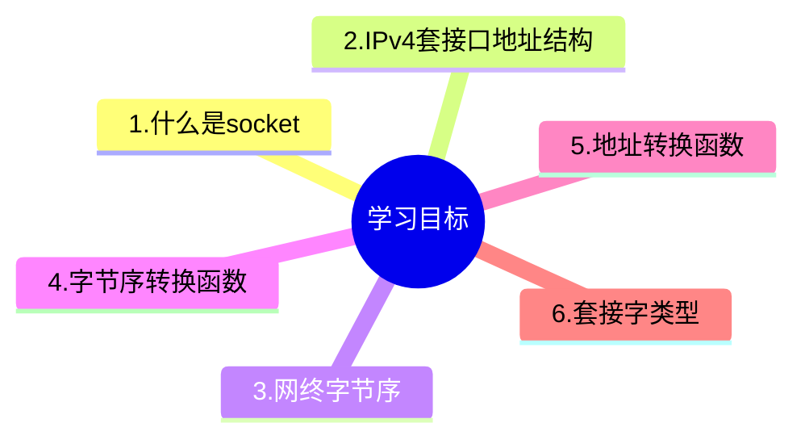
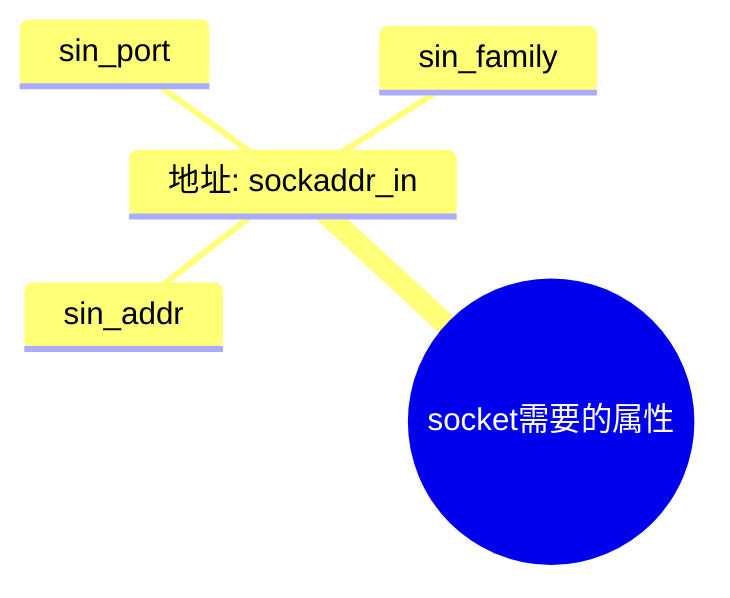

## 学习目标


## 1. 什么是socket

- socket可以看成是用户进程与内核网络协议栈的
编程接口
- socket不仅可以用于本机的进程间通信，还可以
用于网络上不同主机的进程间通信


我的理解: socket就是对前面学习的tcp/ip的代码封装,但是位于系统的内核,也就是说提供给用户的一组API,用于网络通信.

> [!WARNING]
> socket 这里理解成"插座"



## ipv4 socket 地址结构体

ipv4 socket地址结构体,在头文件`netinet/in.h`中定义。 `sockaddr_in`结构体定义如下：

使用`man 7 ip`命令查看`sockaddr_in`结构体的定义：

```c
struct sockaddr_in {
    sa_family_t sin_family; // 地址族，ipv4 就是AF_INET
    in_port_t sin_port; // 端口号    
    struct in_addr sin_addr; // IP地址
    char sin_zero[8]; // 未使用,注意这个在man 7 ip中没有说明
                     //暗示程序员不需要知道这个??
                     //当成上面的普通的来用?
};
```


1.  `sin_family`字段表示地址族,socket在设计的时候还可以用于其它的协议,不仅是tcp/ip,比如还有`unix`域，对于IPv4地址，该值为`AF_INET`。
2.  `sin_port`字段表示端口号，使用网络字节序（big-endian）存储。
3.  `sin_addr`字段表示IP地址，使用`struct in_addr`结构体表示。

`struct in_addr`结构体定义如下：

```c
struct in_addr {
    uint32_t s_addr; // IP地址，使用网络字节序存储
};
```

1.  `s_addr`字段表示IP地址，使用网络字节序存储。

### 疑问1

> [!NOTE]
> 到这里就有一个疑问,`socketaddr_in`结构体具体的定义是什么呢?后面有没有`char sin_zero[8];`字段呢?通过下面的代码来验证

```c
{{#include ./code/size_ofsockaddr_in.c}}
```
输出的结果是：`16`,

```
size bytes of sockaddr_in 16
size bytes of sin_family 2
size bytes of sin_port 2
size bytes of sin_addr 4
```

结果确实是少`8`


## 通用套接字地址结构体`sockaddr`

定义如下：

它适用于任何地址协议,

```
struct sockaddr {
    sa_family_t sa_family; // 地址族
    char sa_data[14]; // 地址数据，长度取决于地址族
};
```

1.  `sa_family`字段表示地址族。
2.  `sa_data`字段表示地址数据，长度取决于地址族。

```
#include <stdio.h>
#include <netinet/in.h>

int main(int argc, char const *argv[])
{
    struct  sockaddr_in addr1;
    struct  sockaddr addr2;

    printf("sizof(sockaddr_in) = %ld\n", sizeof(addr1));
    printf("sizof(sockaddr) = %ld\n", sizeof(addr2));

    // 最后输出的结果是：
    // sizof(sockaddr_in) = 16
    // sizof(sockaddr) = 16
    // 说明sockaddr_in和sockaddr的大小是相同的，都是16字节。
    
    return 0;
}
```

在通常的网络编程中,我们先填写`sockaddr_in`结构体,然后再把它转换成通用的`sockaddr`结构体.

## [网络字节序](https://notes.roj.ac.cn/myNetworkProgramming/socket%E7%BC%96%E7%A8%8B.html#网络字节序)

## 网络字节序

字节序分为：

- 大端字节序（Big-endian）
- 小端字节序（Little-endian）


网络字节序（Network Byte Order）是指数据的高位字节保存在内存的低地址中，而数据的低位字节保存在内存的高地址中。就是大端字节序.

在TCP/IP协议中，所有长度字段和数字都采用网络字节序。例如，在TCP报文头部的源端口字段中，端口号的高位字节保存在内存的低地址中，而端口号的低位字节保存在内存的高地址中。
