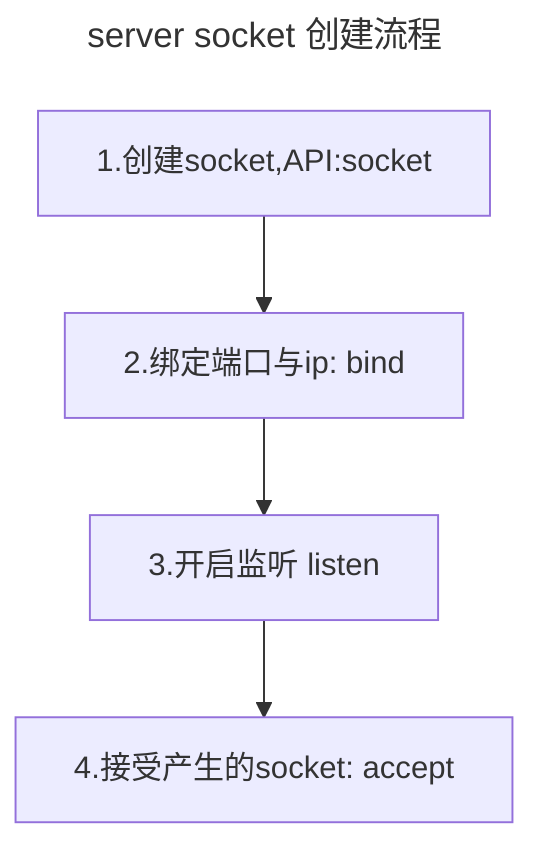

# 第一章 理解网络编程和socket

> ![INFO]
> 网络编程就是编写程序使用两台连网的计算机相互交换数据.

这就是整个网络编程的全部内容.我觉得不需要去详细的理解TCP/IP的细节.

下面我按我的理解这一章的内容.


如果我们想到在电脑上创建一个server端的软件,用来接收其它电脑上另一个程序通过网络发来的信息,应该如何做呢? 应该按下面的流程来做



## 第一步创建 socket(插座)


如果我们家里需要网络通信,首先要有一个网络面板(网络插座)用来连接网络,然后才能通信. 同样我们也需要先创建一个socket,这个socket的作用就是用于后面的网络连接.


```c
int socket(int domain,int type,int protocal)
```

具体参数的含义与理解见一下章节

## 第二步 bind函数

通过第一步我们创建了一个socket(插座),那么应该把它放在哪里呢?
其实就是根据哪些信息可以找到这个socket.


1. 信息首先要能发送给电脑,也就是需要知道电脑的IP,一个电脑可以有多个IP.


比如这个电脑就有两个网口,(单网口也可以有多IP)


2. 可以想像到一个电脑上能进行网络通信的软件有多个,那么就有很多个socket.


电脑为了和外部通信,创建了端口这个概念.

你可以把端口想像成电脑一个一个孔洞,每一个数据通过这个孔洞发流入进电脑,如何你的socket"安装"在这个端口上,那么就可以接收到这个数据了.

然后这个socket和还需要和某一端口绑定在一起.

```c
#include <sys/socket.h>
int bind(int sockfd,struct sockaddr_in * myaddr,socklen_t addrlen)
```

##  第三步: 激活监听,listen

现在我们有了一个socket,并把它放到了合适的位置(bind),接下就能通信了吗?
不能,还需要启用,激活它,就像家里弄了网络面板,网线,还需要网络公司给我们开通网络权限.

```c
int listen(int sockfd,int backlog)
```

`listen`的其实是在`socket`创建一个监听队列,队列大小为`backlog`,每一个client请求连接后,就会加入到队列里,等待处理

## 第四步: accept,处理连接请求


```c
int accept(int sockfd,struct sockaddr * addr ,socklen_t * addrlen);
```

上一步,可以接收连接,然后加入到队列里,但是还需要对这些队列里的内容进行处理.

`accept`的作用,从队列取出一个连接数据,然后创建一个`socket`.你可能会问,为什么又创建了一个socket,原来不是有一个吗?

首先我们要明确的知道一个概念,两个socket一在一起才能进行通信,或者说通信的两个电脑之间各有一个socket,不允许一socket对应多个socket.

第一个socket,我们的成为socket,我们称为`server socket`,它在同一时刻与一个client socket进行连接,然后接收到必要的信息之后.根据这些信息产生一个socket A.这个新的socket A已后只与这个client socket进行通信.

这个过程我们称为`accept`


## server端代码

```cpp
{{#include code/1-hello_world_server.c}}
```

编译
```sh
gcc -g -o server 1-hello_world_server.c
```

测试

```sh
netcat -v 127.0.0.1 8989
```

结果

```
➞  netcat -v 127.0.0.1 8989                                                                                                                                  
localhost [127.0.0.1] 8989 (sunwebadmins) open
Hello World!%

```

##  client端代码


client实现比较简单

1. 创建socket
2. 调用connect,与server socket进行连接
3. 发送数据
4. 接收返回的数据
5. 结束client socket


```cpp
{{#include code/1-hello_world_client.c}}
```

运行结果

```
➞  ./1-hello_world_client.out
Message from server: Hello World!
```

## inet_addr 函数

`inet_addr` 是一个用于将 IPv4 地址从点分十进制字符串表示转换为网络字节序的 32 位二进制值的函数。它在 Linux 和其他类 Unix 系统的网络编程中广泛使用。


`man 3 inet_addr`


函数原型：


```c
#include <arpa/inet.h>
in_addr_t inet_addr(const char *cp);
```


参数：
- `cp`：以点分十进制格式表示的 IPv4 地址字符串，例如 "192.168.0.1"。

返回值：
- 成功时，返回转换后的 32 位网络字节序的 IPv4 地址。
- 失败时，返回 `INADDR_NONE`（通常为 -1）。

`inet_addr` 函数将点分十进制格式的 IPv4 地址字符串转换为网络字节序的 32 位二进制值。它执行以下步骤：

1. 将点分十进制的 IPv4 地址字符串按照点号分隔符分割为四个部分，每个部分表示一个字节。
2. 将每个部分转换为对应的整数值（0-255）。
3. 将四个字节组合成一个 32 位的二进制值，并按照网络字节序排列。

例如，对于 IP 地址 "192.168.0.1"，`inet_addr` 函数将返回一个 32 位的整数值 `0x0100A8C0`（网络字节序）。

使用示例：


```c
#include <stdio.h>
#include <arpa/inet.h>

int main() {
    const char *ip_str = "192.168.0.1";
    in_addr_t ip_addr = inet_addr(ip_str);
    
    if (ip_addr == INADDR_NONE) {
        printf("无效的 IP 地址\n");
    } else {
        printf("IP 地址的网络字节序表示: 0x%08X\n", ip_addr);
    }
    
    return 0;
}
```


输出：


```
IP 地址的网络字节序表示: 0x0100A8C0
```


需要注意的是，`inet_addr` 函数只支持 IPv4 地址的转换，对于 IPv6 地址，需要使用 `inet_pton` 函数进行转换。

另外，由于 `inet_addr` 函数不能处理格式错误的 IP 地址字符串，因此在实际使用中，通常推荐使用更加健壮和通用的 `inet_pton` 函数来进行 IP 地址的转换。

## linux的文件操作

每一个程序都有多个文件描述符,从 0 到 1023，这些0,1,2文件描述符被称为标准输入、标准输出、标准错误。

这个文件描述符是由linux系统维护的.


```c
int open(const char *pathname, int flags);
int close(int fd);
ssize_t read(int fd, void *buf, size_t count);
ssize_t write(int fd, const void *buf, size_t count);
```