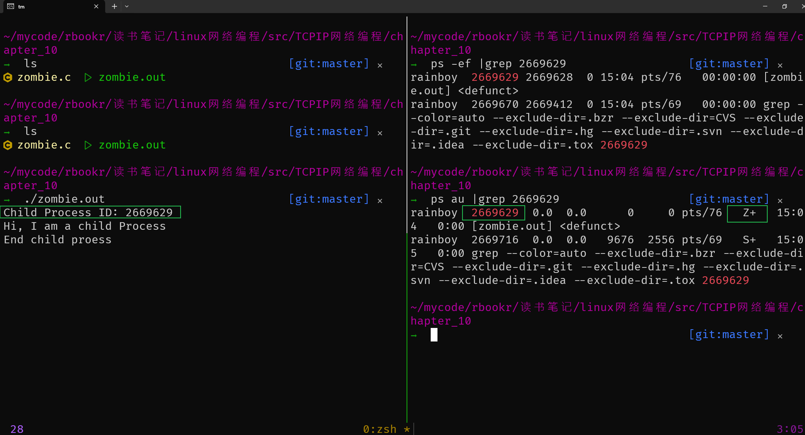
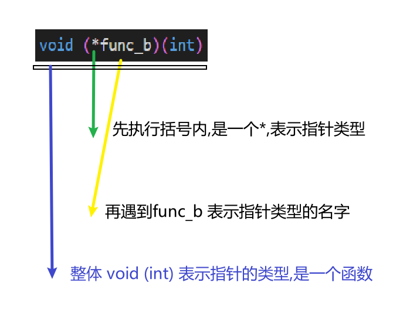

为了加大服务器同时处理用户的连接,有效的利用CPU

1. 多进程服务器: 创建多个进程提供服务
2. 多路复用: 捆绑并统一管理IO对象提供服务
3. 多线程: 生成与客户短等量化的线程提供服务


## 10.1 进程概念及引用


### 理解进程

进程的定义如下：**占用内存空间的正在运行的程序**

### 进程ID


在说进程创建方法之前，先要简要说明进程 ID。无论进程是如何创建的，所有的进程都会被操作系统分配一个 ID。此 ID 被称为「进程ID」，其值为大于 2 的整数。1 要分配给操作系统启动后的（用于协助操作系统）首个进程，因此用户无法得到 ID 值为 1 。接下来观察在 Linux 中运行的进程。


### fork创建进程

创建进程的方式很多，此处只介绍用于创建多进程服务端的 fork 函数。

```c
#include <unistd.h>
pid_t fork(void);
// 成功时返回进程ID,失败时返回 -1
```

fork 函数将创建调用的进程副本。也就是说，并非根据完全不同的程序创建进程，而是复制正在运行的、调用 fork 函数的进程。另外，两个进程都执行 fork 函数调用后的语句（准确的说是在 fork 函数返回后）。但因为是通过同一个进程、复制相同的内存空间，之后的程序流要根据 fork 函数的返回值加以区分。即利用 fork 函数的如下特点区分程序执行流程。

-   父进程：fork 函数返回子进程 ID
-   子进程：fork 函数返回 0

此处，「父进程」（Parent Process）指原进程，即调用 fork 函数的主体，而「子进程」（Child Process）是通过父进程调用 fork 函数复制出的进程。接下来是调用 fork 函数后的程序运行流程。如图所示：

[](https://camo.githubusercontent.com/7c517aeff982752b7b862d181d7d4061edcb420dd3e668e3ab0a9c0704daa2a2/68747470733a2f2f692e6c6f6c692e6e65742f323031392f30312f32302f356334336461353431326239302e706e67)

从图中可以看出，父进程调用 fork 函数的同时复制出子进程，并分别得到 fork 函数的返回值。但复制前，父进程将全局变量 gval 增加到 11,将局部变量 lval 的值增加到 25，因此在这种状态下完成进程复制。复制完成后根据 fork 函数的返回类型区分父子进程。父进程的 lval 的值增加 1 ，但这不会影响子进程的 lval 值。同样子进程将 gval 的值增加 1 也不会影响到父进程的 gval 。因为 fork 函数调用后分成了完全不同的进程，只是二者共享同一段代码而已。接下来给出一个例子：


```c
#include <stdio.h>
#include <unistd.h>
int gval = 10;
int main(int argc, char *argv[])
{
    pid_t pid;
    int lval = 20;
    gval++, lval += 5;
    pid = fork();
    if (pid == 0)
        gval += 2, lval += 2;
    else
        gval -= 2, lval -= 2;
    if (pid == 0)
        printf("Child Proc: [%d,%d] \n", gval, lval);
    else
        printf("Parent Proc: [%d,%d] \n", gval, lval);
    return 0;
}
```

## 10.2 进程与僵尸进程
文件操作中，关闭文件和打开文件同等重要。同样，进程销毁和进程创建也同等重要。如果未认真对待进程销毁，他们将变成僵尸进程。

进程的工作完成后（执行完 main 函数中的程序后）应被销毁，但有时这些进程将变成僵尸进程，占用系统中的重要资源。这种状态下的进程称作「僵尸进程」，这也是给系统带来负担的原因之一。

> 僵尸进程是当子进程比父进程先结束，而父进程又没有回收子进程，释放子进程占用的资源，此时子进程将成为一个僵尸进程。如果父进程先退出 ，子进程被init接管，子进程退出后init会回收其占用的相关资源

> UNIX命令ps列出的进程的状态（"STAT"）栏标示为 "Z"则为僵尸进程。[1]

> 收割僵尸进程的方法是通过kill命令手工向其父进程发送SIGCHLD信号。如果其父进程仍然拒绝收割僵尸进程，则终止父进程，使得init进程收养僵尸进程。init进程周期执行wait系统调用收割其收养的所有僵尸进程。

### 产生僵尸进程的原因

产生僵尸进程的原因是: **当子进程结束时,操作系统不会主动将子进程的退出状态传递给父进程** 。只有父进程**主动**请求获取子进程的退出状态, 操作系统才会将其传递。如果父进程没有主动要求获取子进程的退出状态,操作系统将一直保存子进程的退出状态,导致子进程长时间处于僵尸进程状态。因此,**为了及时回收子进程,父进程应该主动获取子进程的退出状态。**

zombie.c

```c
{{#include chapter_10/zombie.c }}
```



### 销毁僵尸 wait函数

父进程应该主动请求获取子进程的返回值以销毁子进程。使用 wait 函数来获取子进程的终止状态，通过宏 WIFEXITED 和 WEXITSTATUS 来分离和处理子进程的返回值。

{{#include chapter_10/wait.c }}

### 销毁僵尸 waitpid函数

wait 函数会引起程序阻塞，还可以考虑调用 waitpid 函数。这是防止僵尸进程的第二种方法，也是防止阻塞的方法。

```c
#include <sys/wait.h>
pid_t waitpid(pid_t pid, int *statloc, int options);
/*
成功时返回终止的子进程ID 或 0 ，失败时返回 -1
pid: 等待终止的目标子进程的ID,若传 -1，则与 wait 函数相同，可以等待任意子进程终止
statloc: 与 wait 函数的 statloc 参数具有相同含义
options: 传递头文件 sys/wait.h 声明的常量 WNOHANG ,即使没有终止的子进程也不会进入阻塞状态，而是返回 0 退出函数。
*/
```

waitpid.c
```c
#include <stdio.h>
#include <unistd.h>
#include <sys/wait.h>
int main(int argc, char *argv[])
{
    int status;
    pid_t pid = fork();
    if (pid == 0)
    {
        sleep(15); //用 sleep 推迟子进程的执行
        return 24;
    }
    else
    {
        //调用waitpid 传递参数 WNOHANG ，这样之前有没有终止的子进程则返回0
        while (!waitpid(-1, &status, WNOHANG))
        {
            sleep(3);
            puts("sleep 3 sec.");
        }
        if (WIFEXITED(status))
            printf("Child send %d \n", WEXITSTATUS(status));
    }
    return 0;
```

## 10.3 信号处理

> 子进程究竟何时终止？调用 waitpid 函数后要无休止的等待吗？

信号是一种软中断，它是由操作系统向进程发送的通知消息。信号的作用是通知进程发生了某种事件，如进程终止、进程收到某种输入、进程执行时间到达某一点等。信号的处理方式是通过信号处理函数来实现的。

子进程终止的识别主体是操作系统，因此，若操作系统能把子进程结束的信息告诉正忙于工作的父进程，将有助于构建更高效的程序

### 信号与signal函数

我们可以注册信号处理函数，当信号发生时，操作系统将调用相应的信号处理函数。信号处理函数的原型如下：

```c
#include <signal.h>
void (*signal(int signo, void (*func)(int)))(int);
/*
为了在产生信号时调用，返回之前注册的函数指针
函数名: signal
参数：int signo,void(*func)(int)
返回类型：参数类型为int型，返回 void 型函数指针
*/
```

这个函数比较难,我这样理解

有函数为

```c
void func_a(int)
```

这个函数的是一个返回值为void,参数为int的函数.

```c
void (*func_b)(int)

//相当于

//定义一个类型,函数指针
typedef void (*)(int) func_a_pointer;
// 定义一个指向函数的变量
func_a_pointer func_a_p = func_a;
```
怎么理解函数指针


再难一点,定义函数的返回值 为函数指针

```c
void (*func_c(int))(int)

typedef void (*)(int) func_a_pointer;
// 定义一个指向函数的变量
func_a_pointer function_c(int);
```

再难一点,函数的返回值为函数指针,且函数的参数还有一个函数指针

```c
void (*signal(int signo, void (*func)(int)))(int);
```


调用上述函数时，第一个参数为特殊情况信息，第二个参数为特殊情况下将要调用的函数的地址值（指针）。发生第一个参数代表的情况时，调用第二个参数所指的函数。下面给出可以在 signal 函数中注册的部分特殊情况和对应的函数。

-   SIGALRM：已到通过调用 alarm 函数时候产生
-   SIGINT：输入 ctrl+c
-   SIGCHLD：子进程终止


```c
#include <stdio.h>
#include <unistd.h>
#include <signal.h>
void timeout(int sig) //信号处理器
{
    if (sig == SIGALRM)
        puts("Time out!");
    alarm(2); //为了每隔 2 秒重复产生 SIGALRM 信号，在信号处理器中调用 alarm 函数
}
void keycontrol(int sig) //信号处理器
{
    if (sig == SIGINT)
        puts("CTRL+C pressed");
}
int main(int argc, char *argv[])
{
    int i;
    signal(SIGALRM, timeout); //注册信号及相应处理器
    signal(SIGINT, keycontrol);
    alarm(2); //预约 2 秒候发生 SIGALRM 信号

    for (i = 0; i < 3; i++)
    {
        puts("wait...");
        sleep(100);
    }
    return 0;
}
```

> 发生信号时将唤醒由于调用 sleep 函数而进入阻塞状态的进程。

### 利用 sigaction 函数进行信号处理

还有一个函数，叫做 sigaction 函数，他类似于 signal 函数，而且可以完全代替后者，也更稳定。之所以稳定，是因为：

> signal 函数在 Unix 系列的不同操作系统可能存在区别，但 sigaction 函数完全相同

实际上现在很少用 signal 函数编写程序，他只是为了保持对旧程序的兼容，下面介绍 sigaction 函数，只讲解可以替换 signal 函数的功能。


```c
#include <signal.h>

int sigaction(int signo, const struct sigaction *act, struct sigaction *oldact);
/*
成功时返回 0 ，失败时返回 -1
act: 对于第一个参数的信号处理函数（信号处理器）信息。
oldact: 通过此参数获取之前注册的信号处理函数指针，若不需要则传递 0
*/
```

声明并初始化 sigaction 结构体变量以调用上述函数，该结构体定义如下：

```c
struct sigaction
{
    void (*sa_handler)(int);
    sigset_t sa_mask;
    int sa_flags;
};
```


```c
#include <stdio.h>
#include <unistd.h>
#include <signal.h>

void timeout(int sig)
{
    if (sig == SIGALRM)
        puts("Time out!");
    alarm(2);
}

int main(int argc, char *argv[])
{
    int i;
    struct sigaction act;
    act.sa_handler = timeout;    //保存函数指针
    sigemptyset(&act.sa_mask);   //将 sa_mask 成员的所有位初始化成0
    act.sa_flags = 0;            //sa_flags 同样初始化成 0
    sigaction(SIGALRM, &act, 0); //注册 SIGALRM 信号的处理器。

    alarm(2); //2 秒后发生 SIGALRM 信号

    for (int i = 0; i < 3; i++)
    {
        puts("wait...");
        sleep(100);
    }
    return 0;
}
```

### 10.3.4 利用信号处理技术消灭僵尸进程

下面利用子进程终止时产生 SIGCHLD 信号这一点，来用信号处理来消灭僵尸进程。看以下代码：


```c
#include <stdio.h>
#include <stdlib.h>
#include <unistd.h>
#include <signal.h>
#include <sys/wait.h>

void read_childproc(int sig)
{
    int status;
    pid_t id = waitpid(-1, &status, WNOHANG);
    if (WIFEXITED(status))
    {
        printf("Removed proc id: %d \n", id);             //子进程的 pid
        printf("Child send: %d \n", WEXITSTATUS(status)); //子进程的返回值
    }
}

int main(int argc, char *argv[])
{
    pid_t pid;
    struct sigaction act;
    act.sa_handler = read_childproc;
    sigemptyset(&act.sa_mask);
    act.sa_flags = 0;
    sigaction(SIGCHLD, &act, 0);

    pid = fork();
    if (pid == 0) //子进程执行阶段
    {
        puts("Hi I'm child process");
        sleep(10);
        return 12;
    }
    else //父进程执行阶段
    {
        printf("Child proc id: %d\n", pid);
        pid = fork();
        if (pid == 0)
        {
            puts("Hi! I'm child process");
            sleep(10);
            exit(24);
        }
        else
        {
            int i;
            printf("Child proc id: %d \n", pid);
            for (i = 0; i < 5; i++)
            {
                puts("wait");
                sleep(5);
            }
        }
    }
    return 0;
}
```

## 10.4 基于多任务的并发服务器


之前的回声服务器每次只能同事向 1 个客户端提供服务。因此，需要扩展回声服务器，使其可以同时向多个客户端提供服务。下图是基于多进程的回声服务器的模型。

[](https://camo.githubusercontent.com/f86fb2dff6d5c43cafa19721581224e98cfaf56f6971a97824e84039ec4ea680/68747470733a2f2f692e6c6f6c692e6e65742f323031392f30312f32312f356334353336363463646532362e706e67)

从图中可以看出，每当有客户端请求时（连接请求），回声服务器都创建子进程以提供服务。如果请求的客户端有 5 个，则将创建 5 个子进程来提供服务，为了完成这些任务，需要经过如下过程：

-   第一阶段：回声服务器端（父进程）通过调用 accept 函数受理连接请求
-   第二阶段：此时获取的套接字文件描述符创建并传递给子进程
-   第三阶段：子进程利用传递来的文件描述符提供服务

> Q ? 如何传递给子进程文件描述符  
> A 子进程会复制父进程的所有的资源,所以不需要传递
>
> Q: 子进程会复制父进程的server_sd（套接字文件描述符）吗? 那他会收到cient的数据吗?

```c
#include <stdio.h>
#include <stdlib.h>
#include <string.h>
#include <unistd.h>
#include <signal.h>
#include <sys/wait.h>
#include <arpa/inet.h>
#include <sys/socket.h>

#define BUF_SIZE 30
void error_handling(char *message);
void read_childproc(int sig);

int main(int argc, char *argv[])
{
    int serv_sock, clnt_sock;
    struct sockaddr_in serv_adr, clnt_adr;

    pid_t pid;
    struct sigaction act;
    socklen_t adr_sz;
    int str_len, state;
    char buf[BUF_SIZE];
    if (argc != 2)
    {
        printf("Usgae : %s <port>\n", argv[0]);
        exit(1);
    }
    act.sa_handler = read_childproc; //防止僵尸进程
    sigemptyset(&act.sa_mask);
    act.sa_flags = 0;
    state = sigaction(SIGCHLD, &act, 0);         //注册信号处理器,把成功的返回值给 state
    serv_sock = socket(PF_INET, SOCK_STREAM, 0); //创建服务端套接字
    memset(&serv_adr, 0, sizeof(serv_adr));
    serv_adr.sin_family = AF_INET;
    serv_adr.sin_addr.s_addr = htonl(INADDR_ANY);
    serv_adr.sin_port = htons(atoi(argv[1]));

    if (bind(serv_sock, (struct sockaddr *)&serv_adr, sizeof(serv_adr)) == -1) //分配IP地址和端口号
        error_handling("bind() error");
    if (listen(serv_sock, 5) == -1) //进入等待连接请求状态
        error_handling("listen() error");

    while (1)
    {
        adr_sz = sizeof(clnt_adr);
        clnt_sock = accept(serv_sock, (struct sockaddr *)&clnt_adr, &adr_sz);
        if (clnt_sock == -1)
            continue;
        else
            puts("new client connected...");
        pid = fork(); //此时，父子进程分别带有一个套接字
        if (pid == -1)
        {
            close(clnt_sock);
            continue;
        }
        if (pid == 0) //子进程运行区域,此部分向客户端提供回声服务
        {
            close(serv_sock); //关闭服务器套接字，因为从父进程传递到了子进程
            while ((str_len = read(clnt_sock, buf, BUFSIZ)) != 0)
                write(clnt_sock, buf, str_len);

            close(clnt_sock);
            puts("client disconnected...");
            return 0;
        }
        else
            close(clnt_sock); //通过 accept 函数创建的套接字文件描述符已经复制给子进程，因为服务器端要销毁自己拥有的
    }
    close(serv_sock);

    return 0;
}

void error_handling(char *message)
{
    fputs(message, stderr);
    fputc('\n', stderr);
    exit(1);
}
void read_childproc(int sig)
{
    pid_t pid;
    int status;
    pid = waitpid(-1, &status, WNOHANG);
    printf("removed proc id: %d \n", pid);
}
```

#### 10.4.2 实现并发服务器


#### 10.4.3 通过 fork 函数复制文件描述符

[](https://github.com/riba2534/TCP-IP-NetworkNote/tree/master/ch10#1043-通过-fork-函数复制文件描述符)

示例中给出了通过 fork 函数复制文件描述符的过程。父进程将 2 个套接字（一个是服务端套接字另一个是客户端套接字）文件描述符复制给了子进程。

调用 fork 函数时赋值父进程的所有资源，但是套接字不是归进程所有的，而是归操作系统所有，只是进程拥有代表相应套接字的文件描述符。

[](https://camo.githubusercontent.com/8ccabd444c75005032ced58c0a132cb183cf667049d008142733e3e9cf7b8c6f/68747470733a2f2f73322e617831782e636f6d2f323031392f30312f32312f6b5037526a782e706e67)

如图所示，1 个套接字存在 2 个文件描述符时，只有 2 个文件描述符都终止（销毁）后，才能销毁套接字。如果维持图中的状态，即使子进程销毁了与客户端连接的套接字文件描述符，也无法销毁套接字（服务器套接字同样如此）。因此调用 fork 函数后，要将无关紧要的套接字文件描述符关掉，如图所示：

[](https://camo.githubusercontent.com/83a617735ef7e79d738f4293a9a501205e962affd1cca3986f82e5ad32909537/68747470733a2f2f73322e617831782e636f6d2f323031392f30312f32312f6b5048375a542e706e67)

## 10.5 分割 TCP 的 I/O 程序