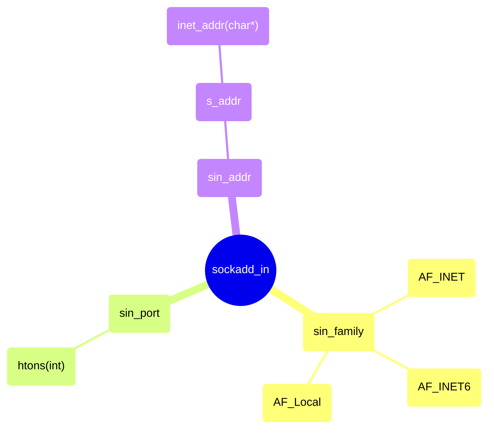

# 地址族与数据序列

书上讲解了一些`ipv4`地址的概念，以及`ipv6`地址的概念。

又说了一些端口号的概念，以及端口号的作用。

但是还是很复杂的,直接理解我第一章节说的内容,每个概念只有一句话.但是这是建立在我对网络编程的了解基础上的.

下讲解了




需要把`sockaddr_in`转化成`struct sockaddr *`才能使用`bind()`等函数.

## 网络字节序与地址的转换

- `htons(int)`：将`int`类型整数转换为网络字节序。
- `htonl(int)`：将`int`类型整数转换为网络字节序。
- `ntohs(int)`：将`int`类型整数转换为主机字节序。
- `ntohl(int)`：将`int`类型整数转换为主机字节序。
- `inet_addr(char*)`：将`char*`类型字符串转换为`in_addr`类型。
- `inet_aton(char*, struct in_addr*)`：将`char*`类型字符串转换为`in_addr`类型。
- `inet_ntoa(struct in_addr)`：将`in_addr`类型转换为`char*`类型字符串,失败返回-1

每次创建服务器端socket都要输入IP地址会有些繁琐,此时可以使用如下的初始化地址信息

```c
struct sockaddr_in server_addr;
char * serv_port = "8989";
server_addr.sin_family = AF_INET;
server_addr.sin_port = htons(atoi(serv_port));
server_addr.sin_addr.s_addr = inet_addr(INADDR_ANY);
```