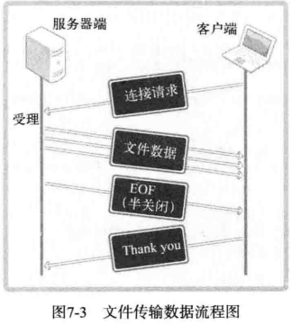

## 1 单方面断开连接带来的问题

主机 A 发送完最后的数据后，调用 close 函数断开了最后的连接，之后主机 A 无法再接受主机 B 传输的数据。实际上，是完全无法调用与接受数据相关的函数。最终，由主机 B 传输的、主机 A 必须要接受的数据也销毁了。


## 2. shutdown函数的作用


```c
#include <sys/socket.h>
int shutdown(int sock, int howto);
/*
成功时返回 0 ，失败时返回 -1
sock: 需要断开套接字文件描述符
howto: 传递断开方式信息
*/
```

调用上述函数时，第二个参数决定断开连接的方式，其值如下所示：

-   `SHUT_RD` : 断开输入流
-   `SHUT_WR` : 断开输出流
-   `SHUT_RDWR` : 同时断开 I/O 流
  

若向 shutdown 的第二个参数传递`SHUT_RD`，则断开输入流，套接字无法接收数据。即使输入缓冲收到数据也会抹去，而且无法调用相关函数。如果向 shutdown 的第二个参数传递`SHUT_WR`，则中断输出流，也就无法传输数据。若如果输出缓冲中还有未传输的数据，则将传递给目标主机。最后，若传递关键字`SHUT_RDWR`，则同时中断 I/O 流。这相当于分 2 次调用 shutdown ，其中一次以`SHUT_RD`为参数，另一次以`SHUT_WR`为参数

## 3. 为什么要半关闭连接


> 留下足够的时间,等所有的数据交换完不就行了,好像也没有必要使用半关闭.

考虑以下情况：

> 一旦客户端连接到服务器，服务器将约定的文件传输给客户端，客户端收到后发送字符串「Thank you」给服务器端。

此处「Thank you」的传递是多余的，这只是用来模拟客户端断开连接前还有数据要传输的情况。此时程序的还嫌难度并不小，因为传输文件的服务器端只需连续传输文件数据即可，而客户端无法知道需要接收数据到何时。客户端也没办法无休止的调用输入函数，因为这有可能导致程序**阻塞**。

> 是否可以让服务器和客户端约定一个代表文件尾的字符？

这种方式也有问题，因为这意味这文件中不能有与约定字符相同的内容。为了解决该问题，服务端应最后向客户端传递 EOF 表示文件传输结束。客户端通过函数返回值接受 EOF ，这样可以避免与文件内容冲突。那么问题来了，服务端如何传递 EOF ？

> 断开输出流时向主机传输 EOF。

当然，调用 close 函数的同时关闭 I/O 流，这样也会向对方发送 EOF 。但此时无法再接受对方传输的数据。换言之，若调用 close 函数关闭流，就无法接受客户端最后发送的字符串「Thank you」。这时需要调用 shutdown 函数，只关闭服务器的输出流。这样既可以发送 EOF ，同时又保留了输入流。下面实现收发文件的服务器端/客户端。

## 4. 基于半关闭的文件传输程序





server代码

```c
{{#include chapter_7/file_server.c}}
```

client代码

```c
{{#include chapter_7/file_client.c}}
```