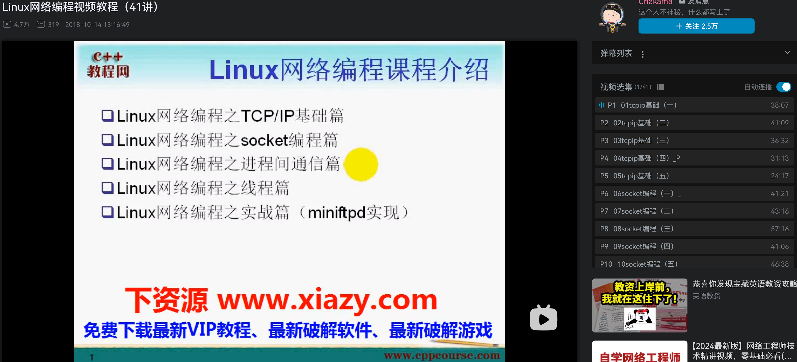

## 说明

我的学习过程

```
基础的socket编程 ->  -> 线程编程 -> muduo库学习
```

## Linux网络编程视频教程



学习自 

-   https://github.com/834810071/NetworkProgramming
-   https://www.bilibili.com/video/av33813135/

我主要的学习目标:

-   固定住 socket 编程的基础知识
-   如何使用 进程 编程
-   如何使用 thread 编程
-   p1 讲解了,网络模型,理解了四层的模型

- [linux网络编程](../readme)
    - [tcpip基础 p1-p5](../1)
    - [socket编程 p6](../2)

## TCP/IP 网络编程


- [tcpip网络编程](./tcpip网络编程/readme)
- [chapter_1](./tcpip网络编程/chapter_1)
- [chapter_2](./tcpip网络编程/chapter_2)
- [chapter_3](./tcpip网络编程/chapter_3)
- [chapter_4](./tcpip网络编程/chapter_4)
- [chapter_5](./tcpip网络编程/chapter_5)
- [chapter_7](./tcpip网络编程/chapter_7)
- [chapter_8](./tcpip网络编程/chapter_8)
- [chapter_9](./tcpip网络编程/chapter_9)
- [chapter_10](./tcpip网络编程/chapter_10)
  
## muduo 网络库

muduo库的实现: https://github.com/EricPengShuai/muduo

- [muduo 网络库](./muduo/readme)
- [chapter_1](./muduo/chapter_1)
- [chapter_2](./muduo/chapter_2)