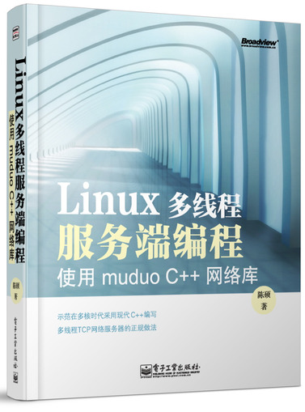

我前面已经看完了  TCPIP网络编程这本书.

1. [muduo 学习笔记 834810071/muduo_study](https://github.com/834810071/muduo_study)
1. [基于 【高级】手写C++ Muduo网络库项目-掌握高性能网络库实现原理 代码](https://github.com/EricPengShuai/muduo)
1. [GitHub - ShangyizhouA-Tiny-Network-Library 使用 C++ 11 重构陈硕的 muduo 库，去除 boost 依赖。内部实现有 HTTP 服务器，可支持 GET 请求。](https://github.com/Shangyizhou/A-Tiny-Network-Library)
2. [可以参考这个项目,看它是如果实现用户的注册与登录的](https://github.com/qinguoyi/TinyWebServer)
2. [chenshuo/documents](https://github.com/chenshuo/documents)
3. 有ppt https://github.com/iceCream1997/muduo_server_learn
4. [S1mpleBugmuduo_cpp11 C++11版本muduo网络库 除去了对boost库的依赖](https://github.com/S1mpleBug/muduo_cpp11?tab=readme-ov-file) 还有视频教程
5. 结合我自己写的一些c++的笔记 https://cpphub.roj.ac.cn
6. 当然还有我们的[cppreference](https://en.cppreference.com/w/) 手册
7. [Hansimovlinux-server 《Linux 高性能服务器编程》和《Linux多线程服务端编程：使用muduo C++网络库》的笔记和源码，以及两个轻量级服务器的项目代码](https://github.com/Hansimov/linux-server) 也比较有用
8.  raichen/LinuxServerCodes: Linux高性能服务器编程源码 [https://github.com/raichen/LinuxServerCodes](https://github.com/raichen/LinuxServerCodes)
9. chenshuo/muduo: Event-driven network library for multi-threaded Linux server in C++11 [https://github.com/chenshuo/muduo](https://github.com/chenshuo/muduo)
10. qinguoyi/TinyWebServer: Linux下C++轻量级Web服务器 [https://github.com/qinguoyi/TinyWebServer](https://github.com/qinguoyi/TinyWebServer)
11. linyacool/WebServer: A C++ High Performance Web Server [https://github.com/linyacool/WebServer](https://github.com/linyacool/WebServer)
12. 使用工具Webbench，进行测试

## 其它可以参考的库

1. [Frees0u1smuduoChatServer 基于Muduo精简实现的Smuduo,在保留原有功能和特性(事件驱动的Reactor模式，非阻塞IO)的基础上，移除boost库依赖，大量使用C++11新特性.](https://github.com/Frees0u1/smuduoChatServer/tree/master)