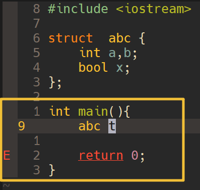

## 1. 起因

我的大部分代码编写已经转到vscode,只有写 OJ代码的使用的是vim(因为快). 现在我准备配置一个专用的nvim,精简一下配置.

## 2. lazy.nvim


这里我们使用[lazy.nvim](https://lazy.folke.io/) 作为我们的插件管理器,因为国内的环境，我们配置一下github下载proxy


`~/.config/nvim/lua/config/lazy.lua`

> [!CODE]+ lazy.nvim 配置
> 

## 3. 主题

我喜欢`gruvbox`,这里使用`ellisonleao/gruvbox.nvim`,根据[lazy.nvim structure plugins](https://lazy.folke.io/usage/structuring) and [lazy.nvim Installation](https://lazy.folke.io/installation)

> Any lua file in `~/.config/nvim/lua/plugins/*.lua` will be automatically merged in the main plugin spec

`~/.config/nvim/lua/config/lazy.lua` 中的 `spec` 字段配置如下:
```lua
require("lazy").setup({
  spec = {
    -- same as: require("lazy").setup("plugins")
    -- 从 lua/plugins 目录加载插件配置
    { import = "plugins" },
  },
})
```

`~/.config/nvim/lua/plugins/gruvbox.lua` 写入如下:
```lua
return {
    "ellisonleao/gruvbox.nvim",
    priority = 1000,
    config = function()
        vim.cmd.colorscheme("gruvbox")
    end,
}
```

## 4. 选项配置

选项配置

主要用到的就是 `vim.g`、`vim.opt`、`vim.cmd` 等，我制造了一个快速参照对比的表格

| In `Vim` | In `nvim` | Note |
| --- | --- | --- |
| `let g:foo = bar` | `vim.g.foo = bar` |  |
| `set foo = bar` | `vim.opt.foo = bar` | `set foo` = `vim.opt.foo = true` |
| `some_vimscript` | `vim.cmd(some_vimscript)` |

## 按键配置


```c
-- define common options
local opts = {
    noremap = true,      -- non-recursive
    silent = true,       -- do not show message
}

-----------------
-- Normal mode --
-----------------

-- Hint: see `:h vim.map.set()`
-- Better window navigation
vim.keymap.set('n', '<C-h>', '<C-w>h', opts)
vim.keymap.set('n', '<C-j>', '<C-w>j', opts)
vim.keymap.set('n', '<C-k>', '<C-w>k', opts)
vim.keymap.set('n', '<C-l>', '<C-w>l', opts)

-- Resize with arrows
-- delta: 2 lines
vim.keymap.set('n', '<C-Up>', ':resize -2<CR>', opts)
vim.keymap.set('n', '<C-Down>', ':resize +2<CR>', opts)
vim.keymap.set('n', '<C-Left>', ':vertical resize -2<CR>', opts)
vim.keymap.set('n', '<C-Right>', ':vertical resize +2<CR>', opts)

-----------------
-- Visual mode --
-----------------

-- Hint: start visual mode with the same area as the previous area and the same mode
vim.keymap.set('v', '<', '<gv', opts)
vim.keymap.set('v', '>', '>gv', opts)
```

## 插件

### lualine

[lualine.nvim](https://github.com/nvim-lualine/lualine.nvim)是一个状态栏插件

`lua/plugins/lualine.lua`

```lua
return {
    "nvim-lualine/lualine.nvim",
    dependencies = { "nvim-tree/nvim-web-devicons" },
    config = function()
        require("lualine").setup({
            options = {
                theme = "gruvbox",
            },
        })
    end,
}
```

配置

### Comment.nvim 和 lang-cpp.lua

### which-key.nvim

> Create key bindings that stick. WhichKey helps you remember your Neovim keymaps, by showing available keybindings in a popup as you type.

简而言之就是我们可以使用这个插件,来提示我们软件的快捷键是什么？

具体使用参考[which-key.nvim 使用](./which-key.md),最佳实践:

```lua
-- 在你的 plugins/gitsigns.lua 文件中
return {
  "lewis6991/gitsigns.nvim",
  -- 其他配置...
  keys = {
    -- ↓↓↓ 这就是那个特殊的“显式分组条目” ↓↓↓
    {
      "<leader>g",
      group = "Git", -- 子菜单的标题
      desc = "Git (Gitsigns)", -- 在<leader>菜单中显示的描述
      icon = "", -- Nerd Font 图标 (可选)
      -- 注意: 这里没有第二个元素 (rhs 命令)
    },
    
    -- ↓↓↓ 下面是这个分组里的具体键位 ↓↓↓
    { "<leader>gj", "<cmd>Gitsigns next_hunk<cr>", desc = "Next Hunk" },
    { "<leader>gk", "<cmd>Gitsigns prev_hunk<cr>", desc = "Previous Hunk" },
    { "<leader>gp", "<cmd>Gitsigns preview_hunk<cr>", desc = "Preview Hunk" },
    { "<leader>gs", "<cmd>Gitsigns stage_hunk<cr>", desc = "Stage Hunk" },
    { "<leader>gu", "<cmd>Gitsigns undo_stage_hunk<cr>", desc = "Undo Stage" },
    { "<leader>gr", "<cmd>Gitsigns reset_hunk<cr>", desc = "Reset Hunk" },
  },
}
```

### 1. marks.nvim

文件内标记 (Marks)

- `mx` 设置标记 x (x 为任意字母 a-z)
- `m,` 设置下一个可用的小写字母标记
- `m;` 在当前行上切换标记 (如果当前行没有标记，则添加一个；如果有，则删除它)
- `dmx` 删除标记 x
- `dm-` 删除当前行上的所有标记
- `dm<space>` 删除当前缓冲区（文件）中的所有标记
- `m]` 跳转到下一个标记
- `m[` 跳转到上一个标记

m: 预览标记。系统会提示您输入要预览的特定标记；如果直接按 回车键，则会预览下一个标记。

跨文件书签 (Bookmarks)

- `m[0-9]` 添加一个书签到书签组 [0-9] 中 (例如 m1 会在第1组添加一个书签)
- `dm[0-9]` 删除书签组 [0-9] 中的所有书签
- `m}` 跳转到下一个同类型的书签 (类型与光标下的书签相同)。此功能可跨缓冲区（文件）工作。
- `m{` 跳转到上一个同类型的书签 (类型与光标下的书签相同)。此功能可跨缓冲区（文件）工作。
- `dm=` 删除光标所在位置的书签

配合 `whichkey.nvim`的`'` or `` ` ``  使用,实现快速的跳转

### 2. lsp

从 Neovim v0.11 开始引入了 `vim.lsp.config` 和 `vim.lsp.enable` 这 2 个 API 对 LSP 进行配置，这下再也不用安装 nvim-lspconfig 了。<del>但我们可能还是需要一个 LSP Registry 用来方便地下载 LSP，比如 mason.nvim</del>(这里我选择手动下载clangd)

1. 首先看一下 [nvim官方lsp 文档](https://neovim.io/doc/user/lsp.html)

TODO 简单配置如下

实现功能: 实时错误显示


### 3. nvim-cmp

这里使用经典nvim-cmp

- [nvim-cmp gihub 地址](https://github.com/hrsh7th/nvim-cmp/)
- [LazyVim nvim-cmp 配置](https://www.lazyvim.org/extras/coding/nvim-cmp) 


### 4. nvim-telescope

### 5. nvim-autopairs

### 6. nvim-comment

### 7. nvim-bufferline

### 8. nvim-lualine

### 10. nvim-gitsigns

### 11. nvim-toggleterm

### 12. nvim-whichkey

### 13. nvim-dap

### 14. nvim-dap-ui

### 15. nvim-dap-virtual-text

### 16. nvim-dap-python

### 17. nvim-dap-go

### 18. nvim-dap-ruby

### 19. nvim-dap-vscode-js

### 20. nvim-dap-ui

### 21. nvim-dap-virtual-text

### 22. nvim-dap-python

### 23. nvim-dap-go

### 24. nvim-dap-ruby

### 25. nvim-dap-vscode-js

### 26. nvim-dap-ui

### 27. nvim-dap-virtual-text

### 28. nvim-dap-python

### 29. nvim-dap-go

### 30. nvim-dap-ruby

### 31. nvim-dap-vscode-js

### 32. nvim-dap-ui

### 33. nvim-dap-virtual-text

### 34. nvim-dap-python

### 35. nvim-dap-go

### 36. nvim-dap-ruby

### 37. nvim-dap-vscode-js

### 38. nvim-dap-ui

### 39. nvim-dap-virtual-text

### 40. nvim-dap-python

### 41. nvim-dap-go

### 42. nvim-dap-ruby

### 43. nvim-dap-vscode-js

### 44. nvim-dap-ui

### 45. n

## 5. 参考

- [从零开始配置 Neovim(Nvim)](https://martinlwx.github.io/zh-cn/config-neovim-from-scratch/)