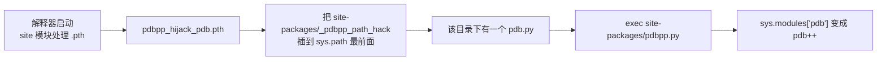

你习惯了 `cgdb`：上面一屏源码、当前行高亮、旁边变量、`break` / `n` / `s` / `c` 一路走过去。切到 Python 一敲调试，只剩下一个 `(Pdb) ` 提示符——`l` 一次吐十行源码，走到哪一行、手里有哪些变量，全靠脑补。

Python 标准库的调试器 `pdb` 是**行式 REPL**：它不缺能力（断点、单步、栈帧、事后调试都有），它缺的是**显示器**。补上这块有两条路线：

- **pudb**：全屏 TUI，源码 / 变量 / 调用栈 / 断点四个窗格常驻，是终端里最接近 cgdb 的 Python 调试器；
- **pdbpp**（也叫 pdb++）：不换屏，把 `pdb` 原地升级——语法高亮、sticky 源码、Tab 补全、`display` 常驻表达式。

本文按「装 → 用 → 对比 → 避坑」走一遍。Arch 上对应的包是官方仓库的 `extra/python-pudb` 和 AUR 的 `python-pdbpp`。

## 1. 先分清你要哪一种

| | pudb | pdbpp | 原生 pdb | nvim-dap / VSCode |
| --- | --- | --- | --- | --- |
| 界面 | 全屏 TUI（curses） | 行式 + 高亮 + sticky 源码 | 行式 | 编辑器内 GUI |
| 装法 | `pacman -S python-pudb` | AUR `yay -S python-pdbpp` | 内置 | 需配 debugpy |
| 入口 | `pudb 脚本.py` | `import pdb; pdb.set_trace()` | 同左 | 编辑器按钮 |
| 看源码 | 常驻一屏 | `ll` 或 sticky 模式 | `l` 十行 | 常驻一屏 |
| 要不要改代码 | 不用，命令行直接跑 | 不用，装了就自动升级 | 不用 | 要写 launch.json |
| 鼠标 | 支持 | 无 | 无 | 支持 |
| 适合 | 交互式排查、崩溃现场 | 插一行断点就走 | 应急、无第三方环境 | 大型项目日常 |

**一句话选：想「看见」就用 pudb，想「快」就用 pdbpp。**

两者可以同时装：pudb 直接基于 `bdb` 实现，全程不 `import pdb`，所以 pdbpp 对 `pdb` 做的劫持影响不到 pudb。

## 2. 安装

### 2.1 pudb：官方仓库，一行搞定

```bash
sudo pacman -S python-pudb
pudb --version
```

Arch 的 `python-pudb` 是 2025.1.5，会顺带装上 `python-urwid`、`python-urwid_readline`、`python-jedi`、`python-pygments` 等依赖，总共约 1 MB。它提供 `pudb` 命令，同时也支持 `python -m pudb`。

### 2.2 pdbpp：只有 AUR

```bash
yay -S python-pdbpp                 # 会一并装上 AUR 的 python-fancycompleter
python -c "import pdb; print(pdb.__file__)"
# 没装： /usr/lib/python3.14/pdb.py
# 装了： /usr/lib/python3.14/site-packages/pdbpp.py
```

第二行是**验证劫持是否生效**的可靠办法：装上 pdbpp 后，`import pdb` 拿到的已经是 pdb++，所以 `pdb.__file__` 会指向 `pdbpp.py`。

好消息是 pdbpp 依赖 `python-fancycompleter`，这个包同样只在 AUR；`python-pygments` 在官方仓库。所以 `yay -S python-pdbpp` 会从 AUR 拉两个包。

### 2.3 隔离方案：装进项目 venv

不想让系统 Python 被全局劫持（第 6 节会讲这意味着什么），就装进虚拟环境：

```bash
cd 你的项目
uv venv && uv pip install pudb pdbpp     # 或 python -m venv .venv && .venv/bin/pip install pudb pdbpp
```

这里有两个坑要先说清楚：

- **`uv tool install pdbpp` 装不了。** `pdbpp` 包里没有任何命令行入口点（连 `pdbpp` 这个命令都不存在），`uv tool` 会以「没有可执行文件」直接拒绝。这不是配置问题，是设计如此。
- **`uv tool install pudb` 能装，但要小心解释器隔离。** `pudb` 确实有命令，但 `pudb 脚本.py` 是在 **uv 工具环境自己的解释器**里执行你的脚本的，脚本 import 的 numpy、requests 可能不在场。调试目标缺依赖时，请把 pudb 装进项目的 venv，用 `.venv/bin/pudb 脚本.py` 跑。

## 3. pudb：四种进入方式

```bash
pudb window.py                 # 1. 最常用：直接跑，界面里设断点
python -m pudb window.py       # 2. 等价写法
pudb -m http.server 8000       # 3. 调试模块（-m 后面的参数原样传给模块）
pudb -c window.py              # 4. 先照常跑，遇到异常或断点才停下
```

想在自己代码里埋断点，有几种写法：

```python
import pudb; pudb.set_trace()      # 标准写法，停下来
pu.db                              # 不用 import，见下
import pudb.b                      # 导入即断，一行一个断点
```

`pu.db` 是 pudb 的一个小妙招：`import pudb` 时它会往 builtins 里注入一个叫 `pu` 的对象，`pu.db` 和 `pu.go` 是**属性访问**，写上去就触发调试器：

| 写法 | 效果 |
| --- | --- |
| `pu.db` | 停在这里（等价 `pudb.set_trace()`） |
| `pu.go` | 不在这里停，但挂上调试器——之后 Ctrl-C 能中断、界面里设的断点会生效 |
| `pudb.set_trace(paused=False)` | 与 `pu.go` 等价 |

用 `pudb 脚本.py` 启动时 pudb 已经导入，所以 `pu.db` 连 import 都不用写。注意 `breakpoint()` **不会**进 pudb——它走的是 `pdb`。想让 `breakpoint()` 指向 pudb：

```bash
PYTHONBREAKPOINT=pudb.set_trace pudb window.py
```

## 4. 界面与真实键位

pudb 一屏四块：左边是**源码**，右侧自上而下是**变量**、**调用栈**、**断点**。默认焦点在源码，`H` 把光标拉回当前执行行（"top of stack"），`u` / `d` 上下切栈帧。

### 4.1 源码窗格（最常用）

| 键 | 作用 |
| --- | --- |
| `n` | 单步跳过（next） |
| `s` | 单步进入（step into） |
| `r` / `f` | 执行到当前函数返回（finish） |
| `c` | 继续运行 |
| `b` | 在光标所在行 设置 / 清除断点 |
| `t` | 运行到光标所在行（run to cursor） |
| `J` | 把执行点**跳**到光标行（不执行中间代码，慎用） |
| `e` | 显示 traceback（异常状态下用） |
| `L` | 显示当前位置 / 跳到指定行 |
| `/` | 搜索源码，`,` / `.` 上一个 / 下一个匹配 |
| `m` | 模块浏览器：看已加载模块、加载或重载模块 |
| `Ctrl-e` | 用 `$EDITOR` 打开当前文件并定位到当前行 |
| `o` | 切到程序输出（print 的内容） |
| `!` | 开外部 shell；`Ctrl-x` 在源码旁开内部命令行 |
| `H` / `u` / `d` | 回到当前行 / 上移栈帧 / 下移栈帧 |
| `j` `k` `h` `l` `G` `g` `Ctrl-f` `Ctrl-b` | Vi 风格移动与翻页 |
| `C` `V` `S` `B` | 分别聚焦 代码 / 变量 / 栈 / 断点 |
| `Ctrl-p` | 打开设置界面 |
| `Ctrl-r` / `Ctrl-l` / `Ctrl-c` | 重载断点 / 重绘屏幕 / 在运行中中断回界面 |
| `F1` 或 `?` | 帮助页（键位都在这） |
| `q` | 退出 |

### 4.2 变量窗格

`Enter` / 空格展开收起，`h` 收起、`l` 展开。对象支持多种展示方式：`d` 默认、`t` 类型、`r` repr、`s` str、`i` id、`c` 自定义。另外：

- `*` 循环切换属性可见性：公开 / `_private` / `__dunder__`；
- `m` 切换方法可见性（默认不显示 `def`，排查时打开很有用）；
- `w` 切换长行折行；
- `n` 或 `Insert` 添加观察表达式（watch），`Delete` 删除。

### 4.3 断点窗格

`e` 编辑断点，弹出的对话框里有四样东西：**Enabled 开关**、**Condition（Python 表达式）**、**Ignore the next N times（前 N 次不中断）**，以及当前 Hit 次数。这就是 pudb 的条件断点入口：先 `b` 设断点，再到断点窗格 `e` 填条件。

pudb 会在启动时加载上次保存的断点，文件是 `~/.config/pudb/saved-breakpoints-3.14`（名字带 Python 版本号）。断点窗格里 `s` 保存、`d` 删除、`b` 启用/禁用。

### 4.4 侧栏与设置

窗口太窄时按 `+` / `-` 调整侧栏宽度，`_` / `=` 最小化或最大化，`[` / `]` 调整当前侧栏块的高度占比。`Ctrl-p` 打开设置界面，可以改主题、行号、栈帧方向等，写进 `~/.config/pudb/pudb.cfg`（遵守 `XDG_CONFIG_HOME`）。内置主题有 `classic`、`vim`、`dark_vim`、`midnight`、`monokai`、`monokai_256`、`nord_dark_256`、`solarized`、`gray_light_256`、`mono`、`agr_256`。

## 5. pudb 的两个杀手锏

### 5.1 异常自动进事后调试

用 `pudb 脚本.py` 跑，脚本抛异常时 pudb 不会只打印 traceback 然后退出，而是**直接停在出事那一行**，变量窗格里还是事故现场的局部变量。按 `e` 看完整 traceback，`u` / `d` 上下翻栈帧。

想在别处手动做同样的事：

```python
try:
    出错的代码()
except Exception:
    import pudb; pudb.post_mortem()      # 从当前异常的 traceback 进入
```

配合 `python -i` 也可以：脚本崩了之后 `import pudb; pudb.pm()`。

### 5.2 重启循环与 `--pre-run`

脚本跑完，pudb 会弹出一个 「Finished」对话框，问你是 **Restart** 还是 **Quit**。选 Restart 就重新从头跑一遍，而且——这是关键——会先执行你在框里填的命令：

```bash
pudb --pre-run "python gen_data.py" solve.py
```

`--pre-run` 接的是**一条 shell 命令**（不是 Python 语句），每次重启前调用一次。调算法题时这一条特别顺手：随机数据每次重新生成，改完代码在界面里直接 Restart，不用来回切终端。

### 5.3 其他值得一提的

- **单独终端控制**：设 `PUDB_TTY=/dev/pts/3`，调试器界面就画在另一个终端里，当前终端留给程序输出；
- **远程调试**：`pudb.remote` 模块可以提供 host/port 形式的远程调试器；
- **IPython 魔法命令**：`import pudb.ipython` 后可用 `%pudb test.py args`，在 IPython 进程里跑脚本。

## 6. pdbpp：不换屏的增强 pdb

pdbpp 的思路和 pudb 完全不同：**它不自己做界面，而是把标准库的 `pdb` 换掉**。

机制在安包装的时候就已经生效了：



`_pdbpp_path_hack/pdb.py` 的内容很短，就是把 `pdbpp.py` 读进来 exec，然后把自己的 `__file__` 改成 `pdbpp.py` 的路径。于是**任何** `import pdb` 的地方拿到的都是 pdb++：

| 你写的代码 / 命令 | 得到的东西 |
| --- | --- |
| `import pdb; pdb.set_trace()` | pdb++ 提示符 `(Pdb++) ` |
| `breakpoint()` | pdb++（`breakpoint()` 内部就是 `import pdb`） |
| `python -m pdb 脚本.py` | pdb++ |
| `pytest --pdb` | pdb++ |
| `import pdb; pdb.pdb.set_trace()` | **真正的原生 pdb**（保留的后门） |

最后一行值得记住：`pdb.pdb` 是原来的 stdlib 模块对象，pdbpp 特意留了这条退路。

想临时关掉劫持：

```bash
PDBPP_HIJACK_PDB=0 python window.py     # 0 表示不劫持，默认是 1
```

也可以直接跑 pdb++ 自己：

```bash
python -m pdbpp window.py
python -m pdbpp -m http.server 8000
```

注意**没有 `pdbpp` 这个命令**——包里没定义命令行入口点，只能通过 `-m` 调用。

## 7. pdbpp 新命令速查

在 `(Pdb++) ` 提示符下多了这些命令：

| 命令 | 作用 |
| --- | --- |
| `ll` / `longlist` | 列出**整个函数**（原生 `l` 只给十行），当前行标 `->` |
| `sticky [start end]` | sticky 模式：每次位置变化都重绘整个函数，单步时能一路看上下文 |
| `interact` | 在当前作用域起一个交互式解释器（全局里就是当前所有变量） |
| `display EXPR` | 添加常驻表达式，每次单步后重新求值，值变了就打印 |
| `undisplay EXPR` | 移除常驻表达式 |
| `source EXPR` | 查看函数/方法/类的源码 |
| `edit EXPR` | 用 `$EDITOR` 打开并定位到该函数/方法/类 |
| `hf_unhide` / `hf_hide` / `hf_list` | 管理被 `@pdb.hideframe` 隐藏的栈帧 |

### 7.1 智能命令解析：老手最容易踩的地方

原生 pdb 优先把输入当命令，所以有个经典惨案——你有个变量叫 `c`，打下 `c` 想看它，结果程序继续跑了：

```python
(Pdb) c            # 你以为是打印变量 c，其实是 continue
```

pdb++ 反过来：**只要有同名变量，就优先当变量**。要强制执行命令，加 `!!`：

```python
(Pdb++) c          # 打印变量 c
(Pdb++) !!c        # 真的执行 continue
```

`list` 是个特例：`list([1, 2])` 仍然按 Python 内置函数解析。

### 7.2 几个便利函数

```python
import pdb

pdb.xpm()        # eXtended Post Mortem：在 except 块里用，从事发那行进事后调试
pdb.disable()    # 让之后的 set_trace() 全部失效（发布前兜底）
pdb.enable()     # 恢复
```

两个装饰器也很有用：

```python
@pdb.hideframe                      # 这个函数的栈帧在 up/down/where 里不显示，减少噪音
def noisy_helper(x):
    ...

@pdb.break_on_setattr("balance")    # 任何实例给 balance 赋值时中断
class Account:
    pass
```

`break_on_setattr` 接受一个 `condition` 回调，可以对值做过滤，不必一赋值就断。

## 8. pdbpp 配置

在 `~/.pdbrc.py` 里写一个继承 `pdb.DefaultConfig` 的 `Config` 类：

```python
# ~/.pdbrc.py
import pdb

class Config(pdb.DefaultConfig):
    sticky_by_default = True          # 一进去就 sticky，单步时自动重绘整个函数
    highlight = True                  # 语法高亮 + 高亮当前行
    editor = "nvim"                   # edit 命令用哪个编辑器
    truncate_long_lines = True
    current_line_color = "39;49;7"    # 反色高亮（默认值）
```

常用选项：

| 选项 | 默认值 | 说明 |
| --- | --- | --- |
| `sticky_by_default` | `False` | 是否一启动就进 sticky 模式 |
| `highlight` | `True` | 高亮行号与当前行（需要 pygments） |
| `editor` | `None` | `edit` 命令的编辑器，支持 `{filename}` / `{lineno}` 占位符 |
| `prompt` | `'(Pdb++) '` | 提示符 |
| `line_number_color` / `filename_color` | turquoise / yellow | 配色 |
| `truncate_long_lines` | `True` | 截断超宽行 |
| `enable_hidden_frames` | `True` | 是否启用隐藏栈帧机制 |

改完不用重启进程，下次调试读的就是新配置。

## 9. 踩坑清单

**1. `python -m pdb.py` 是错的，正确写法是 `python -m pdb`。**

```bash
$ python -m pdb.py window.py
/usr/bin/python: Error while finding module specification for 'pdb.py'
(ModuleNotFoundError: __path__ attribute not found on 'pdb' while trying to find 'pdb.py')
```

`-m` 后面接的是**模块名**不是文件名，`pdb.py` 会被当成子模块去找。这个错在装了 pdbpp 之后更容易撞上，因为你想确认劫持生效。要确认就看 `pdb.__file__`。

**2. pdbpp 是全局劫持，影响面比你想的大。**

`.pth` 文件在**解释器启动时**生效，所以只要 pdbpp 装在某个 site-packages 里，那个环境里所有 Python 程序的 `import pdb` 都变了。这意味着：

- 别的项目、CI 里的调试行为跟着变（哪怕你没在那里用过 pdbpp）；
- 少数依赖 `pdb` 内部实现细节的库可能出意外；
- 想排除干扰就 `PDBPP_HIJACK_PDB=0`，或干脆装进项目 venv 而不是系统 Python。

这也是为什么本文推荐 pudb 走 `pacman`（不碰 `pdb`）、pdbpp 优先考虑 venv。

**3. `pudb -s` / `--steal-output` 在当前版本是坏的。**

`pudb` 的 CLI 里有 `-s, --steal-output` 这个选项，但在 2025.1.5（也就是 Arch 里这个版本）里它第一行就 `raise NotImplementedError("output stealing")`，后面才是实现代码——典型的死代码。加上 `-s` 会直接报错，别用它来解决「程序输出把界面冲乱」的问题；改用 `o` 键看输出，或者设 `PUDB_TTY` 把界面挪到另一个终端。

**4. 装成 `uv tool` 的 pudb，跑不动有依赖的脚本。**

`pudb 脚本.py` 用的是 pudb 所在解释器的 `sys.path`。uv tool 是隔离环境，你的项目依赖不在里面，会 `ModuleNotFoundError`。正确做法是装进项目 venv：`.venv/bin/pudb 脚本.py`。

**5. 系统 Python 上不要直接 `pip install`。**

Arch 的 Python 受 PEP 668 保护，`pip install` 会报 `externally-managed-environment`。三种正路：`pacman` / AUR 装包、项目 venv、或者 `uv tool`（记得第 4 条的隔离问题）。

**6. 名字里带 `ipdb` 的包有两个，别装错。**

`ipdb`（IPython 版 pdb，在 PyPI）和 `extra/python-ipip-ipdb`（IPIP.net 的 IP 地址库解析库）是两回事。后者名字里的 `ipip` 是 IP 数据库，跟调试器毫无关系。想用 IPython 风格的调试体验，正路是 `uv tool install ipdb`（它的命令是 `ipdb3`），而在 pdbpp 里按 `!` 也能开 IPython shell。

**7. pudb 是 curses 程序，标准输入输出必须是真的 TTY。**

把 `pudb` 放进管道、重定向、或者在 CI 里跑，界面起不来。要在脚本里判断，用 `sys.stdin.isatty()` 之类的守卫，别让调试语句在流水线里炸掉。

## 10. 一张速查表

```bash
# 安装
sudo pacman -S python-pudb              # pudb，官方仓库
yay -S python-pdbpp                     # pdbpp，AUR
uv pip install pudb pdbpp               # 或装进项目 venv

# 启动
pudb 脚本.py                            # pudb 全屏调试
pudb -c 脚本.py                         # 先跑，遇异常/断点才停
pudb -m 模块 参数...                     # 调试模块
pudb --pre-run "python gen_data.py" 脚本.py   # 重启前先跑 shell 命令

python -m pdb 脚本.py                   # 装了 pdbpp 后就是 pdb++

# 代码里埋断点
import pudb; pudb.set_trace()           # pudb
pu.db                                   # pudb，免 import
import pudb.b                           # pudb，导入即断
import pdb; pdb.set_trace()             # 原生 pdb（装了 pdbpp 则是 pdb++）
breakpoint()                            # 同上

# 验证与开关
python -c "import pdb; print(pdb.__file__)"    # 看 pdb 是不是被劫持了
PDBPP_HIJACK_PDB=0 python 脚本.py              # 临时关掉 pdbpp 劫持
PUDB_TTY=/dev/pts/3 pudb 脚本.py               # 界面画到另一个终端

# 配置
~/.config/pudb/pudb.cfg                 # pudb 设置（Ctrl-p 图形化修改）
~/.pdbrc.py                             # pdbpp 设置，class Config(pdb.DefaultConfig)
```

**选型结论**：日常排查、要看上下文和数据结构，用 pudb（`b` 设断点、`t` 跑到光标、`!` 开 shell、崩溃自动停现场）；只是插一行断点快速看一下，用 pdbpp（`sticky` + `ll` 就够）。两者都装不冲突，但 pdbpp 会全局替换 `pdb`，心里要有数。

## 参考

- [pudb 官方文档](https://documen.tician.de/pudb/)
- [pudb 源码仓库](https://github.com/inducer/pudb)
- [pdbpp 源码仓库](https://github.com/pdbpp/pdbpp)
- [Arch 包：python-pudb](https://archlinux.org/packages/extra/any/python-pudb/) / [AUR：python-pdbpp](https://aur.archlinux.org/packages/python-pdbpp)
- [Python 官方文档：pdb](https://docs.python.org/3/library/pdb.html)
- [Python 官方文档：breakpoint() 与 PYTHONBREAKPOINT](https://docs.python.org/3/library/functions.html#breakpoint)
- 站内：[nvim-dap](../../nvim-for-oi/dap.md)、[Python 算法思路快速验证指南](./rapid_prototyping_toolkit.md)
