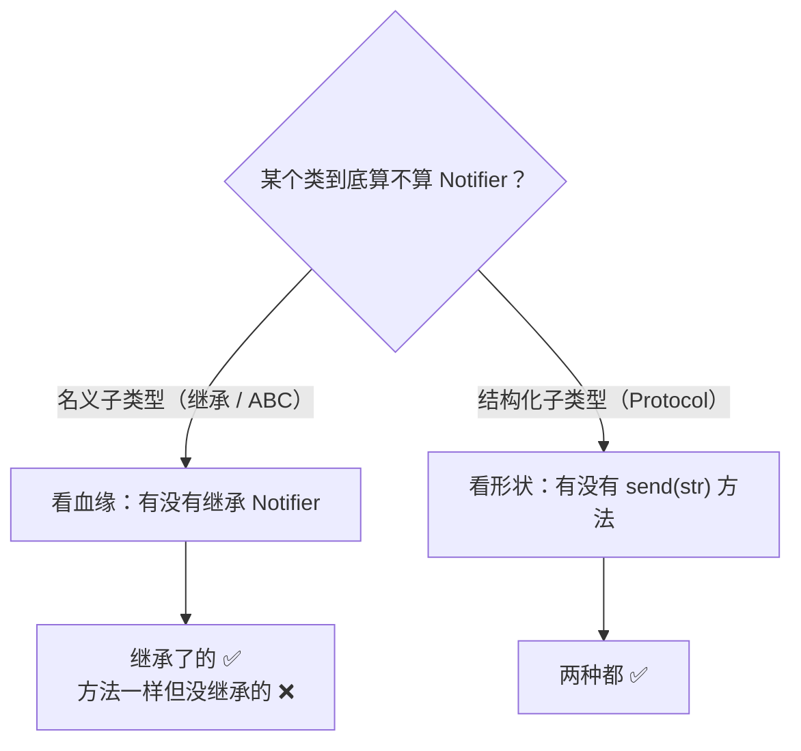

你写了一个函数，它需要「一个能发送消息的东西」。这个东西现在可能是邮件客户端，以后可能是短信、微信或者消息队列。那么类型注解该怎么写？

- 注解成具体的 `EmailClient`，函数就被绑死了，换实现就报类型错误；
- 什么都不写，又等于放弃类型检查，传错对象只能等运行时才发现。

`Protocol` 就是为这个问题设计的：**把「我需要你会做什么」写成一份招聘启事，任何满足这份启事的类都能传进来，不需要继承。**

本文从零讲清 `Protocol` 的用法、常见坑，以及它如何帮你解耦依赖。文中所有代码都在 Python 3.14 上实际运行验证过。

## 1. 先看两种「将就」的写法

### 写法 A：注解成具体类

```python
class EmailClient:
    def send(self, text: str) -> None:
        ...

def notify(client: EmailClient, text: str) -> None:
    client.send(text)
```

问题很直接：`notify` 只认 `EmailClient`。哪怕你写了一个功能一模一样的 `SmsClient`，类型检查器（mypy / pyright）也会拒绝你：

```python
class SmsClient:
    def send(self, text: str) -> None:
        print("短信:", text)

notify(SmsClient(), "服务器挂了")   # 类型检查报错：期望 EmailClient
```

### 写法 B：干脆不写注解

```python
def notify(client, text):
    client.send(text)
```

这样能跑了，但代价是丢掉了所有检查：传进来的对象到底有没有 `send` 方法，只能等到运行时才知道。

我们真正想表达的其实是「**只要你能 `send(str)` 就行，我不在乎你是谁**」。`Protocol` 就是把这个意思写进类型系统的工具。

## 2. 三步写好一个 Protocol

```python
from typing import Protocol

class Notifier(Protocol):              # 第 1 步：定义契约
    def send(self, text: str) -> None: ...

def notify(client: Notifier, text: str) -> None:   # 第 2 步：按契约注解
    client.send(text)

class SmsClient:                       # 第 3 步：实现方什么都不用继承
    def send(self, text: str) -> None:
        print("短信:", text)

notify(SmsClient(), "服务器挂了")       # ✅ 通过静态检查
```

注意 `SmsClient` 的定义里**完全没有出现 `Notifier`**。它没有继承、没有注册、没有任何声明，只因为「长得像」就自动满足了 `Notifier`。

运行一下：

```text
短信: 服务器挂了
```

这就是**结构化子类型**（structural subtyping）：判断标准是「长得像不像」，而不是「是不是亲生的」。

> [!NOTE] 版本要求
> `typing.Protocol` 从 **Python 3.8** 开始提供（[PEP 544](https://peps.python.org/pep-0544/)）。更早的版本可以用 `typing_extensions.Protocol` 顶替，用法一样。
>
> 另外，本文用了 `str | None` 这种联合类型写法，需要 **Python 3.10+**；如果你还在 3.9 或更早，写成 `Optional[str]` 即可。

## 3. 两种子类型：看血缘还是看形状

同样是「这个类算不算 `Notifier`」，两种类型系统给出的答案并不一样：



- **名义子类型**（nominal typing）：靠 `class SmsClient(Notifier)` 这句继承来登记关系。Python 的 `ABC`、Java 的 `implements`、C++ 的继承都是这一类。
- **结构化子类型**（structural typing）：靠方法签名本身。Python 的 `Protocol` 属于这一类。

| 维度 | 普通继承 / `ABC` | `Protocol` |
| --- | --- | --- |
| 判断依据 | 是否显式继承 | 方法是否匹配 |
| 实现方要不要改代码 | 要（加基类） | **不要** |
| 能不能约束第三方库的类 | 不能（改不了别人） | **能** |
| 静态检查 | 支持 | 支持 |
| 运行时检查 | 天然支持 | 需 `@runtime_checkable` |

`Protocol` 最不可替代的场景就在第三行：**你无法给第三方库的类加继承**。比如你想接受「任何有 `.read()` 的对象」，`io` 里的类你一个都改不了，但 `Protocol` 可以约束它们。

## 4. Protocol 的三条规则

### 规则一：Protocol 只是契约，不能实例化

契约本身不是一个能干活的对象：

```python
Notifier()
# TypeError: Protocols cannot be instantiated
```

### 规则二：方法体写 `...`，只声明不实现

```python
class Notifier(Protocol):
    def send(self, text: str) -> None: ...      # 省略号表示「这里不写实现」
```

### 规则三：默认实现只有「显式继承」才拿得到

Protocol 里可以写带方法体的默认实现，但**只有显式继承它的类才能继承到这个实现**；靠结构匹配的类拿不到。

```python
class Greeter(Protocol):
    def name(self) -> str: ...
    def greet(self) -> str:
        return f"Hello, {self.name()}"     # 默认实现

class Person(Greeter):                      # 显式继承
    def name(self) -> str:
        return "Rainboy"

print(Person().greet())                     # Hello, Rainboy ✅
```

```python
class Duck:                                 # 结构匹配，但没有 greet
    def name(self) -> str:
        return "Duck"

hasattr(Duck(), "greet")                    # False —— 没拿到默认实现
```

所以：**Protocol 的默认实现是一种「可选的代码复用」，不是「自动注入」。** 想让对方直接获得实现，就得让对方显式继承。

## 5. 运行时检查：`@runtime_checkable`

默认情况下，`Protocol` 只在**静态检查期**起作用，运行时 `isinstance` 会直接报错：

```python
isinstance(SmsClient(), Notifier)
# TypeError: Instance and class checks can only be used with @runtime_checkable protocols
```

加上装饰器就能在运行时判断：

```python
from typing import Protocol, runtime_checkable

@runtime_checkable
class Notifier(Protocol):
    def send(self, text: str) -> None: ...

isinstance(SmsClient(), Notifier)   # True
```

### 但它有三个坑，必须知道

**坑一：只查「成员在不在」，不查签名对不对。**

```python
class WrongSignature:
    def send(self):          # 签名完全不对：缺参数、缺返回注解
        return 1

isinstance(WrongSignature(), Notifier)   # True —— 照样通过！
```

`isinstance` 只确认「有没有一个叫 `send` 的属性」，不会比较参数类型。**所以运行时检查不能替代静态检查**，它只适合做粗粒度的守卫。

**坑二：含有数据成员（非方法）的 Protocol 不支持 `issubclass`。**

```python
@runtime_checkable
class HasName(Protocol):
    name: str

class Person2:
    name = "x"

issubclass(Person2, HasName)
# TypeError: Protocols with non-method members don't support issubclass().
#            Non-method members: 'name'.

isinstance(Person2(), HasName)   # True —— isinstance 可以，issubclass 不行
```

原因是 `issubclass` 只能检查「类上有没有这个属性」，而数据成员往往是实例属性，类级别查不到，所以直接禁止。

**坑三：只查浅层，不递归。**

`isinstance` 不会去检查方法内部调用的其他方法是否存在。契约的完整性最终仍要靠静态检查器把关。

> [!TIP] 实践建议
> 能用静态检查解决就别用 `@runtime_checkable`。它适合「插件加载后做个合法性过滤」这类场景，不适合当成完整的接口校验。

## 6. 泛型 Protocol

Protocol 也能接受类型参数，用 `TypeVar` 声明一个泛型契约：

```python
from typing import Protocol, TypeVar

T = TypeVar("T")

class Repo(Protocol[T]):
    def get(self, key: int) -> T | None: ...
    def save(self, item: T) -> None: ...

class UserRepo:
    def get(self, key: int) -> str | None:
        return "rainboy"

    def save(self, item: str) -> None:
        print("saved:", item)
```

`Repo[str]` 表示「存取 `str` 的仓库」。静态检查器会替你把 `T` 对上号：如果 `get` 返回 `int`、`save` 收 `str`，就会被标红。

泛型 Protocol 的典型用途是抽象「容器」「仓库」「序列化器」这类与元素类型无关的结构。

## 7. 实战：给四层架构解耦存储层

`Protocol` 最有价值的地方，是让内层代码只依赖「能力」而不依赖「实现」。这正好是 [从课程报名例子理解 Python 四层架构](./registration-layered-architecture.md) 里 `service` 层的做法（下面的 `Student`、`Course` 就是那篇文章领域层定义的数据类）：

```python
# service.py：接口由调用方（内层）定义
from typing import Protocol

class EnrollmentStore(Protocol):
    def get_student(self, student_id: int) -> Student | None: ...
    def get_course(self, course_id: int) -> Course | None: ...
    def has_enrollment(self, student_id: int, course_id: int) -> bool: ...
    def count_enrollments(self, course_id: int) -> int: ...
    def add_enrollment(self, student_id: int, course_id: int) -> None: ...
```

```python
# db.py：实现方什么都不用继承，也不用 import service
class SQLiteEnrollmentStore:
    def get_student(self, student_id: int) -> Student | None: ...
    # ...其余四个方法
```

两处关键：

1. **接口定义在调用方一侧**（`service.py`），而不是实现方一侧（`db.py`）。如果反过来写在 `db.py`，`service` 依然要 `import db`，解耦就白做了。
2. **实现方零耦合**：`db.py` 里没有一行提到 `EnrollmentStore`，它只是恰好长成了那个样子。

好处是实打实的：测试 `EnrollmentService` 时，塞一个只有五个方法的内存假对象进去就行，完全不需要 SQLite。

```python
class InMemoryStore:
    def __init__(self) -> None:
        self.students = {1: Student(1, "小明")}
        self.courses = {1: Course(1, "Python 入门", 2)}
        self.rows: set[tuple[int, int]] = set()

    def get_student(self, student_id): return self.students.get(student_id)
    def get_course(self, course_id): return self.courses.get(course_id)
    def has_enrollment(self, s, c): return (s, c) in self.rows
    def count_enrollments(self, c): return sum(1 for _, cid in self.rows if cid == c)
    def add_enrollment(self, s, c): self.rows.add((s, c))
```

这五行的假对象**没有继承任何东西**，却完全满足 `EnrollmentStore`。

## 8. 常见坑速查

| 现象 | 原因 | 解决 |
| --- | --- | --- |
| `TypeError: Protocols cannot be instantiated` | Protocol 本来就不能实例化 | 用具体类，别用 Protocol 当对象 |
| `TypeError: ... only be used with @runtime_checkable` | 没加装饰器就 `isinstance` | 加 `@runtime_checkable` |
| `issubclass` 报 `non-method members` | Protocol 里有数据成员 | 改用 `isinstance`，或把数据成员改成方法 |
| 明明签名不对，`isinstance` 却是 `True` | 运行时只查成员存在 | 依赖静态检查器，别只靠运行时 |
| 结构匹配的类拿不到默认实现 | 默认实现不自动注入 | 让它显式继承 Protocol |
| `Protocol` 报未定义 | Python < 3.8 | `pip install typing_extensions`，从它导入 |

## 9. 什么时候该用 Protocol

**适合用：**

- 想约束「第三方库的类」或「别人写的类」——你改不了它们的继承关系；
- 内层代码要定义自己需要的接口（依赖倒置）；
- 想让实现方保持零耦合、零 import；
- 需要给鸭子类型的代码补上静态检查。

**不必用：**

- 只有一个实现，且不打算换——直接注解具体类更简单；
- 需要强制子类实现某些方法——用 `ABC` + `@abstractmethod` 更合适，它能阻止实例化；
- 需要运行时严格的接口校验——`Protocol` 做不到，得自己写校验逻辑。

一句话记住它：**`ABC` 管的是「你必须继承我」，`Protocol` 管的是「你只要长得像我就行」。**

## 参考

- [PEP 544 – Protocols: Structural subtyping](https://peps.python.org/pep-0544/)
- [Python 官方文档：typing.Protocol](https://docs.python.org/3/library/typing.html#typing.Protocol)
- [mypy 文档：Protocols and structural subtyping](https://mypy.readthedocs.io/en/stable/protocols.html)
- 站内：[从课程报名例子理解 Python 四层架构](./registration-layered-architecture.md)
